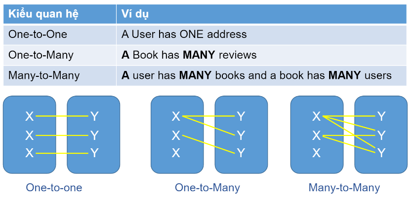

# Day 01

## 💛Session 01 - RDBMS Concepts

Chúng ta bắt gặp tổ chức dữ liệu, quản lí dữ liệu diễn ra hàng ngày trong đời sống.

- Bà bán rau: ghi chép thu chi, công nợ, mối nhập hàng...
- Ngân hàng: ghi nhận lại lịch sử từng giao dịch, tiền vào ra...
- Hệ thống siêu thị: ghi nhận nhập xuất hàng, giá, mã sản phẩm, tồn kho...

---

### 💥Data management

 **Data management** là quá trình tổ chức, sắp xếp, và quản lý thông tin để đảm bảo tính toàn vẹn, khả dụng, và tin cậy của dữ liệu. Nó bao gồm các hoạt động như thu thập, lưu trữ, xử lý, truy xuất, và bảo mật dữ liệu.

Data management được tổ chức thành 2 loại khác nhau:

- File-based system: Tổ chức thành file lưu trữ trên máy tính 
    - Dư thừa dữ liệu, không nhất quán
    - Không thể truy cập đồng thời
    - Bảo mật không được cao
    - Tính toàn vẹn không có

- Database system: Tổ chức khoa học hơn, có thể chia nhỏ để tối ưu hiệu suất

---

### 💥 Database Management System (DBMS)

Database Management System (Hệ quản trị cơ sở dữ liệu) là một phần mềm được sử dụng để quản lý và điều khiển cơ sở dữ liệu. DBMS cung cấp các công cụ và cơ chế để lưu trữ, truy xuất, cập nhật và xử lý dữ liệu trong cơ sở dữ liệu.

Một hệ quản trị cơ sở dữ liệu cho phép người dùng tạo, sửa đổi và xóa dữ liệu trong cơ sở dữ liệu, thực hiện truy vấn để truy xuất thông tin từ cơ sở dữ liệu, và quản lý các quyền truy cập và bảo mật dữ liệu. Nó cung cấp giao diện để tương tác với cơ sở dữ liệu thông qua các ngôn ngữ truy vấn như SQL (Structured Query Language).

---

### 💥 Database Models

Mô hình cơ sở dữ liệu (Database Models) là một cách để mô tả cấu trúc và tổ chức dữ liệu trong một cơ sở dữ liệu. Chúng định nghĩa các quy tắc và nguyên tắc cho việc lưu trữ, truy xuất và quản lý dữ liệu trong hệ thống cơ sở dữ liệu.

Có nhiều mô hình cơ sở dữ liệu khác nhau, nhưng ba mô hình phổ biến nhất là:

1. Mô hình quan hệ (Relational Model): Mô hình quan hệ sử dụng các bảng (relations) để lưu trữ dữ liệu và mô tả mối quan hệ giữa chúng. Trong mô hình này, dữ liệu được tổ chức thành các bảng, mỗi bảng có các hàng (records) và cột (attributes). Các bảng có thể liên kết với nhau thông qua các khóa (keys), tạo ra mối quan hệ giữa chúng. Mô hình quan hệ được sử dụng rộng rãi và là cơ sở cho hầu hết các hệ thống cơ sở dữ liệu quan hệ (RDBMS) như Oracle, MySQL và PostgreSQL.

2. Mô hình hướng đối tượng (Object-Oriented Model): Mô hình hướng đối tượng sử dụng các đối tượng (objects) để lưu trữ dữ liệu. Nó cho phép định nghĩa các lớp (classes) và các đối tượng thuộc lớp đó, mô tả các thuộc tính và phương thức của đối tượng. Mô hình hướng đối tượng phổ biến trong lĩnh vực phát triển phần mềm và được sử dụng trong các hệ thống cơ sở dữ liệu hướng đối tượng (OODBMS) như MongoDB và Couchbase.

3. Mô hình mạng (Network Model): Mô hình mạng sử dụng các mạng (networks) để lưu trữ dữ liệu và mô tả quan hệ giữa các mạng. Mỗi mạng trong mô hình này có thể có nhiều bản ghi (records) và có thể liên kết với nhau thông qua các liên kết (links). Mô hình mạng đã được sử dụng trong quá khứ, nhưng hiện nay ít được sử dụng so với mô hình quan hệ và hướng đối tượng.

Ngoài ba mô hình trên, còn có các mô hình khác như mô hình cơ sở dữ liệu phân tán (Distributed Model), mô hình cơ sở dữ liệu không cấu trúc (Unstructured Model), và mô hình cơ sở dữ liệu hỗn hợp (Hybrid Model), tùy thuộc vào yêu cầu và tính chất của dự án hoặc hệ thống cụ thể.

Chúng ta sẽ tập trung chính vào mô hình **Relational Model**

Mô hình bán hàng thương mại điển tử phổ biến

Chúng ta bắt gặp rất nhiều mối quan hệ giữa các table từ mô hình trên

- Cagegories - Products: Xảy ra mối quan hệ 1 - NHIỀU. Tức là 1 danh mục có thể chứa 1 hoặc nhiều sản phẩm.
- Brands - Products: Xảy ra mối quan hệ 1 - NHIỀU
- Customers - Orders: Xảy ra mối quan hệ 1 - NHIỀU
- Staffs - Orders: Xảy ra mối quan hệ 1 - NHIỀU

---

### 💥 Một số thuật ngữ liên quan đến RDBMS

#### 🔹 Relation

là một khái niệm cơ bản để biểu diễn một bảng (table) trong mô hình quan hệ. Quan hệ là tập hợp các bản ghi (records) có cùng cấu trúc dữ liệu.

#### 🔹 Table

Hay còn gọi là Bảng, là một cấu trúc dữ liệu được sử dụng để lưu trữ thông tin liên quan đến một thực thể (entity) cụ thể. Bảng được sử dụng để tổ chức dữ liệu thành các hàng (rows) và cột (columns).

#### 🔹 Column

Hay còn gọi là cột, là một thành phần của bảng (table) và đại diện cho một thuộc tính (attribute) cụ thể của quan hệ đó

#### 🔹 Row

Hay còn gọi là một hàng (row) là một thành phần của bảng (table) và đại diện cho một bản ghi (record) cụ thể trong quan hệ đó

#### 🔹 Attributes

thuộc tính (attribute) là một thành phần của quan hệ (relation) và đại diện cho một thông tin cụ thể về thực thể (entity) được mô tả trong quan hệ đó. Thuộc tính là các đặc điểm hoặc thuộc tính của thực thể mà quan hệ đang biểu diễn.

#### 🔹 Domains

miền (domain) là một khái niệm được sử dụng để mô tả tập hợp các giá trị dữ liệu có thể được chứa trong một thuộc tính (attribute) cụ thể. Miền xác định các giới hạn, kiểu dữ liệu và quy tắc áp dụng cho giá trị của thuộc tính trong quan hệ.

#### 🔹 Primary Key

Khóa chính (Primary Key) là một thuộc tính hoặc tập hợp các thuộc tính trong một quan hệ (relation) của cơ sở dữ liệu quan hệ mà định danh một cách duy nhất mỗi bản ghi (record) trong quan hệ đó. Khóa chính được sử dụng để xác định một cách duy nhất mỗi hàng trong bảng và có vai trò quan trọng trong việc xác định tính toàn vẹn và duy nhất của dữ liệu.

#### 🔹 Foreign Key

Khóa ngoại (Foreign Key) là một thuộc tính trong một quan hệ (relation) trong cơ sở dữ liệu quan hệ, được sử dụng để thiết lập mối quan hệ giữa hai quan hệ khác nhau. Khóa ngoại là một thuộc tính trong quan hệ hiện tại, trỏ tới khóa chính của một quan hệ khác.

---

### 💥 Entiry là gì ?

Entity (thực thể) trong ngữ cảnh của cơ sở dữ liệu là một đối tượng hoặc một khái niệm có ý nghĩa độc lập và có thể được lưu trữ và quản lý trong cơ sở dữ liệu. Nó đại diện cho một đối tượng trong thế giới thực hoặc trong một hệ thống thông tin.

Trong mô hình quan hệ, entity được biểu diễn bằng một bảng (table) và mỗi hàng (row) trong bảng đại diện cho một thể hiện của entity. Mỗi cột (column) trong bảng tương ứng với một thuộc tính (attribute) của entity.

Ví dụ, trong một hệ thống quản lý nhân viên, "Nhân viên" có thể là một entity. Mỗi nhân viên có thể có các thuộc tính như "Họ và tên", "Ngày sinh", "Địa chỉ", "Số điện thoại", và "Vị trí công việc". Mỗi nhân viên trong hệ thống sẽ được biểu diễn bằng một hàng trong bảng và các thuộc tính tương ứng sẽ là các cột trong bảng.

---

## 💛 Session 02

### 💥 Data Modeling

Data Modeling là quá trình tạo ra mô hình cấu trúc và tổ chức dữ liệu trong hệ thống cơ sở dữ liệu. Nó là quá trình trừu tượng hóa thực tế và biểu diễn các thông tin, quan hệ và thuộc tính dữ liệu một cách logic và có tổ chức.

Mục tiêu chính của Data Modeling là xác định cách dữ liệu được tổ chức, tương tác và lưu trữ trong hệ thống. Nó giúp hiểu rõ cấu trúc dữ liệu, mối quan hệ giữa các đối tượng dữ liệu và cách chúng tương tác với nhau. Data Modeling cung cấp một khung làm việc để thiết kế, triển khai và duy trì cơ sở dữ liệu một cách hiệu quả và nhất quán.

Trong quá trình Data Modeling, các mô hình dữ liệu được tạo ra để biểu diễn các khía cạnh khác nhau của dữ liệu, bao gồm:

### 1. Conceptual Data Modeling

Conceptual Data Model (mô hình dữ liệu khái niệm) là một mô hình trừu tượng cao cấp trong quá trình thiết kế cơ sở dữ liệu. Nó tập trung vào mô tả thông tin và quan hệ giữa các thực thể chính trong hệ thống, mà không quan tâm đến cấu trúc lưu trữ cụ thể hoặc hệ quản trị cơ sở dữ liệu.

Mục tiêu chính của Conceptual Data Model là cung cấp một cái nhìn tổng quan về dữ liệu và cấu trúc của hệ thống dựa trên mối quan hệ giữa các thực thể chính. Nó thường được sử dụng để hiểu và thảo luận với các bên liên quan, bao gồm người quản lý, người dùng cuối và nhà phát triển, để đảm bảo sự hiểu rõ và đồng thuận về các yêu cầu và mục tiêu của hệ thống.

Conceptual Data Model không chỉ mô tả cấu trúc dữ liệu, mà còn giải thích ý nghĩa và tương tác giữa các thực thể. Nó sử dụng các khái niệm như thực thể (entity), quan hệ (relationship) và thuộc tính (attribute) để biểu diễn dữ liệu và mối quan hệ giữa chúng một cách trừu tượng. Các thực thể thường là các đối tượng hoặc khái niệm quan trọng trong lĩnh vực đang được mô hình hóa, ví dụ như "khách hàng", "sản phẩm" hoặc "đơn hàng".

Conceptual Data Model thường được biểu diễn bằng các biểu đồ, ví dụ như Entity-Relationship Diagrams (ERD) hoặc các biểu đồ quan hệ khác. Mô hình này cung cấp một cơ sở để phát triển các mô hình dữ liệu logic (Logical Data Model) và mô hình dữ liệu vật lý (Physical Data Model) trong quá trình thiết kế cơ sở dữ liệu.

### 2. Logical Data Modeling

Logical Data Modeling là quá trình thiết kế mô hình dữ liệu logic cho cơ sở dữ liệu. Nó tập trung vào việc mô tả các thực thể, quan hệ và thuộc tính của dữ liệu một cách trừu tượng, không phụ thuộc vào cấu trúc lưu trữ cụ thể hoặc hệ quản trị cơ sở dữ liệu.

Mô hình dữ liệu logic giúp hiểu và biểu diễn các mối quan hệ giữa các đối tượng dữ liệu trong hệ thống. Nó sử dụng các khái niệm như thực thể (entity), quan hệ (relationship), thuộc tính (attribute) và ràng buộc (constraint) để mô tả cách dữ liệu được tổ chức và tương tác với nhau.

Mục tiêu chính của Logical Data Modeling là xác định các thực thể quan trọng trong hệ thống, mô tả các thuộc tính và quan hệ của chúng, và xác định các ràng buộc logic để đảm bảo tính chính xác và toàn vẹn của dữ liệu. Nó cung cấp một mô hình trừu tượng và độc lập với hệ thống vật lý, cho phép các nhà phát triển và người quản lý dự án hiểu và thảo luận về cấu trúc dữ liệu một cách rõ ràng.

Logical Data Modeling thường được thực hiện trước khi bước thiết kế cơ sở dữ liệu vật lý (Physical Data Modeling). Nó cung cấp một cơ sở để triển khai cấu trúc dữ liệu vào một hệ quản trị cơ sở dữ liệu cụ thể và tạo ra các bảng, cột, chỉ mục và quan hệ dữ liệu tương ứng.

Một số phương pháp và công cụ phổ biến được sử dụng trong Logical Data Modeling bao gồm Entity-Relationship Diagrams (ERD), Unified Modeling Language (UML), và các biểu đồ quan hệ khác để biểu diễn mối quan hệ giữa các thực thể và thuộc tính dữ liệu.

### 3. Physical Data Modeling

Physical Data Modeling là quá trình thiết kế cấu trúc và tổ chức dữ liệu trong cơ sở dữ liệu theo một cách cụ thể và tối ưu hóa cho môi trường vật lý nơi cơ sở dữ liệu sẽ được triển khai. Nó tập trung vào các khía cạnh kỹ thuật và vật lý của cơ sở dữ liệu, bao gồm các yếu tố như cấu trúc bảng, kiểu dữ liệu, chỉ mục, khóa, phân vùng dữ liệu và vị trí lưu trữ trên đĩa.

Physical Data Modeling chuyển đổi thiết kế dữ liệu từ mức Conceptual Data Model (mô hình dữ liệu khái niệm) và Logical Data Model (mô hình dữ liệu logic) thành một mô hình cụ thể hơn, phù hợp với môi trường vật lý và hệ quản trị cơ sở dữ liệu cụ thể. Nó đảm bảo rằng cấu trúc dữ liệu được thiết kế tối ưu cho hiệu suất và quản lý dữ liệu.

Trong quá trình Physical Data Modeling, các yêu cầu về hiệu suất, khả năng mở rộng, tính sẵn sàng và bảo mật của hệ thống cơ sở dữ liệu được xem xét. Các quyết định về cấu trúc dữ liệu, chỉ mục, phân vùng và vị trí lưu trữ dữ liệu thường được đưa ra để đảm bảo dữ liệu được truy cập và xử lý một cách hiệu quả.

Physical Data Modeling là bước quan trọng trong quá trình thiết kế cơ sở dữ liệu và cung cấp một khung làm việc để triển khai và vận hành cơ sở dữ liệu trong môi trường vật lý.

### 💥 Entity-Relationship (E-R) Model

Mối quan hệ trong CSDL xác định cách mà các thực thể hoặc bảng trong cơ sở dữ liệu tương tác và tương quan với nhau. Có ba loại mối quan hệ chính:

1. Mối quan hệ một một (One-to-One): Một thực thể trong mối quan hệ này tương ứng với một thực thể duy nhất trong mối quan hệ khác. Mỗi thực thể trong quan hệ đó được kết nối với một thực thể duy nhất trong quan hệ khác.

2. Mối quan hệ một nhiều (One-to-Many): Một thực thể trong mối quan hệ này tương ứng với nhiều thực thể trong mối quan hệ khác. Thực thể trong quan hệ này có thể có nhiều liên kết tới các thực thể khác trong quan hệ khác.

3. Mối quan hệ nhiều nhiều (Many-to-Many): Nhiều thực thể trong mối quan hệ này tương ứng với nhiều thực thể trong mối quan hệ khác. Quan hệ này yêu cầu sử dụng một bảng trung gian (intermediate table) để lưu trữ các liên kết giữa các thực thể.

CSDL sử dụng mối quan hệ để tạo ra sự tương tác và liên kết giữa các thực thể trong cơ sở dữ liệu. Mối quan hệ giúp tổ chức dữ liệu theo cách logic và cho phép truy vấn dữ liệu phức tạp, truy xuất thông tin từ nhiều bảng và thực hiện các thao tác dữ liệu liên quan. Mối quan hệ cũng giúp đảm bảo tính toàn vẹn và nhất quán của dữ liệu trong cơ sở dữ liệu.

---

### 💥 E-R Diagram

E-R Diagram (Entity-Relationship Diagram) là một công cụ mô hình hóa dữ liệu được sử dụng để biểu diễn các thực thể (entities), mối quan hệ (relationships) và thuộc tính (attributes) của một hệ thống cơ sở dữ liệu quan hệ. Được phát triển bởi Peter Chen vào những năm 1970, E-R Diagram giúp mô tả cách dữ liệu được tổ chức và tương tác với nhau trong một hệ thống.

E-R Diagram sử dụng các ký hiệu đồ thị để biểu diễn các thành phần chính của hệ thống cơ sở dữ liệu. Các thành phần chính bao gồm:

1. Thực thể (Entity): Đại diện cho một đối tượng, một vật, hoặc một khái niệm trong hệ thống. Thực thể có thể là một đối tượng vật lý (ví dụ: sản phẩm, khách hàng) hoặc một khái niệm trừu tượng (ví dụ: đơn hàng, hợp đồng).

2. Mối quan hệ (Relationship): Biểu thị mối quan hệ giữa các thực thể. Một mối quan hệ thể hiện cách mà các thực thể tương tác và liên kết với nhau. Ví dụ, một mối quan hệ "mua hàng" có thể kết nối thực thể "khách hàng" với thực thể "sản phẩm".

3. Thuộc tính (Attribute): Đại diện cho các thông tin chi tiết về mỗi thực thể. Thuộc tính mô tả các đặc điểm, đặc tính hoặc thông tin cụ thể liên quan đến thực thể. Ví dụ, trong thực thể "khách hàng", các thuộc tính có thể bao gồm tên, địa chỉ, số điện thoại.

E-R Diagram giúp hiển thị mối quan hệ giữa các thực thể và cách chúng tương tác trong hệ thống cơ sở dữ liệu. Nó hỗ trợ trong việc thiết kế cơ sở dữ liệu, xác định các quan hệ và thuộc tính cần thiết, và cung cấp một cấu trúc trực quan để truyền tải thông tin về cách dữ liệu được tổ chức và liên quan đến nhau.

Normalization ==> Day 02

## 💛 Homeworks Guides

- Download Software SQL Server 2019 and Tools