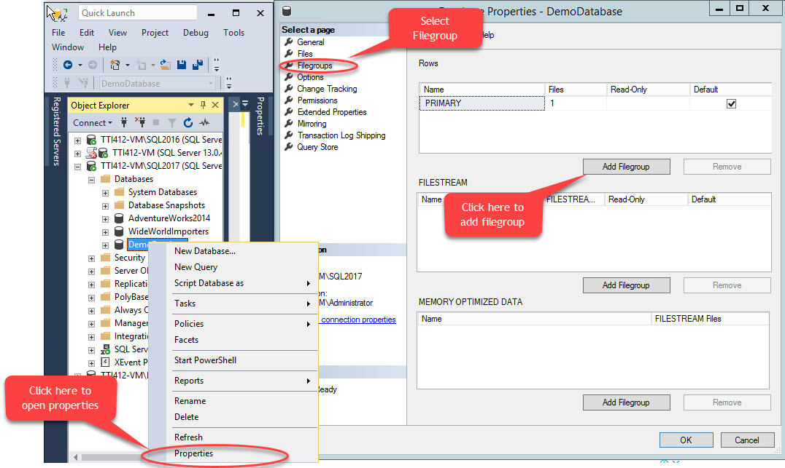
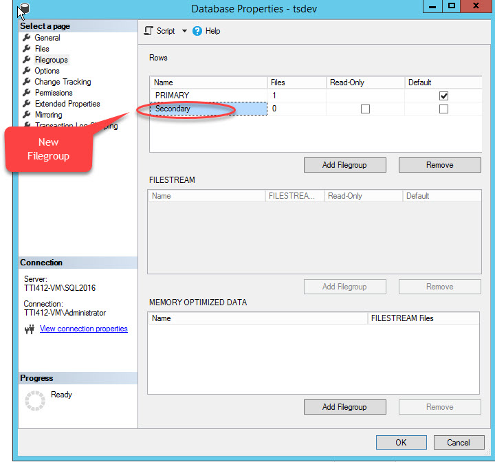
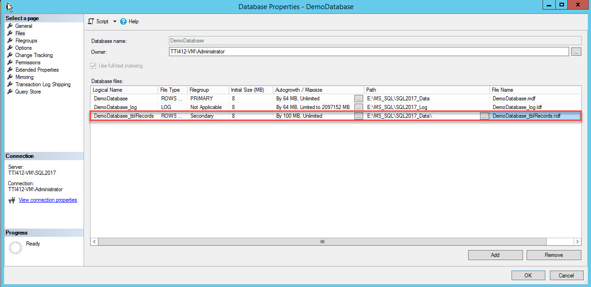
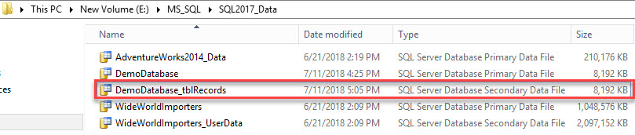

# Day 03


## 💛Session 03 - Introduction to SQL Server 2019

- Cách cài đặt phần mềm
  - SQL SERVER 2019 EXPRESS EDITION: https://www.microsoft.com/en-us/sql-server/sql-server-downloads --> Tải bản Express
  - SQL SERVER MANAGEMENT STUDIO (SSMS): https://learn.microsoft.com/en-us/sql/ssms/download-sql-server-management-studio-ssms?view=sql-server-ver16

Hướng dẫn cài đặt: 

 - CHo win: https://youtu.be/JIvu6wx8BSY
 - CHo Mac: https://www.youtube.com/watch?v=VgXci_5hzxY


---

## 💛 Session 05- Creating and Managing Databases

### 💥 Database (Cơ sở dữ liệu) là gì? 

- Một Database là tập hợp của rất nhiều dữ liệu phản ánh thế giới thực hoặc một phần của thế giới thực.
- Có cấu trúc, được lưu trữ tuân theo quy tắc dựa trên lý thuyết toán học.
- Các dữ liệu trong Database có liên quan với nhau về một lĩnh vực cụ thể, được tổ chức đặc biệt cho việc lưu trữ, tìm kiếm và trích xuất dữ liệu.
- Được các Hệ cơ sở dữ liệu khai thác xử lý, tìm kiếm, tra cứu, sửa đổi, bổ sung hay loại bỏ dữ liệu trong Database.

Ở mức logic, một DATABASE gồm nhiều bảng (TABLE), mỗi bảng được xác định bằng một tên, bảng chứa dữ liệu có cấu trúc và các ràng buộc (CONSTRAINT) định nghĩa trên các bảng. Ngoài ra, Database còn có khung nhìn (VIEW), các thủ tục/ hàm….

Ở mức vật lý, DATABASE của SQL Server được lưu trữ dưới 3 loại tập tin: 

- Tập tin dữ liệu (Data-file): gồm 1 tập tin lưu trữ dữ liệu chính (`*.mdf`) chứa các dữ liệu khởi đầu và các tập tin dữ liệu thứ cấp (`*.ndf`) chứa dữ liệu phát sinh hoặc không lưu hết trong tập tin lưu trữ chính.
- Tập tin nhật ký thao tác (`*.ldf`) chứa thông tin giao tác, thường dùng để khôi phục Database nếu xảy ra sự cố. 

---

### 💥Tại sao phải tạo Database?

Như việc truy xuất, đóng mở tập tin thông thường, bạn cần tạo file lưu trữ trước khi truy xuất. Tương tự vậy, bạn cần tạo một DATABASE để lưu trữ dữ liệu trong SQL Server để tiện cho việc truy vấn sau này.

SQL Server sẽ giúp bạn quản lý, truy xuất những dữ liệu này một cách có cấu trúc và dễ dàng hơn.

---

### 💥 Cách tạo Database?

#### 🔹 Tạo bằng giao diện đồ họa GUI


#### 🔹 Tạo bằng dòng lệnh 

```sql
CREATE DATABASE  <database_name>
```

Trong đó database_name là tên mà bạn đặt cho Database bạn muốn tạo

---

### 💥 Xóa một Database?

#### 🔹 Xóa bằng giao diện đồ họa GUI


#### 🔹 Xóa bằng dòng lệnh 

Cú pháp:

```sql
DROP DATABASE  [ IF EXISTS ]
    database_name 
    [,database_name2,...];
```

Trong đó database_name là tên Database bạn muốn xóa

---

### 💥 Comment trong SQL Query

Để tạo COMMENT trong SQL, chúng ta sử dụng cú pháp

```sql
--Nội dung Comment
```
---


### 💥 FileGroup

#### Tạo FileGroup

Click phải lên Database chọn `Properties` >> chọn `Filegroups` sau đó click `Add Filegroup` như hình dưới đây:



Kết quả được như hình sau



Hoặc bạn có thể tạo bằng lệnh

```sql
USE [master]
GO
ALTER DATABASE [DemoDatabase] ADD FILEGROUP [Secondary ]
GO
```

Bước tiếp theo. Liên kết file vật lý với File Group


Sau đó. Cấu hình như hình



Kết quả lưu ở vật lý




Hoặc với dùng lệnh để add file

```sql
USE [master]
GO
ALTER DATABASE [DemoDatabase] ADD FILE ( NAME = N'DemoDatabase_tblRecords', FILENAME =
N'E:\MS_SQL\SQL2017_Data\DemoDatabase_tblRecords.ndf' , SIZE = 8192KB , FILEGROWTH = 102400KB ) TO FILEGROUP [Secondary]
GO
```

Xem thêm: 

- https://www.sqlshack.com/managing-file-groups-of-sql-databases/
- https://codingsight.com/moving-existing-table-from-primary-filegroup-to-different-filegroup


### 💥 Backup và Restore Một Database

- Backup và restore từ file .bak
- Gen ra thành SQL Scrtip để thực thi: Bao gồm cấu trúc Schema và Data

### 💥 Database Snapshot

Database snapshot là một bản sao tĩnh (read-only) của một cơ sở dữ liệu tại một thời điểm cụ thể. Nó lưu trữ dữ liệu nhưng không cho phép thay đổi dữ liệu trong snapshot. Database snapshot thường được sử dụng để tạo ra các bản sao lưu (backup) của cơ sở dữ liệu hoặc để tạo ra một điểm khôi phục (restore point) để phục hồi cơ sở dữ liệu sau khi có sự cố xảy ra.

Khi tạo một snapshot, hệ thống sao chép các dữ liệu hiện có trong cơ sở dữ liệu và lưu trữ chúng trong một không gian lưu trữ riêng. Từ đó, các truy vấn đọc có thể được thực hiện trên snapshot mà không ảnh hưởng đến dữ liệu trong cơ sở dữ liệu gốc. Mỗi khi có một thay đổi dữ liệu trong cơ sở dữ liệu gốc, snapshot không bị ảnh hưởng, vẫn giữ nguyên dữ liệu lúc tạo snapshot.

Snapshot có thể được sử dụng để phục hồi cơ sở dữ liệu trong trường hợp có sự cố xảy ra, ví dụ như mất dữ liệu, lỗi trong quá trình cập nhật dữ liệu, hoặc muốn phục hồi dữ liệu về một thời điểm cụ thể. Bằng cách khôi phục cơ sở dữ liệu từ snapshot, ta có thể đảm bảo rằng dữ liệu được phục hồi trở về trạng thái tương ứng với thời điểm tạo snapshot.

Tuy nhiên, cần lưu ý rằng snapshot không phải là một phương án sao lưu hoàn chỉnh cho cơ sở dữ liệu. Nó chỉ lưu trữ dữ liệu hiện tại tại một thời điểm cụ thể và không bao gồm lịch sử thay đổi dữ liệu hoặc log giao dịch. Nếu muốn có một bản sao lưu đầy đủ và có khả năng khôi phục toàn bộ dữ liệu, cần sử dụng các phương pháp sao lưu khác như sao lưu toàn bộ cơ sở dữ liệu hoặc sao lưu theo log giao dịch.

//////////////////////////////////////////////////////////////////////////////////////

## 💛 Session 06- Creating Tables


### 💥 Tại sao phải tạo Table?


Trong bài trước, chúng ta đã biết DATABASE ( Cơ sở dữ liệu) dùng để lưu trữ thông tin, truy xuất dữ liệu khi cần thiết. Vậy làm sao để lưu trữ dữ liệu trong Database? Làm sao để truy xuất dữ liệu đã lưu?

>Bài toán thực tế đặt ra: 
>
>Khi muốn quản lý một trường học, bạn sẽ cần quản lý những gì? Danh sách giáo viên, danh sách học sinh, điểm thi, quá trình công tác, phòng ban…. Và khi truy vấn thì cần truy vấn như thể nào với các thông tin đó?

Vậy khi tất cả dữ liệu cùng nằm trong một Database thì cần có một cách tổ chức thể hiện các thông tin theo một hệ thống lưu trữ, đó chính là TABLE – Bảng.

Một Database bao gồm nhiều Table, giữa các Table có mối liên hệ với nhau thể hiện qua KHÓA CHÍNH & KHÓA NGOẠI. 

---

### 💥 Vậy Table (Bảng) là gì?

Là đối tượng được Database sử dụng để tổ chức và lưu trữ dữ liệu.

Mỗi Table trong Database có thể liên kết với một hoặc nhiều Table khác, ở một hoặc nhiều thuộc tính

---

### 💥 Cách tạo Table

#### 🔹 Tạo bằng giao diện đồ họa GUI


#### 🔹 Tạo bằng dòng lệnh 

Tạo Table với các column, và kiểu Data type

Cú Pháp: 

```sql
CREATE TABLE [database_name.][schema_name.]table_name (
    pk_column data_type PRIMARY KEY,
    column_1 data_type NOT NULL,
    column_2 data_type,
    ...,
    table_constraints
);
```

Ví dụ:

```sql
--Create table categories
CREATE TABLE [dbo].[categories] (
  [category_id] INT,
  [category_name] NVARCHAR(50),
  [description] NVARCHAR(500),
);
GO
--Create table  products
CREATE TABLE [dbo].[products] (
  [product_id] INT,
  [name] NVARCHAR(100),
  [price] DECIMAL(18,2),
  [discount] DECIMAL(4,2),
  [description] NVARCHAR(MAX)
);
GO

```


#### 🔹Giải thích lệnh GO

```sql
--Tạo databse
CREATE DATABASE Batch37
GO
--Sử dụng database
USE Batch37
GO
-- Tạo table vào databse Batch37
CREATE TABLE [dbo].[categories] (
  [category_id] INT, 
  [category_name] NVARCHAR(50) ,
  [description] NVARCHAR(500)
);
GO
```

#### 🔹 Tạo table và chỉ định lưu vào một filegroup cụ thể

Với cách làm này, các table sẽ được tách ra khỏi file `.mdf` giúp tăng hiệu suất truy vấn.

Cú pháp:

```sql
CREATE TABLE [dbo].[TenBang]
(
    Cot1 datatype1,
    Cot2 datatype2,
    ...
)
ON TenFileGroup
```

Ví dụ

```sql
CREATE TABLE [dbo].[Employees]
(
    EmployeeID INT,
    EmployeeName NVARCHAR(100)
)
ON HR --file group with name "HR"
```

#### 🔹 Quy tắc đặt tên các cột trong Table

Trong SQL Server, có một số quy tắc và khuyến nghị khi đặt tên cột để đảm bảo tính rõ ràng, dễ đọc và dễ hiểu trong quá trình phát triển và bảo trì cơ sở dữ liệu. Dưới đây là một số quy tắc thường được sử dụng:

1. Sử dụng tên có ý nghĩa: Đặt tên cột dựa trên ý nghĩa và nội dung của dữ liệu mà cột đại diện. Tên cột nên phản ánh mục đích và thông tin liên quan của nó.

2. Sử dụng đúng kiểu từ: Đặt tên cột bằng các từ ngữ rõ ràng, dễ hiểu và không gây nhầm lẫn. Tránh việc sử dụng các từ viết tắt, chữ số hoặc ký tự đặc biệt trong tên cột.

3. Sử dụng kiểu đặt tên theo quy ước: Có thể sử dụng các quy ước về đặt tên như Pascal Case (ví dụ: EmployeeName), Camel Case (ví dụ: employeeName) hoặc Snake Case (ví dụ: employee_name). Quy ước này giúp tạo ra tên cột dễ đọc và dễ nhìn.

4. Tránh sử dụng các từ khóa: Đảm bảo rằng tên cột không trùng với các từ khóa được sử dụng trong câu lệnh SQL hoặc trong hệ quản trị cơ sở dữ liệu.

5. Sử dụng tên cột ngắn gọn và đủ mô tả: Tránh đặt tên cột quá dài hoặc quá ngắn. Đặt tên cột sao cho nó cung cấp thông tin đủ để hiểu nó đại diện cho dữ liệu nào, nhưng đồng thời không quá dài để làm cho các truy vấn và mã SQL trở nên phức tạp.

6. Sử dụng phân cách hợp lý: Sử dụng ký tự phân cách (như dấu gạch dưới "_") hoặc phân cách từ (như dấu cách) để tách các từ trong tên cột. Điều này giúp làm rõ từng thành phần của tên cột và làm cho nó dễ đọc hơn.

7. Tuân thủ quy tắc đặt tên chung: Ngoài các quy tắc cụ thể cho SQL Server, hãy tuân thủ các quy tắc đặt tên chung trong lĩnh vực phát triển phần mềm, nhưng hãy đảm bảo tuân thủ quy tắc cụ thể cho SQL Server.

Lưu ý rằng quy tắc đặt tên có thể khác nhau tùy thuộc vào quy ước của dự án hoặc tổ chức. Quan trọng nhất là đảm bảo tính rõ ràng, dễ đọc và duy trì của tên cột trong quá trình phát triển và bảo trì cơ sở dữ liệu.

---

Ví dụ 2: Các kiểu dữ liệu thường gặp

```sql
CREATE TABLE [dbo].[myTable] (
    Id              INT,
    Age             TINYINT,
    Price           DECIMAL(18,2),
    Discount        DECIMAL(4,2),
    ProductName     NVARCHAR(255),
    BirthDay        DATE, --Kiểu ngày yyyy-mm-dd
    CreatedAt       DATETIME2, --kiểu yyyy-mm-dd H:i:s
    StartAt         TIME (0), -- H:i:s
    EndAt           TIME (0), -- H:i:s
    IsActive        BIT, -- 0 or 1
    Content         NVARCHAR(MAX), --Nội dung dài
    ModuleId        UNIQUEIDENTIFIER DEFAULT NEWID()
)
```


---

### 💥 Cách Xóa Table

#### 🔹 Xóa bằng giao diện đồ họa GUI


CLick phải lên tên table --> Delete.

#### 🔹 Xóa bằng dòng lệnh 

Cú pháp:

```sql
DROP TABLE [IF EXISTS]  [database_name.][schema_name.]table_name;
```

Ví dụ:

```sql
-- Xóa table categories, Nếu table không tồn tại thì gây lỗi
DROP TABLE [dbo].[categories];
-- Xóa table categories với mệnh đề IF EXISTS để check tồn tại thì mới xóa, ==> tránh lỗi
DROP TABLE IF EXISTS [dbo].[categories];
```
---


### 💥 Alert Table

Các thao tác này bạn có thể thực hiện với giao diện đồ họa GUI

#### 🔹 Thêm một Column Table

```sql
--Thêm vào table customers một cột email
ALTER TABLE [dbo].[customers]
ADD email varchar(255);
```

#### 🔹 Xóa một Column Table

```sql
--Xóa cột email từ table customers
ALTER TABLE [dbo].[customers]
DROP COLUMN email;
```

#### 🔹 Thay đổi tên của Column Table

```sql
EXEC sp_rename 'table_name.old_column_name', 'new_column_name', 'COLUMN';
```

Ref: https://learn.microsoft.com/vi-vn/sql/relational-databases/tables/rename-columns-database-engine?view=sql-server-ver16

#### 🔹 Thay đổi Data Type của Column Table

```sql
ALTER TABLE [dbo].[customers]
ALTER COLUMN email nvarchar(255);
```


#### 🔹 Thay đổi tên của Table

```sql
EXEC sp_rename 'old_table_name', 'new_table_name'
```

---


### 💥 TRUNCATE

Xóa dữ liệu của một table và dữ lại cấu trúc

TRUNCATE TABLE [schema_name].[table_name]

Temporary Tables (Bảng tạm thời) là các bảng được tạo ra trong cơ sở dữ liệu để lưu trữ tạm thời dữ liệu trong quá trình thực thi của một phiên làm việc. Chúng tồn tại trong bộ nhớ hoặc trên đĩa trong một thời gian ngắn và được xóa tự động sau khi phiên làm việc kết thúc hoặc sau khi chúng không còn cần thiết.

Bạn có thể tìm thấy bảng tạm ở: `System Databases > tempdb > Temporary Tables`

#### 🔹 Tạo bảng tạm

```sql
CREATE TABLE #tmp_products  -- bắt đầu với kí tự #
(
    product_name VARCHAR(MAX),
    list_price DEC(10,2)
);
```

Sau khi tạo xong bạn có thể chèn dữ liệu vào

```sql
INSERT INTO #tmp_products
SELECT
    product_name,
    list_price
FROM 
    dbo.products
WHERE
    brand_id = 2;
```

Truy vấn từ bảng tạm


```sql
SELECT * FROM #tmp_products
```

- Lưu ý: các câu lệnh trên thực hiện liên tiếp nhau vì bảng tạm chỉ tồn tại trong phiên truy vấn. Dữ liệu sẽ mất khi kết thúc truy vấn.

- Tuy nhiên bạn có thể tạo một bảng tạm với cấp độ toàn cục (Global), bạn có thể truy vấn tại bất kỳ một phiên truy vấn nào.

```sql
CREATE TABLE ##heller_products -- Sử dụng 2 dấu ## ở trước tên
(
    product_name VARCHAR(MAX),
    list_price DEC(10,2)
);
```

---


## 💛Homeworks Guide 

Tạo các bảng theo thứ tự (Đến cột DataSize)

- categories
- brands
- customers
- staffs
- products
- stores
- stocks
- orders
- order_items


