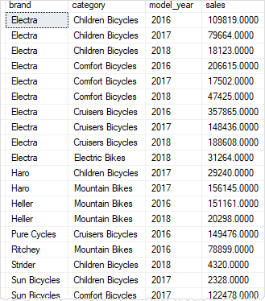

# Day 5
💥 🔹
## 💛 Session 07- Azure SQL


### 💥 Giới thiệu SQL Azure

SQL Azure là một dịch vụ cơ sở dữ liệu quan hệ dựa trên đám mây, thúc đẩy các công nghệ SQL Server hiện có. Microsoft SQL Azure mở rộng chức năng của Microsoft SQL Server để phát triển các ứng dụng dựa trên web, có khả năng mở rộng và được phân phối. SQL Azure cho phép người dùng thực hiện các truy vấn quan hệ, hoạt động tìm kiếm và đồng bộ hóa dữ liệu với người dùng di động và các office từ xa. SQL Azure có thể lưu trữ và lấy cả dữ liệu có cấu trúc và phi cấu trúc.


Quy trình hoạt động của SQL Azure được giải thích trong mô hình như được trình bày bên dưới:


### 💥  Mô hình hoạt động của SQL Azure

Ba đối tượng cốt lõi trong mô hình hoạt động của SQL Azure như sau:

1. Tài khoản

Đầu tiên phải tạo một tài khoản SQL Azure. Tài khoản này được tạo ra cho mục đích thanh toán. Thuê bao tài khoản được ghi lại và đo lường, được tính tiền theo lượng sử dụng. Sau khi tài khoản người dùng được tạo ra, các yêu cầu cần phải được cung cấp cho cơ sở dữ liệu SQL Azure, bao gồm số lượng cơ sở dữ liệu cần thiết, kích thước cơ sở dữ liệu, v.v...

2. Server

Máy chủ SQL Azure là đối tượng giúp tương tác giữa tài khoản và cơ sở dữ liệu. Sau khi tài khoản được đăng ký, cơ sở dữ liệu được cấu hình sử dụng máy chủ SQL Azure. Các thiết lập khác như thiết lập tường lửa và gán tên miền (DNS) cũng được cấu hình trong máy chủ SQL Azure.

3. Database

Cơ sở dữ liệu SQL Azure lưu trữ tất cả dữ liệu theo cách tương tự như bất kỳ cơ sở dữ liệu SQL Server tại chỗ. Mặc dù lưu trữ bằng công nghệ đám mây, cơ sở dữ liệu SQL Azure có tất cả các chức năng của một RDBMS bình thường như table, view, query, function, thiết lập bảo mật, v.v...

Ngoài những đối tượng cốt lõi thì còn một đối tượng bổ sung trong SQL Azure. Đối tượng này là công nghệ Đồng bộ dữ liệu SQL Azure. Công nghệ Đồng bộ dữ liệu SQL Azure được xây dựng trên Microsoft Sync Framework và cơ sở dữ liệu SQL Azure.

SQL Azure Data Sync giúp đồng bộ hóa dữ liệu trên SQL Server cục bộ với các dữ liệu trên SQL Azure như được trình bày trong hình dưới:

Data Sync còn có khả năng quản lý dữ liệu giúp chia sẻ dữ liệu dễ dàng giữa các cơ sở dữ liệu SQL khác nhau. Data Sync không chỉ được sử dụng để đồng bộ hóa tại chỗ với SQL Azure, mà còn để đồng bộ hóa một tài khoản SQL Azure với tài khoản khác.

### 💥  Các lợi ích của SQL Azure

1. Chi phí thấp hơn

SQL Azure cung cấp một số hàm tương tự như trên SQL Server tại chỗ với chi phí thấp hơn so với SQL Server tại chỗ. Ngoài ra, khi SQL Azure trên nền tảng đám mây, nó có thể được truy cập từ bất kỳ vị trí nào. Do đó, không có thêm chi phí cần thiết để phát triển một cơ sở hạ tầng CNTT chuyên dụng và phòng ban để quản lý cơ sở dữ liệu.

2. Sử dụng TDS

TDS được sử dụng trong các cơ sở dữ liệu SQL Server tại chỗ cho các thư viện máy khách. Do đó, hầu hết các nhà phát triển đã quen thuộc với TDS và cách sử dụng tiện ích này. Cùng một loại giao diện TDS được sử dụng trong SQL Azure để xây dựng các thư viện máy khách. Do đó, các nhà phát triển làm việc trên SQL Azure dễ dàng hơn

3. Biện pháp chuyển đổi dự phòng tự động

SQL Azure lưu trữ nhiều bản sao dữ liệu trên các vị trí vật lý khác nhau. Thậm chí khi có lỗi phần cứng do sử dụng nhiều hoặc tải quá mức, SQL Azure giúp duy trì các hoạt động kinh doanh bằng cách cung cấp khả năng sẵn sàng của dữ liệu thông qua các địa điểm vật lý khác.

4. Tính linh hoạt trong việc sử dụng dịch vụ

Ngay cả các tổ chức nhỏ cũng có thể sử dụng SQL Azure bởi mô hình định giá cho SQL Azure được dựa trên khả năng lưu trữ được tổ chức sử dụng. Nếu tổ chức cần lưu trữ nhiều hơn, giá có thể thay đổi cho phù hợp với nhu cầu. Điều này giúp các tổ chức có được sự linh hoạt trong việc đầu tư tùy thuộc vào việc sử dụng dịch vụ.

5. Hỗ trợ Transact-SQL

Do SQL Azure hoàn toàn dựa trên mô hình cơ sở dữ liệu quan hệ, nó cũng hỗ trợ các hoạt động và truy vấn Transact-SQL. Khái niệm này cũng tương tự như hoạt động của các SQL Server tại chỗ. Do đó, các quản trị viên không cần bất kỳ đào tạo hoặc hỗ trợ bổ sung nào để sử dụng SQL Azure

### 💥  Sự khác biệt giữa SQL Azure và SQL Server

Một số khác biệt quan trọng khác giữa SQL Azure và SQL Server phía khách hàng như sau:

- Các công cụ – SQL Server phía khách hàng cung cấp một số công cụ để theo dõi và quản lý. Tất cả những công cụ này có thể không được hỗ trợ bởi SQL Azure bởi có một số tập hợp công cụ hạn chế có sẵn trong phiên bản này
- Sao lưu – Sao lưu và phục hồi chức năng phải được hỗ trợ trong SQL Server phía khách hàng để khắc phục thảm họa. Đối với SQL Azure, do tất cả các dữ liệu là trên nền tảng điện toán đám mây, sao lưu và phục hồi là không cần thiết
- Câu lệnh USE – Câu lệnh USE không được SQL Azure hỗ trợ. Do đó, người dùng không thể chuyển đổi giữa các cơ sở dữ liệu trong SQL Azure so với SQL Server phía khách hàng.
- Xác thực – SQL Azure chỉ hỗ trợ xác thực SQL Server và SQL Server phía khách hàng hỗ trợ cả xác thực SQL Server và xác thực của Windows
Hỗ trợ Transact-SQL – Không phải tất cả các chức năng - Transact-SQL đều được SQL Azure hỗ trợ
Tài khoản và đăng nhập – Trong SQL Azure, các tài khoản quản trị được tạo ra trong cổng thông tin quản lý Azure. Do đó, không có thông tin đăng nhập người dùng mức thể hiện cấp riêng biệt
- Tường lửa – Các thiết lập tường lửa cho các cổng và địa chỉ IP cho phép có thể được quản lý trên máy chủ vật lý cho SQL Server phía khách hàng. Bởi cơ sở dữ liệu SQL Azure có mặt trên điện toán đám mây, xác thực thông qua các thông tin đăng nhập là phương pháp duy nhất để xác minh người dùng


## 💛 Session 08- Accessing Data

Chi tiết xem link: https://documents.aptech.io/docs/aptech-mssql/A.Presentations/session-08


### 💥 Câu lệnh SELECT

Trong SQL SELECT là câu lệnh phức tạp nhất, bởi nó có thể kết hợp thêm nhiều mệnh đề khác để truy vấn đến kết quả cuối cùng mong muốn.

Dưới đây là cú pháp đầy đủ của câu lệnh SELECT trong SQL Server:

```sql
SELECT [DISTINCT | ALL]
    [TOP (expression) [PERCENT] [WITH TIES]]
    column1, column2, ...
FROM
    table_name
[WITH (table_hint [,...])]
[WHERE condition]
[GROUP BY grouping_column1, grouping_column2, ...]
[HAVING search_condition]
[ORDER BY order_column1 [ASC | DESC], order_column2 [ASC | DESC], ...]
[OFFSET {integer_constant | offset_row_count_expression} {ROW | ROWS}]
    [FETCH {FIRST | NEXT} {integer_constant | fetch_row_count_expression} {ROW | ROWS} ONLY]
[OPTION (query_hint [,...])];
```

Giải thích các thành phần chính của cú pháp:

- DISTINCT: Lọc các giá trị trùng lặp trong kết quả.
- ALL: Trả về tất cả các giá trị, bao gồm cả các giá trị trùng lặp.
- TOP: Xác định số lượng bản ghi đầu tiên được trả về.
- PERCENT: Xác định số phần trăm bản ghi đầu tiên được trả về.
- WITH TIES: Bao gồm các bản ghi có giá trị cuối cùng tương đương với bản ghi cuối cùng trong phạm vi TOP.
- column1, column2, ...: Các cột hoặc biểu thức được chọn để trả về.
- FROM: Xác định bảng hoặc các bảng được truy vấn.
- WHERE: Xác định điều kiện để lọc bản ghi.
- GROUP BY: Nhóm các bản ghi dựa trên các cột được chỉ định.
- HAVING: Xác định điều kiện cho nhóm bản ghi.
- ORDER BY: Xác định thứ tự sắp xếp của kết quả.
- OFFSET-FETCH: Xác định số hàng bỏ qua và số hàng trả về từ kết quả.
- OPTION: Xác định các gợi ý thực thi cho câu lệnh.

Lưu ý rằng không phải tất cả các thành phần đều bắt buộc trong một câu lệnh SELECT. Bạn có thể điều chỉnh cú pháp để phù hợp với yêu cầu truy vấn cụ thể của mình.

#### 🔹 SELECT * - Lấy tất cả

Lấy tất cả các column từ table `categories`
```sql
SELECT * FROM [dbo].[categories]
```

Lưu ý: Khi chạy thực tế, hạn chế dùng cách này vì nó có thể dẫn đến lổ hỏng bảo mật: https://www.w3schools.com/sql/sql_injection.asp


#### 🔹 SELECT cụ thể columns cần lấy

Ví dụ: Lấy Column Id, first_name, last_name từ table `customers`

```sql
SELECT [customer_id], [first_name], [last_name] FROM [dbo].[customers]
```

#### 🔹 SELECT với một biểu thức

Ví dụ: Dựa vào first_name, last_name hãy tạo một cột FullName khi lấy.

```sql
SELECT [customer_id], [first_name], [last_name], [first_name] + ' ' + [last_name] AS FullName FROM [dbo].[categories]
```

- Nối 2 cột bằng toán tử +
- Dùng mệnh đề AS để đặt tên / Đổi tên cho một Cột


#### 🔹 SELECT với mệnh đề WHERE

- Dùng khi bạn muốn truy vấn muốn nhận kết quả dựa vào điều kiện nào đó.
- Thông thường kết hợp cùng các toán tử

**Các phép toán lô-gíc (logical)**

*   AND: dùng để kết hợp các mệnh đề với nhau, trả về TRUE nếu tất cả các mệnh đề đều đúng.
*   OR: dùng để kết hợp các mệnh đề với nhau, trả về TRUE nếu một trong các mệnh đề đúng.
*   NOT: dùng để phủ định kết quả của mệnh đề.
*   LIKE: dùng để so sánh một giá trị với một chuỗi ký tự.
*   IN: dùng để kiểm tra xem một giá trị có nằm trong một danh sách các giá trị hay không.
*   BETWEEN: value1 AND value2 dùng để kiểm tra xem một giá trị có nằm trong một khoảng giá trị hay không.
*   EXISTS: dùng để kiểm tra sự tồn tại của một bản ghi trong một bảng con.
*   ANY: dùng để so sánh với một danh sách các giá trị và trả về TRUE nếu bất kỳ giá trị nào trong danh sách đó khớp với giá trị được so sánh.
*   SOME: cũng tương tự như ANY, nó cũng dùng để so sánh với một danh sách các giá trị và trả về TRUE nếu bất kỳ giá trị nào trong danh sách đó khớp với giá trị được so sánh.
*   ALL: dùng để so sánh với một danh sách các giá trị và trả về TRUE nếu tất cả các giá trị trong danh sách đó khớp với giá trị được so sánh.

**Các phép toán so sánh (comparison)**

`=` `<>` `!=` `>` `>=` `<` `<=`


Ví dụ: Tìm những sản phẩm có giá bán >= 50.000

```sql
SELECT * FROM products WHERE price >= 500000
```
Ví dụ: Tìm những sản phẩm có giá bán >= 20.000 và <= 50.000

```sql
SELECT * FROM products WHERE price >= 200000 AND price <= 500000
```

Ví dụ: Tìm những sản phẩm có discount = 10 hoặc 20

```sql
SELECT * FROM products WHERE discount = 10 OR discount = 20
```

Ví dụ: Tìm những sản phẩm được nhập mô tả Description (Tức khác NULL)

```sql
SELECT * FROM products WHERE Description IS NOT NULL
```

Ví dụ: Tìm những sản phẩm thuộc danh mục có ID 2 hoặc 3

```sql
SELECT * FROM products WHERE category_id IN (2,3)
--Câu lệnh trên tương đương với toán tử OR
SELECT * FROM products WHERE category_id = 2 OR category_id = 3
```

Ví dụ: Tìm những đơn đặt hàng từ 2016-01-01 - 2016-05-01


```sql
SELECT *
FROM orders
WHERE order_date BETWEEN '2016-01-01' AND '2016-03-01';


--- Chuyển đổi chuỗi sang kiểu ngày
SELECT *
FROM orders
WHERE order_date BETWEEN CONVERT(DATE, '2016-01-01') AND CONVERT(DATE, '2016-03-01');


--- Ép kiểu: chuỗi --> Date
SELECT *
FROM orders
WHERE order_date BETWEEN CAST('2016-01-01' AS DATE) AND CAST('2016-03-01' AS DATE);
```

Ví dụ: Tìm tên khách hàng có số điện thoại đuôi 678

```sql
SELECT *
FROM customers
WHERE phone LIKE '%478'
```

Dưới đây là một bảng giải thích các ký tự đại diện (wildcard) phổ biến được sử dụng với LIKE:

| Ký tự đại diện (Wildcard) | Mô tả                                                                                     |
|-------------------------|------------------------------------------------------------------------------------------|
| %                       | Đại diện cho bất kỳ chuỗi ký tự nào (bao gồm cả chuỗi rỗng)                               |
| _                       | Đại diện cho bất kỳ ký tự đơn lẻ nào                                                          |
| [character_list]        | Đại diện cho bất kỳ ký tự nào trong danh sách các ký tự được chỉ định                            |
| [^character_list]       | Đại diện cho bất kỳ ký tự nào không nằm trong danh sách các ký tự được chỉ định                 |
| [range_of_characters]   | Đại diện cho bất kỳ ký tự nào nằm trong một khoảng các ký tự được chỉ định                       |

Ví dụ về việc sử dụng wildcard trong mệnh đề LIKE:

- `WHERE column_name LIKE 'A%'`: Tìm tất cả các giá trị trong cột "column_name" bắt đầu bằng "A".
- `WHERE column_name LIKE '%B'`: Tìm tất cả các giá trị trong cột "column_name" kết thúc bằng "B".
- `WHERE column_name LIKE '%C%'`: Tìm tất cả các giá trị trong cột "column_name" chứa "C" ở bất kỳ vị trí nào.
- `WHERE column_name LIKE '_D%'`: Tìm tất cả các giá trị trong cột "column_name" có chữ cái đầu tiên là bất kỳ ký tự nào, sau đó là "D".
- `WHERE column_name LIKE '[ABC]%'`: Tìm tất cả các giá trị trong cột "column_name" bắt đầu bằng "A", "B" hoặc "C".
- `WHERE column_name LIKE '[^XYZ]%'`: Tìm tất cả các giá trị trong cột "column_name" không bắt đầu bằng "X", "Y" hoặc "Z".
- `WHERE column_name LIKE '[A-Z]%'`: Tìm tất cả các giá trị trong cột "column_name" bắt đầu bằng một ký tự trong khoảng từ "A" đến "Z".

Lưu ý rằng mệnh đề LIKE được sử dụng trong câu lệnh SELECT của SQL để tìm kiếm các giá trị phù hợp với mẫu chuỗi được chỉ định.


#### 🔹 SELECT với mệnh đề ORDER BY

- Dùng để sắp xếp kết quả truy vấn theo một hoặc nhiều cột.
- Mặc định sắp xếp theo thứ tự tăng dần (ASC), nhưng bạn cũng có thể chỉ định thứ tự giảm dần (DESC).

Ví dụ: Sắp xếp tất cả các khách hàng theo `first_name` tăng dần:

```sql
SELECT
    first_name,
    last_name
FROM
    customers
ORDER BY
    first_name; --Mặc định không set thì là ASC
```

Ví dụ: Sắp xếp tất cả các khách hàng theo `first_name` giảm dần:

```sql
SELECT
    first_name,
    last_name
FROM
    customers
ORDER BY
    first_name DESC;
```


Ví dụ: Sắp xếp theo thành phố, first_name, last_name

```sql
-- Sắp xếp theo nhiều column
SELECT
    city,
    first_name,
    last_name
FROM
   customers
ORDER BY
    city,
    first_name;
```

#### 🔹 SELECT với mệnh đề OFFSET-FETCH

- Dùng để phân trang kết quả truy vấn.
- Mệnh đề OFFSET xác định số hàng bỏ qua từ kết quả `bắt đầu` trả về.
- Mệnh đề FETCH xác định số hàng trả về từ kết quả.

Cú pháp:

```sql
ORDER BY column_list [ASC |DESC]
OFFSET offset_row_count {ROW | ROWS}
FETCH {FIRST | NEXT} fetch_row_count {ROW | ROWS} ONLY
```


Ví dụ: Truy vấn tất cả các sản phẩm và bỏ qua 10 hàng đầu tiên:

```sql
SELECT
    product_name,
    price
FROM
    dbo.products
ORDER BY
    price,
    product_name 
OFFSET 10 ROWS;
```
Ví dụ: bỏ qua 10 hàng đầu tiên, và lấy 10 dòng tiếp theo:

```sql
SELECT
    product_name,
    price
FROM
    dbo.products
ORDER BY
    price,
    product_name 
OFFSET 10 ROWS 
FETCH NEXT 10 ROWS ONLY;
```

Lưu ý: Mệnh đề OFFSET-FETCH chỉ được hỗ trợ từ SQL Server 2012 (bao gồm cả SQL Server 2012) trở đi.

Xem thêm: https://www.sqlservertutorial.net/sql-server-basics/sql-server-offset-fetch/


#### 🔹 SELECT với mệnh đề DISTINCT

Dùng để loại bỏ các giá trị trùng lặp trong kết quả truy vấn.

```sql
--- Lấy danh sách city từ Table customers
SELECT city
FROM customers
ORDER BY city ASC
---
--- Kết quả trùng lặp các giá trị và bạn muốn khử trùng lặp thì dùng DISTINCT
---

SELECT DISTINCT city
FROM customers
ORDER BY city ASC
```


Nếu bạn chỉ định nhiều cột, mệnh đề DISTINCT sẽ đánh giá sự trùng lặp dựa trên sự kết hợp các giá trị của các cột này.

```sql
SELECT 
	city, 
	state, 
	zip_code
FROM 
	customers
GROUP BY 
	city, state, zip_code
ORDER BY
	city, state, zip_code;
```

Xem thêm: https://www.sqlservertutorial.net/sql-server-basics/sql-server-select-distinct/

#### 🔹 SELECT với mệnh đề TOP & TOP PERCENT

Mệnh đề SELECT TOP được sử dụng để chỉ định số lượng bản ghi cần trả về.

Ví dụ: Lấy 10 bản ghi đầu tiên trong kết quả trả về table products

```sql
SELECT TOP 10 * 
FROM products
```

Ví dụ lấy 5% số lượng bản từ table products

```sql
--- Ngẩu nhiên --> Mang tính tương đối
SELECT TOP 5 PERCENT * 
FROM products
```

#### 🔹 SELECT với mệnh đề WITH TIES

Mệnh đề WITH TIES được sử dụng trong câu lệnh ORDER BY của SQL để bao gồm các hàng có giá trị "ràng buộc" (ties) trong kết quả sắp xếp. Một "ràng buộc" xảy ra khi hai hoặc nhiều hàng có giá trị sắp xếp bằng nhau theo cùng một tiêu chí.

Khi sử dụng WITH TIES, các hàng có giá trị "ràng buộc" sẽ được bao gồm trong kết quả cuối cùng của câu lệnh ORDER BY, chứ không chỉ có các hàng có giá trị duy nhất.

```sql
SELECT TOP 10 WITH TIES product_id, name, price 
FROM products
ORDER BY price DESC
```


#### 🔹 SELECT với mệnh đề GROUP BY,GROUP BY với HAVING

Mệnh đề GROUP BY dùng để nhóm các hàng dữ liệu thành các nhóm dựa trên giá trị của một hoặc nhiều cột. Nó cho phép bạn thực hiện các phép tính tổng hợp (aggregate) trên các nhóm dữ liệu này.

Khi sử dụng GROUP BY, dữ liệu sẽ được phân chia thành các nhóm dựa trên giá trị của cột được chỉ định trong mệnh đề GROUP BY. Các bản ghi có giá trị giống nhau trong cột này sẽ thuộc cùng một nhóm.

Ví dụ: Lấy tất cả các mức giảm giá discount của sản phẩm theo thứ tự tăng dần.

```sql
SELECT discount
FROM products
GROUP BY discount
ORDER BY discount ASC
--- Câu lệnh này tương đương bạn dùng DISTINCT
```

Ví dụ: Lấy tất cả các mức giảm giá discount của sản phẩm theo thứ tự tăng dần, đồng thời thống kê số lượng sản phẩm có mức giảm giá đó.


```sql
SELECT 
  discount, 
  COUNT(Id) AS Total --- Đếm dựa vào ID và đặt tên là Total
FROM products
GROUP BY discount
ORDER BY discount ASC
```

Ví dụ: Lấy tất cả các mức giảm giá discount của sản phẩm theo thứ tự tăng dần, đồng thời thống kê số lượng sản phẩm có mức giảm giá đó. Chỉ lấy những mức discount >= 5

```sql
SELECT 
  discount, 
  COUNT(Id) AS Total --- Đếm dựa vào ID và đặt tên là Total
FROM products
GROUP BY discount
HAVING discount >= 5 --- Lọc sau khi nhóm xong
ORDER BY discount ASC
```

Ví dụ: Thống kê số lượng đơn hàng khách hàng đã mua theo năm.

```sql
SELECT
    customer_id,
    YEAR (order_date),
    COUNT (order_id) order_count
FROM
    orders
GROUP BY
    customer_id,
    YEAR (order_date)
HAVING
    COUNT (order_id) >= 2
ORDER BY
    customer_id;
```


#### 🔹 SELECT với mệnh đề INTO

Dùng để tạo bảng mới từ kết quả truy vấn

```sql
SELECT * INTO customersBackup2019
FROM customers;
```

Bạn có thể tận dụng tính năng này để backup một table

#### 🔹 SELECT Không có FROM

```sql
-- Trả về ngày hiện tại
SELECT GETDATE() 
-- Lấy 3 kí tự bên trái của chuỗi
SELECT LEFT('SQL Tutorial', 3) AS ExtractString;
-- Chuyển chuỗi thành kí tự thường
SELECT LOWER('SQL Tutorial is FUN!');
```


## 💛 Session 09- Advanced Queries and Joins - Part 1

### 💥 GROUP BY với WHERE

Mục đích của GROUP BY là nhóm các bản ghi có cùng giá trị của một hoặc nhiều cột. Khi kết hợp với WHERE, GROUP BY sẽ nhóm các bản ghi thỏa mãn điều kiện của WHERE.


Ví dụ: Liệt kê danh sách giảm giá của những sản phẩm có giá trên 2000

```sql
SELECT 
  discount, 
  COUNT(Id) AS Total --- Đếm dựa vào ID và đặt tên là Total
FROM products
WHERE price > 20000
GROUP BY discount
ORDER BY discount ASC
```

Câu lệnh sẽ chạy mệnh đề WHERE trước, lọc ra những sản phẩm có giá > 2000 trước khi đem đi GROUP BY


### 💥 GROUP BY với NULL

Khi bạn sử dụng mệnh đề GROUP BY và có giá trị NULL trong cột được nhóm, các bản ghi với giá trị NULL sẽ được gom vào một nhóm duy nhất. Điều này có nghĩa là tất cả các bản ghi có giá trị NULL trong cột được nhóm sẽ tồn tại trong một nhóm riêng biệt.

Ví dụ: Lấy danh sách thành phố của khách hàng đã đặt hàng.

```sql
SELECT shipping_city
FROM orders
GROUP BY shipping_city
ORDER BY shipping_city
```

Bạn sẽ thấy giá trị NULL được liệt kê ra ở đầu danh sách.


### 💥 GROUP BY với ALL

Trong SQL Server, mệnh đề GROUP BY ALL được sử dụng để áp dụng phép nhóm cho tất cả các bản ghi trong bảng, bao gồm cả các bản ghi trùng lặp. Điều này có nghĩa là tất cả các bản ghi sẽ được coi là cùng một nhóm.

Dưới đây là một ví dụ để hiểu cách sử dụng mệnh đề GROUP BY ALL trong SQL Server:

Giả sử bạn có một bảng "Orders" với các cột "order_id", "customer_id" và "order_amount". Bạn muốn tính tổng số lượng đơn hàng và tổng số tiền cho tất cả các đơn hàng, bao gồm cả các đơn hàng trùng lặp:

```sql
SELECT order_id, customer_id, SUM(order_amount) AS TotalAmount
FROM orders
GROUP BY ALL order_id, customer_id;
```

Trong ví dụ trên, mệnh đề GROUP BY ALL được sử dụng để áp dụng phép nhóm cho tất cả các bản ghi trong bảng "orders". Kết quả trả về sẽ bao gồm tất cả các cặp order_id và customer_id có trong bảng, bất kể chúng có trùng lặp hay không. Tổng số tiền cho mỗi cặp order_id và customer_id sẽ được tính bằng hàm SUM(TotalAmount).

Lưu ý rằng mệnh đề GROUP BY ALL không phổ biến và thường không được sử dụng trong các trường hợp thông thường. Nó cung cấp một cách để xử lý các bản ghi trùng lặp trong quá trình nhóm dữ liệu.

### 💥 GROUPING SETS

là một cú pháp mở rộng của mệnh đề GROUP BY để cho phép bạn `nhóm dữ liệu theo nhiều tập hợp khác nhau trong một câu truy vấn duy nhất`. Nó cho phép bạn tạo các kết quả tổng hợp từ các nhóm dữ liệu khác nhau một cách thuận tiện.

Với GROUPING SETS, bạn có thể chỉ định một danh sách các cột hoặc biểu thức nhóm để tạo các tập hợp nhóm khác nhau. Cú pháp của GROUPING SETS như sau:

```sql
SELECT 
    column1, column2, ..., aggregate_function(column)
FROM table
GROUP BY 
    GROUPING SETS (column1, column2, ..., ())
```

Tìm hiểu qua ví dụ

Tạo một table mới `dbo.sales_summary`

```sql
SELECT
    b.brand_name AS brand,
    c.category_name AS category,
    p.model_year,
    round(
        SUM (
            i.quantity * i.price * (1 - i.discount)
        ),
        0
    ) sales INTO dbo.sales_summary
FROM
    dbo.order_items i
INNER JOIN dbo.products p ON p.product_id = i.product_id
INNER JOIN dbo.brands b ON b.brand_id = p.brand_id
INNER JOIN dbo.categories c ON c.category_id = p.category_id
GROUP BY
    b.brand_name,
    c.category_name,
    p.model_year
ORDER BY
    b.brand_name,
    c.category_name,
    p.model_year;
```
Bạn sẽ nhận được một bảng dữ liệu tổng hợp doanh thu theo `brand`, `categories` và `year_model`



Ví dụ: Từ đó hãy, Truy vấn trả về số tiền bán được nhóm theo thương hiệu và danh mục:

```sql
SELECT
    brand,
    category,
    SUM (sales) sales
FROM
    dbo.sales_summary
GROUP BY
    brand,
    category
ORDER BY
    brand,
    category;
```

Tương tự vậy: Chỉ nhóm theo `brand`

```sql
SELECT
    brand,
    SUM (sales) sales
FROM
    dbo.sales_summary
GROUP BY
    brand
ORDER BY
    brand;
```

Tương tự vậy: Chỉ nhóm theo `categories`

```sql
SELECT
    category,
    SUM (sales) sales
FROM
    dbo.sales_summary
GROUP BY
    category
ORDER BY
    category;
```
Và một nhóm tổng hợp: tổng doanh thu của tất cả `brand` và `categories`

```sql
SELECT
    SUM (sales) sales
FROM
    dbo.sales_summary;
```

Như vậy chúng ta có 4 nhóm dữ liệu:

```sql
(brand, category)
(brand)
(category)
()
```
Để có một báo cáo tổng hợp thông tin 4 nhóm trên bạn có thể dùng mệnh đề `UNION ALL` để nối lại như sau:

```sql
SELECT
    brand,
    category,
    SUM (sales) sales
FROM
    dbo.sales_summary
GROUP BY
    brand,
    category
UNION ALL
SELECT
    brand,
    NULL,
    SUM (sales) sales
FROM
    dbo.sales_summary
GROUP BY
    brand
UNION ALL
SELECT
    NULL,
    category,
    SUM (sales) sales
FROM
    dbo.sales_summary
GROUP BY
    category
UNION ALL
SELECT
    NULL,
    NULL,
    SUM (sales)
FROM
    dbo.sales_summary
ORDER BY brand, category;
```

==> Nhược điểm: Câu lênh truy vấn dài, phức tạp, hiệu suất truy vấn chậm

==> Bạn có thể fix vấn đề này bằng cách dùng GROUP với `GROUPING SETS`

```sql
SELECT
	brand,
	category,
	SUM (sales) sales
FROM
	dbo.sales_summary
GROUP BY
	GROUPING SETS (
		(brand, category),
		(brand),
		(category),
		()
	)
ORDER BY
	brand,
	category;
```
Hàm GROUPING cho biết liệu một cột được chỉ định trong mệnh đề GROUP BY có được tổng hợp hay không. Nó trả về 1 nếu được tổng hợp hoặc 0 nếu không được tổng hợp trong tập kết quả.

```sql
SELECT
    GROUPING(brand) grouping_brand,
    GROUPING(category) grouping_category,
    brand,
    category,
    SUM (sales) sales
FROM
    sales.sales_summary
GROUP BY
    GROUPING SETS (
        (brand, category),
        (brand),
        (category),
        ()
    )
ORDER BY
    brand,
    category;
```

Giá trị trong cột grouping_brand cho biết hàng có được tổng hợp hay không, 1 nghĩa là số tiền bán hàng được tổng hợp theo thương hiệu, 0 có nghĩa là số tiền bán hàng không được tổng hợp theo thương hiệu. Khái niệm tương tự được áp dụng cho cột grouping_category.

### 💥 GROUP BY với CUBE

Cú pháp CUBE sẽ tạo ra tất cả các tổ hợp có thể của các cột được chỉ định, bao gồm các nhóm theo từng cột riêng lẻ, các nhóm con của từng cột, các nhóm con của các tổ hợp cột, và tổng hợp toàn bộ dữ liệu.

Hay nói dễ hiểu hơn `CUBE` là cú pháp ngắn gọn để làm `GROUPING SETS`

```sql
SELECT
    d1,
    d2,
    d3,
    aggregate_function (c4)
FROM
    table_name
GROUP BY
    GROUPING SETS (
        (d1,d2,d3), 
        (d1,d2),
        (d1,d3),
        (d2,d3),
        (d1),
        (d2),
        (d3), 
        ()
     );
```
Rất dài dòng, thay về thì dùng ngay `CUBE`

```sql
SELECT
    d1,
    d2,
    d3,
    aggregate_function (c4)
FROM
    table_name
GROUP BY
    CUBE (d1, d2, d3); -- Rút gọn lại còn 1 dòng
```

Từ ví dụ trên có thể rút gọn lại, cho kết quả giống nhay

```sql
SELECT
    brand,
    category,
    SUM (sales) sales
FROM
    dbo.sales_summary
GROUP BY
    CUBE(brand, category)
ORDER BY
	brand,
	category;
```


### 💥 GROUP BY với ROLLUP

ROLLUP là một mệnh đề con của mệnh đề GROUP BY cung cấp cách viết tắt để xác định nhiều nhóm nhóm. Không giống như mệnh đề con CUBE, ROLLUP không tạo ra tất cả các tập hợp nhóm có thể có dựa trên các cột thứ nguyên; CUBE tạo ra một tập hợp con trong số đó.

Khi tạo các tập hợp nhóm, ROLLUP giả định một hệ thống phân cấp giữa các cột thứ nguyên và chỉ tạo các tập hợp nhóm dựa trên hệ thống phân cấp này.

ROLLUP thường được sử dụng để tạo subtotals và totals cho mục đích báo cáo.

`CUBE (d1,d2,d3)` định nghĩa ra `8` grouping sets:

```sql
(d1, d2, d3)
(d1, d2)
(d2, d3)
(d1, d3)
(d1)
(d2)
(d3)
()
```
Trong khi `ROLLUP(d1,d2,d3)` tạo `4` grouping sets, theo cấu trúc phân cấp d1 > d2> d3

```sql
(d1, d2, d3)
(d1, d2)
(d1)
()
```

Cú pháp:

```sql
SELECT
    d1,
    d2,
    d3,
    aggregate_function(c4)
FROM
    table_name
GROUP BY
    ROLLUP (d1, d2, d3);
```

Nối tiếp ví dụ trên 

```sql
SELECT
    brand,
    category,
    SUM (sales) sales
FROM
    dbo.sales_summary
GROUP BY
    ROLLUP(brand, category);
```
Kết quả được canh theo cột brand:  brand > category


### 💥 GROUP BY WITH Aggregate Function

Khi kết hợp với các hàm tổng hợp như COUNT, SUM, AVG, MIN, MAX, GROUP BY sẽ nhóm các bản ghi có cùng giá trị của một hoặc nhiều cột và tính toán các hàm tổng hợp trên các nhóm này.

#### 🔹 COUNT

Dùng để đếm số lượng bản ghi trong một nhóm.

```sql
-- Đếm số lượng sản phẩm theo từng loại giá
SELECT
    price,
    COUNT(product_id) AS 'NumberOfProducts'
FROM products
GROUP BY price
```

#### 🔹 SUM

Dùng để tính tổng các giá trị trong một cột.

```sql
-- Tính tổng số lượng tồn kho theo từng nhóm category_id
SELECT
    category_id, 
    SUM(Stock) AS 'total_stock'
FROM products
GROUP BY category_id
```

#### 🔹 MIN

Dùng để lấy giá trị nhỏ nhất của các giá trị trong một cột.

```sql
-- Hiển thị sản phẩm có giá thấp nhất theo từng nhóm category_id
SELECT
    category_id, 
    MIN(price) AS 'min_price'
FROM products
GROUP BY category_id
```

#### 🔹 MIN

Dùng để lấy giá trị lớn nhất của các giá trị trong một cột.

```sql
-- Hiển thị sản phẩm có giá cao nhất theo từng nhóm category_id
SELECT
    category_id, 
    MAX(price) AS 'max_price'
FROM products
GROUP BY category_id
```

### 💥 Sub Query

Subquery (hoặc còn gọi là inner query hoặc nested query) là một câu truy vấn SELECT được nhúng bên trong một câu truy vấn khác. Nó cho phép bạn sử dụng kết quả của một câu truy vấn như là một tập dữ liệu đầu vào cho câu truy vấn chính.

Ví dụ: Liệt kê danh sách danh mục kèm số lượng sản phẩm có trong danh mục đó


```sql
SELECT
  c.*, (SELECT COUNT(product_id) FROM dbo.products AS P WHERE p.category_id = c.product_id) AS 'number_product'
FROM dbo.categories AS c
```

Ví dụ, bạn có thể sử dụng subquery để tìm tất cả các khách hàng có đơn hàng với tổng giá trị lớn hơn một ngưỡng nào đó:

```sql
SELECT customer_name
FROM dbo.customers
WHERE customer_id IN (
    SELECT customer_id
    FROM dbo.orders
    GROUP BY customer_id
    HAVING SUM(order_amount) > 1000
)
```

Ví dụ: Lấy thông tin đơn hàng của tất cả khách hàng ở `New York`

```sql
SELECT
    order_id,
    order_date,
    customer_id
FROM
    dbo.orders
WHERE
    customer_id IN (
        SELECT
            customer_id
        FROM
            dbo.customers
        WHERE
            city = 'New York'
    )
ORDER BY
    order_date DESC;
```

Để có hiệu suất truy vấn cao hơn, khuyến nghị nên chuyển subquery thành JOIN trong các trường hợp nhất định. Lý do là các hệ quản lý cơ sở dữ liệu thường tối ưu hóa truy vấn JOIN và có thể sử dụng các chỉ mục và kỹ thuật tham gia để tìm kiếm và kết hợp dữ liệu hiệu quả.

#### 🔹 Sub Query and ANY

Cú pháp

```sql
scalar_expression comparison_operator ANY (subquery)
```

- scalar_expression: biểu thức giá trị đơn
- comparison_operator: toán tử so sánh
- subquery: trả về một danh sách (v1, v2, … vn). `ANY` trả về `TRUE` nếu `scalar_expression` thõa điều kiện `comparison_operator` với MỘT TRONG các giá trị từ (v1, v2, … vn). Ngược lại trả về `FALSE`

Ví dụ

```sql
SELECT
    product_name,
    price
FROM
    dbo.products
WHERE
    -- Nếu price >= với bất kì giá trị nào
    -- trong kết quả SELECT thì WHERE thực thi
    price >= ANY (
        SELECT
            AVG (price)
        FROM
            production.products
        GROUP BY
            brand_id
    )
```


#### 🔹 Sub Query and ALL

ALL có cách dùng tương tự nhưng khác một chỗ là khi dùng `ALL` trả về `TRUE` nếu `scalar_expression` thõa điều kiện `comparison_operator` với TẤT CẢ giá trị từ (v1, v2, … vn). Ngược lại trả về `FALSE`


#### 🔹 Sub Query and EXISTS, NOT EXISTS 

Cú pháp

```sql
WHERE [NOT] EXISTS (subquery)
```
EXISTS trả về `TRUE` nếu `subquery` trả về kết quả; ngược lại trả về `FALSE`.

NOT EXISTS phủ định của EXISTS

Ví dụ: Lấy thông tin khách hàng, có đơn hàng mua vào năm 2017.

```sql
SELECT
    customer_id,
    first_name,
    last_name,
    city
FROM
    dbo.customers c
WHERE
    EXISTS (
        -- Đi tìm những khách hàng mua hàng năm 2017
        SELECT
            customer_id
        FROM
            dbo.orders o
        WHERE
            o.customer_id = c.customer_id
        AND YEAR (order_date) = 2017
    )
ORDER BY
    first_name,
    last_name;
```

Xem thêm: https://www.sqlservertutorial.net/sql-server-basics/sql-server-subquery/

---> Còn tiếp ở Day-06