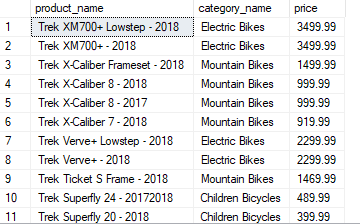
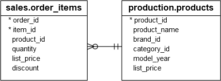
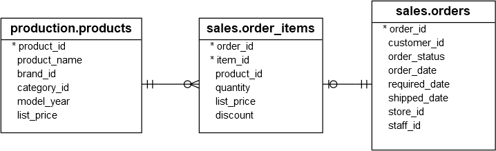
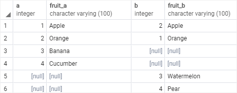
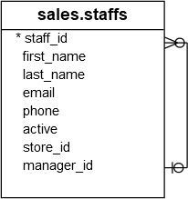
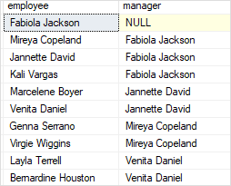
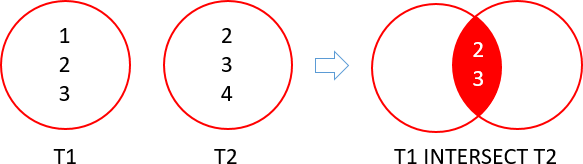
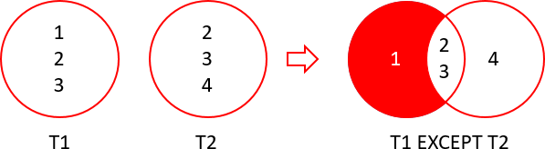

# Day 6
💥 🔹
## 💛 Session 09- Advanced Queries and Joins - Part 2


### 💥 JOINs 

Trong SQL, joins là phép kết hợp các hàng từ hai hoặc nhiều bảng dựa trên một điều kiện kết hợp. Joins cho phép bạn kết hợp dữ liệu từ các bảng liên quan nhau để tạo ra các kết quả kết hợp mới, giúp truy vấn dữ liệu từ nhiều nguồn trở nên linh hoạt và mạnh mẽ hơn.

Tìm hiểu về các phép JOINs qua ví dụ:

```sql
--Tạo bảng a
CREATE TABLE basket_a (
    a INT PRIMARY KEY,
    fruit_a VARCHAR (50) NOT NULL
);
--Tạo bảng b
CREATE TABLE basket_b (
    b INT PRIMARY KEY,
    fruit_b VARCHAR (50) NOT NULL
);
--Chèn dữ liệu vào bảng a
INSERT INTO basket_a (a, fruit_a)
VALUES
    (1, 'Apple'),
    (2, 'Orange'),
    (3, 'Banana'),
    (4, 'Cucumber');
--Chèn dữ liệu vào bảng b
INSERT INTO basket_b (b, fruit_b)
VALUES
    (1, 'Orange'),
    (2, 'Apple'),
    (3, 'Watermelon'),
    (4, 'Pear');
```

#### 🔹 INNER JOIN / JOIN

INNER JOIN là một loại phép nối (join) trong SQL, được sử dụng để kết hợp các hàng từ hai hoặc nhiều bảng dựa trên một điều kiện kết hợp. INNER JOIN chỉ trả về các hàng có giá trị khớp trong `cả hai bảng`.

```sql
SELECT
    a,
    fruit_a,
    b,
    fruit_b
FROM
    basket_a
INNER JOIN basket_b
    ON fruit_a = fruit_b;
```

Kết quả được


Phép nối Inner Join được biểu diễn với sơ đồ  Venn diagram


Ví dụ: Lấy danh sách sản phẩm bao gồm tên sản phẩm, danh mục sản phẩm, giá bán.

```sql
SELECT
    product_name,
    category_name,
    price
FROM
    dbo.products p
INNER JOIN dbo.categories c 
    ON c.category_id = p.category_id -- mối quan hệ giữ 2 bảng
ORDER BY
    product_name DESC;
```

Kết quả



Bảng `products` có trường khóa ngoại `category_id`, dựa vào đó bạn móc nối với Bảng `categories` để lấy tên danh mục dựa vào khóa chính  `category_id`


#### 🔹 OUTER JOIN

OUTER JOIN là một loại phép nối  được sử dụng để kết hợp các hàng từ hai hoặc nhiều bảng dựa trên một điều kiện kết hợp, nhưng khác với INNER JOIN, OUTER JOIN có thể bao gồm các hàng không khớp từ ít nhất một bảng.

Có ba loại OUTER JOIN chính: LEFT OUTER JOIN (hoặc LEFT JOIN), RIGHT OUTER JOIN (hoặc RIGHT JOIN), FULL OUTER JOIN (hoặc FULL JOIN)

#### 🔹 LEFT JOIN

Trả về tất cả các hàng từ bảng bên trái (left table) và các hàng khớp từ bảng bên phải (right table). Nếu không có hàng khớp trong bảng bên phải, các cột từ bảng bên phải sẽ có giá trị NULL trong kết quả.

```sql
SELECT
    a,
    fruit_a,
    b,
    fruit_b
FROM
    basket_a
LEFT JOIN basket_b 
   ON fruit_a = fruit_b;
```

Kết quả


Phép nối Left Join được biểu diễn với sơ đồ  Venn diagram


Ví dụ: Dựa vào mối quan hệ giữ `order_items` và `products` ==> Một sản phẩm có thể nằm trong nhiều đơn hàng



Hãy đưa ra thống kê sản phẩm thuộc đơn hàng nào ?

```sql
SELECT
    product_name,
    order_id
FROM
    dbo.products p
LEFT JOIN dbo.order_items o ON o.product_id = p.product_id
ORDER BY
    order_id;
```

Dựa vào qua hệ giữa 3 bảng sau: Bạn có thể lấy thêm nhiều thông tin hơn, bằng cách kết hợp hơn 1 phép LEFT JOIN.



Hãy đưa ra thống kê sản phẩm thuộc đơn hàng nào, kèm ngày bán ra ?

```sql
SELECT
    p.product_name,
    o.order_id,
    i.item_id,
    o.order_date
FROM
    production.products p
	LEFT JOIN sales.order_items i
		ON i.product_id = p.product_id
	LEFT JOIN sales.orders o
		ON o.order_id = i.order_id
ORDER BY
    order_id;
```


#### 🔹 RIGHT JOIN

Tương tự LEFT OUTER JOIN, nhưng trả về tất cả các hàng từ bảng bên phải (right table) và các hàng khớp từ bảng bên trái (left table). Nếu không có hàng khớp trong bảng bên trái, các cột từ bảng bên trái sẽ có giá trị NULL trong kết quả.

```sql
SELECT
    a,
    fruit_a,
    b,
    fruit_b
FROM
    basket_a
RIGHT JOIN basket_b ON fruit_a = fruit_b;
```

Kết quả


Phép nối Rigth Join được biểu diễn với sơ đồ  Venn diagram


Thực tế phép này ít xài, các lập trình viên có xu hướng chuyển table bên phải qua bên trái rồi dùng LEFT JOIN.

#### 🔹 FULL JOIN

Trả về tất cả các hàng từ cả hai bảng. Nếu không có hàng khớp, các cột tương ứng sẽ có giá trị NULL trong kết quả.

```sql
SELECT
    a,
    fruit_a,
    b,
    fruit_b
FROM
    basket_a
FULL OUTER JOIN basket_b 
    ON fruit_a = fruit_b;
```
Kết quả




Phép nối Full Join được biểu diễn với sơ đồ  Venn diagram


#### 🔹 SEFT JOIN

SELF JOIN là một phép nối mà bạn kết hợp một bảng với chính nó. Nó cho phép bạn kết nối các hàng trong cùng một bảng dựa trên một điều kiện kết hợp, và do đó, tạo ra một tập hợp mới các cặp hàng trong bảng đó.

Cú pháp:

```sql
SELECT t1.column_name, t2.column_name
FROM table_name t1
JOIN table_name t2 ON t1.column = t2.column;
```
Cùng quan sát table `staffs` chúng ta thấy có trường manager_id, là khóa ngoại nằm tham chiếu tới chính table `staffs`



Bạn có thể hiểu trong mô hình cây quản lý nhân sự: cấp trên <==> cấp dưới

Dựa vào trường `manager_id` dễ dàng tìm ra ai là quản lý của một người


```sql
SELECT
    e.first_name + ' ' + e.last_name employee,
    m.first_name + ' ' + m.last_name manager
FROM
    dbo.staffs e
LEFT JOIN dbo.staffs m ON m.staff_id = e.manager_id
ORDER BY
    manager;
```

Kết quả



---

### 💥 Common Table Expressions (CTEs)

Common Table Expression (CTE) là một công cụ trong SQL cho phép bạn tạo ra một bảng tạm thời mà có thể được sử dụng trong câu truy vấn chính. Nó cung cấp một cách để đặt tên và tham chiếu đến một truy vấn con trong câu truy vấn chính, giúp làm cho mã SQL dễ đọc, dễ hiểu và dễ bảo trì.

CTE thường được sử dụng trong các truy vấn phức tạp hoặc truy vấn có cấu trúc lồng nhau, nơi bạn muốn sử dụng kết quả của một truy vấn con nhiều lần hoặc trong các phần khác nhau của câu truy vấn chính.

Cú pháp của CTE bao gồm hai phần chính: phần WITH và phần truy vấn chính.

Phần WITH xác định tên của CTE và các cột (nếu cần) trong CTE. Đây là nơi bạn xác định truy vấn con và đặt tên cho nó. Ví dụ:

```sql
WITH cte_name (column1, column2, ...)
AS (
    -- Truy vấn con
    SELECT column1, column2, ...
    FROM table_name
    WHERE condition
)
```

Phần truy vấn chính sử dụng tên CTE đã định nghĩa trong phần WITH để tham chiếu đến kết quả của truy vấn con. Ví dụ:

```sql
SELECT *
FROM cte_name
WHERE condition;
```

CTE có thể được sử dụng trong nhiều truy vấn khác nhau như SELECT, INSERT, UPDATE, DELETE, hoặc kết hợp với các phép nối (JOIN) và các biểu thức khác trong SQL.

Lợi ích của CTE bao gồm:

1. Mã SQL dễ đọc: CTE giúp tạo ra mã SQL có cấu trúc rõ ràng và dễ đọc hơn, bằng cách tách biệt các phần truy vấn con và truy vấn chính.

2. Tái sử dụng mã: Bạn có thể sử dụng CTE nhiều lần trong cùng một câu truy vấn hoặc trong các câu truy vấn khác nhau, giúp giảm việc lặp lại mã SQL và tăng tính tái sử dụng.

3. Bảo trì dễ dàng: Khi cần thay đổi truy vấn con, bạn chỉ cần chỉnh sửa nó trong phần WITH, và tất cả các truy vấn chính sử dụng CTE sẽ được cập nhật tự động.

Ví dụ: Thống kê doanh thu bán ra theo nhân viên trong năm 2018

```sql
-- Truy vấn và tạo bảng ảo
WITH cte_sales_amounts (staff, sales, year) AS (
    SELECT    
        first_name + ' ' + last_name, 
        SUM(quantity * price * (1 - discount)),
        YEAR(order_date)
    FROM    
        dbo.orders o
    INNER JOIN dbo.order_items i ON i.order_id = o.order_id
    INNER JOIN dbo.staffs s ON s.staff_id = o.staff_id
    GROUP BY 
        first_name + ' ' + last_name,
        year(order_date)
)
-- Câu lệnh SELECT này phải thực hiện đồng thời với câu lệnh trên.
SELECT
    staff, 
    sales
FROM 
    cte_sales_amounts
WHERE
    year = 2018;
```
---

### 💥 Combining Data

#### 🔹 UNION

UNION là một câu lệnh SQL được sử dụng để kết hợp các kết quả của hai hoặc nhiều câu lệnh SELECT thành một tập kết quả duy nhất. Các bản ghi trong các tập kết quả được hợp nhất không có bất kỳ sự trùng lặp nào.


Khi sử dụng UNION trong câu lệnh SQL, dưới đây là một số lưu ý quan trọng mà bạn nên xem xét:

1. Số lượng và kiểu dữ liệu của các cột: Các câu lệnh SELECT trong UNION phải có cùng số lượng cột và cùng kiểu dữ liệu tương ứng. Nếu không, bạn cần sử dụng các biểu thức để đảm bảo rằng các cột có cùng số lượng và kiểu dữ liệu

1. Thứ tự cột: Kết quả của UNION phụ thuộc vào thứ tự của các cột trong câu lệnh SELECT đầu tiên. Vì vậy, hãy đảm bảo rằng các cột trong cả hai câu lệnh SELECT được sắp xếp theo cùng một thứ tự

1. Loại bỏ các bản ghi trùng lặp: UNION tự động loại bỏ các bản ghi trùng lặp trong kết quả cuối cùng. Nếu bạn muốn bao gồm các bản ghi trùng lặp, bạn có thể sử dụng UNION ALL thay vì UNION

1. Sự phù hợp về dữ liệu: Các cột trong các câu lệnh SELECT phải phù hợp về mặt dữ liệu. Ví dụ, cột đầu tiên trong câu lệnh SELECT thứ nhất phải có cùng kiểu dữ liệu với cột đầu tiên trong câu lệnh SELECT thứ hai và ngược lại

1. Hiệu suất: UNION có thể tạo ra một tập kết quả lớn và tốn tài nguyên. Hãy đảm bảo rằng sử dụng UNION chỉ khi cần thiết và kiểm tra hiệu suất của câu lệnh của bạn.


Ví dụ: Nếu kết quả truy vấn thông tin từ table `staffs` và `customer` thành một danh sách:


```sql
SELECT
    first_name, last_name
FROM dbo.staffs
UNION --Loại bỏ giá trị trùng lặp sau khi kết hợp
SELECT
    first_name, last_name
FROM
    dbo.customers;
```

Câu lệnh trên sẽ loại bỏ những records trùng lặp. Nếu bạn không muốn loại bỏ records trùng thì dùng `UNION ALL`

```sql
SELECT
    first_name, last_name
FROM dbo.staffs
UNION ALL -- Giữ giá trị trùng lặp sau khi kết hợp
SELECT
    first_name, last_name
FROM
    dbo.customers;
```

#### 🔹 INTERSECT

Dùng để lấy các bản ghi chung của 2 hoặc nhiều câu lệnh SELECT. Các câu lệnh SELECT phải có cùng số lượng cột và kiểu dữ liệu tương ứng.



Ví dụ có `order_items` và `products` ==> cả 2 đều cho trường product_id.


Dựa vào đó bạn có thể: Lấy ra danh sách những sản phẩm ĐÃ được bán ra.


```sql
SELECT
    product_id
FROM
    dbo.products
INTERSECT
SELECT
    product_id
FROM
    dbo.order_items;
```

#### 🔹 EXCEPT

Dùng để lấy các bản ghi của câu lệnh SELECT đầu tiên mà không có trong các câu lệnh SELECT sau. Các câu lệnh SELECT phải có cùng số lượng cột và kiểu dữ liệu tương ứng.




Dựa vào đó bạn có thể: Lấy ra danh sách những sản phẩm CHƯA được bán ra.

```sql
SELECT
    product_id
FROM
    dbo.products
EXCEPT
SELECT
    product_id
FROM
    dbo.order_items;
```

---

## 💛 Session 14 - Transactions


### 💥 Transaction là gì?

Transaction là một tập hợp các hoạt động được thực hiện như một đơn vị không thể chia rời. Mục tiêu chính của transaction là đảm bảo tính toàn vẹn và nhất quán của dữ liệu trong cơ sở dữ liệu trong quá trình thực hiện các hoạt động.

Transaction được sử dụng để thực hiện các thay đổi dữ liệu trong cơ sở dữ liệu, bao gồm cả việc chèn, cập nhật và xóa dữ liệu. Một transaction bao gồm ít nhất hai hoặc nhiều hơn các hoạt động dữ liệu và được xem là một đơn vị làm việc hoàn chỉnh. 

Nếu một hoặc nhiều hoạt động trong transaction gặp lỗi, toàn bộ transaction sẽ bị hủy và dữ liệu sẽ được phục hồi về trạng thái ban đầu.

Transaction được xác định bằng ba tính chất ACID:

1. Atomicity (Toàn vẹn): Transaction được coi là một đơn vị toàn vẹn không thể chia rời. Nếu một phần của transaction gặp lỗi, toàn bộ transaction sẽ bị hủy và dữ liệu sẽ trở về trạng thái ban đầu.

2. Consistency (Nhất quán): Một transaction phải đảm bảo rằng dữ liệu sẽ được đưa về trạng thái nhất quán sau khi hoàn thành. Nếu dữ liệu không tuân thủ các ràng buộc hoặc quy tắc, transaction sẽ bị hủy.

3. Isolation (Cô lập): Mỗi transaction phải thực hiện một cách cô lập và không bị tác động bởi các transaction khác đang thực hiện đồng thời. Điều này đảm bảo tính nhất quán của dữ liệu và tránh xảy ra xung đột.

4. Durability (Bền vững): Một khi một transaction đã được hoàn thành thành công, các thay đổi dữ liệu phải được lưu trữ vĩnh viễn và không bị mất trong trường hợp xảy ra sự cố hệ thống.

Trong SQL Server hoạt động theo các chế độ giao dịch sau:

- Transaction tự động xác nhận (Autocommit transactions)
- Mỗi câu lệnh riêng lẻ được coi là một giao dịch.

Các ứng dụng của transaction:

- Transaction được sử dụng để đảm bảo tính toàn vẹn của dữ liệu trong các ứng dụng doanh nghiệp.
- Transaction có thể được sử dụng để thực hiện các thao tác như: chuyển tiền, thanh toán hóa đơn, đặt hàng, ...

---

### 💥  Các lệnh quản lý transaction

- **BEGIN TRANSACTION** : Dùng để bắt đầu một transaction.

- **COMMIT TRANSACTION** : Dùng để xác nhận toàn bộ một transaction.

- **COMMIT WORK** : Dùng để đánh đấu kết thúc của transaction.

- **SAVE TRANSACTION** : Dùng để tạo một savepoint trong transaction.

- **ROLLBACK WORK** : Dùng để hủy bỏ một transaction.

- **ROLLBACK TRANSACTION** : Dùng để hủy bỏ toàn bộ một transaction.

- **ROLLBACK TRANSACTION [SavepointName]** : Dùng để hủy bỏ một savepoint trong transaction

---

### 💥 Cách sử dụng transaction

Để bắt đầu một transaction bạn sử dụng từ khóa `BEGIN TRANSACTION` hoặc `BEGIN TRAN`

```sql
-- Bước 1:  start a transaction
BEGIN TRANSACTION; -- or BEGIN TRAN

-- Bước 2:  Các câu lênh truy vấn bắt đầu ở đây INSERT, UPDATE, and DELETE

-- =====================
-- Chạy xong các câu lệnh trên thì bạn kết thúc TRANSACTION với 1 trong 2 hình thức.
-- =====================

-- Bước 3 -  1. commit the transaction
-- Để xác nhận thay đổi dữ liệu
COMMIT;

-- Bước 3 - 2. rollback -- Hồi lại những thay đổi trong những câu lệnh truy vấn ở trên. (Hủy ko thực hiện nữa, trả lại trạng thái ban đầu lúc chưa chạy)
ROLLBACK;
```

Về bản chất các câu lệnh truy vấn trên nó chưa được ghi nhận thay đổi vào dữ liệu thật mà nó tạo ra dữ liệu tạm trước.

Sau đó dựa vào Bước 3, chờ bạn quyết định như thế nào với dữ liệu tạm đó, thì nó mới chính thức đi cập nhật thay đổi với dữ liệu thật.


Ví dụ: Tạo 2 bảng mới `invoices ` và `invoice_items`

```sql
-- Hóa đơn
CREATE TABLE invoices (
  id int IDENTITY(1,1) PRIMARY KEY,
  customer_id int NOT NULL,
  total decimal(10, 2) NOT NULL DEFAULT 0 CHECK (total >= 0),
  FOREIGN KEY (customer_id) REFERENCES customers (customer_id)
);
-- Chi tiết các mục ghi vào hóa đơn
CREATE TABLE invoice_items (
  id int IDENTITY(1,1),
  invoice_id int NOT NULL,
  item_name varchar(100) NOT NULL,
  amount decimal(18, 2) NOT NULL CHECK (amount >= 0),
  tax decimal(4, 2) NOT NULL CHECK (tax >= 0),
  PRIMARY KEY (id, invoice_id),
  FOREIGN KEY (invoice_id) REFERENCES invoices (id)
	ON UPDATE CASCADE
	ON DELETE CASCADE
);
```

Bây giờ chúng ta tạo một `TRANSACTION` thực hiện thêm mới dữ liệu vào cho 2 table cùng lúc:


```sql
-- Bước 1
BEGIN TRANSACTION; -- or BEGIN TRAN
-- Bước 2
-- Thêm vào invoices
INSERT INTO dbo.invoices (customer_id, total)
VALUES (100, 0);
-- Thêm vào invoice_items
 INSERT INTO dbo.invoice_items (invoice_id, item_name, amount, tax)
VALUES (1, 'Keyboard', 70, 0.08),
       (1, 'Mouse', 50, 0.08);
-- Thay đổi dữ liệu cho record đã chèn vào invoices
UPDATE dbo.invoices
SET total = (SELECT
  SUM(amount * (1 + tax))
FROM invoice_items
WHERE invoice_id = 1);

--Bước 3: xác nhận cho phép thay đổi dữ liệu
COMMIT TRANSACTION; -- or COMMIT
```

Kết quả của một tập hợp các câu lệnh truy vấn trên:

- Nếu 1 trong 3 câu lệnh THẤT BẠI ==> Tất cả sẽ đều THẤT BẠI, trả lại trạng thái ban đầu.
- Nếu cả 3 THÀNH CÔNG ==> TRANSACTION thành công, dữ liệu được cập nhật.


Lưu ý Để đúng như phần lý thuyết bạn nên kiểm tra lại cấu hình `XACT_ABORT`:

- Khi "SET XACT_ABORT ON" được thiết lập, nếu một lỗi xảy ra trong một giao dịch, nó sẽ tự động kết thúc giao dịch đó và rollback (hoàn tác) tất cả các thay đổi đã được thực hiện trong giao dịch. Điều này đảm bảo tính toàn vẹn dữ liệu và giúp tránh tình trạng dữ liệu không nhất quán.

- Khi "SET XACT_ABORT OFF" (giá trị mặc định) được thiết lập, một lỗi trong một giao dịch không đảm bảo sẽ kết thúc giao dịch tự động. Trong trường hợp này, các lệnh trong giao dịch có thể tiếp tục thực hiện sau khi xảy ra lỗi, và phải thực hiện rollback thủ công để hoàn tác các thay đổi.


>Bạn có thể TEST trường hợp thất bại với câu lệnh UPDATE, bằng cách cho WHERE invoice_id = id không tồn tại


Ví dụ 2: 


```sql
-- Bước 1
BEGIN TRANSACTION;
-- Bước 2
-- Thêm vào invoice_items

INSERT INTO dbo.invoice_items (invoice_id, item_name, amount, tax)
VALUES (1, 'Headphone', 80, 0.08),
       (1, 'Mainboard', 30, 0.08);

INSERT INTO dbo.invoice_items (invoice_id, item_name, amount, tax)
VALUES (1, 'TochPad', 20, 0.08),
       (1, 'Camera', 90, 0.08);

INSERT INTO dbo.invoice_items (invoice_id, item_name, amount, tax)
VALUES (1, 'Wifi', 120, 0.08),
       (1, 'Bluetooth', 20, 0.08);

--Bước 3: xác nhận HỦY thay đổi dữ liệu
ROLLBACK TRANSACTION;
```

- Các câu lệnh ở Bước 2: vẫn chạy, và đưa vào dữ liệu tạm
- Đến Bước 3, gặp câu lệnh `ROLLBACK` thì dữ liệu tạm bị HỦY, việc INSERT dữ liệu không được ghi nhận.


Ví dụ 3:


```sql
-- Bước 1
BEGIN TRANSACTION;
-- Bước 2
-- Thêm vào invoice_items

INSERT INTO dbo.invoice_items (invoice_id, item_name, amount, tax)
VALUES (1, 'Headphone', 80, 0.08),
       (1, 'Mainboard', 30, 0.08);

SAVE TRANSACTION Savepoint1

INSERT INTO dbo.invoice_items (invoice_id, item_name, amount, tax)
VALUES (1, 'TochPad', 20, 0.08),
       (1, 'Camera', 90, 0.08);

ROLLBACK TRANSACTION Savepoint1

INSERT INTO dbo.invoice_items (invoice_id, item_name, amount, tax)
VALUES (1, 'Wifi', 120, 0.08),
       (1, 'Bluetooth', 20, 0.08);

--Bước 3: xác nhận cho phép thay đổi dữ liệu
COMMIT TRANSACTION
```

`SAVE TRANSACTION` - Nó cho phép lưu lại trạng thái hiện tại của transaction và tiếp tục thực hiện các hoạt động trong transaction. Nếu sau đó có lỗi xảy ra, bạn có thể sử dụng lệnh ROLLBACK để hủy bỏ toàn bộ transaction hoặc sử dụng lệnh ROLLBACK TRANSACTION để hủy bỏ đến điểm đã được lưu trữ bởi SAVE TRANSACTION.

---

### 💥 Locks

Trong SQL Server, locks (khóa) là cơ chế được sử dụng để kiểm soát truy cập và sửa đổi dữ liệu trong quá trình thực hiện các giao dịch. Khi một giao dịch yêu cầu truy cập vào dữ liệu, SQL Server áp dụng các locks trên dữ liệu tương ứng để đảm bảo tính nhất quán và độc lập của dữ liệu trong môi trường đa người dùng.

Có nhiều loại lock khác nhau trong SQL Server, bao gồm:

1. Shared Lock (Shared Read Lock):
   - Được sử dụng khi giao dịch muốn đọc (truy vấn) dữ liệu.
   - Nhiều shared locks có thể được áp dụng trên cùng một dữ liệu.
   - Shared locks không ngăn được các shared locks khác trên cùng một dữ liệu.
   - Shared locks không cho phép exclusive lock được áp dụng lên dữ liệu.

2. Exclusive Lock (Write Lock):
   - Được sử dụng khi giao dịch muốn thay đổi (ghi) dữ liệu.
   - Không thể có bất kỳ shared locks hoặc exclusive locks khác trên cùng một dữ liệu.
   - Exclusive locks ngăn cả shared locks và exclusive locks khác.

3. Update Lock:
   - Được sử dụng trong các trường hợp cần đảm bảo rằng dữ liệu không được đọc hoặc chỉnh sửa trong quá trình thực hiện giao dịch.
   - Update locks được nâng cấp thành exclusive lock khi giao dịch cần thực hiện các thay đổi.

4. Intent Lock:
   - Là các locks nhỏ hơn được áp dụng trên các cấu trúc dữ liệu phức tạp hơn như bảng, trang, phân vùng.
   - Intent locks đại diện cho ý định của giao dịch để áp dụng shared locks hoặc exclusive locks trên các đối tượng con của cấu trúc dữ liệu.

5. Schema Lock:
   - Được sử dụng khi giao dịch thay đổi cấu trúc của cơ sở dữ liệu như tạo, sửa đổi hoặc xóa bảng, quyền truy cập, thủ tục lưu trữ, v.v.

SQL Server cũng hỗ trợ các mức độ khóa khác nhau như row-level locks (khóa mức hàng), page-level locks (khóa mức trang) và table-level locks (khóa mức bảng) để tối ưu hiệu suất và sử dụng tài nguyên. Hệ thống quản lý locks trong SQL Server đảm bảo tính nhất quán và độc lập của dữ liệu trong quá trình thực hiện các giao dịch đồng thời.