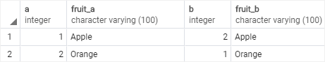
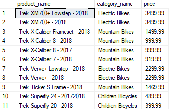
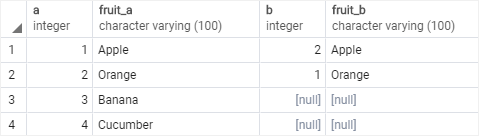
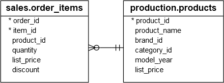
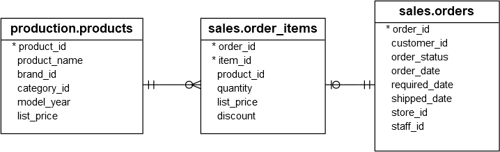
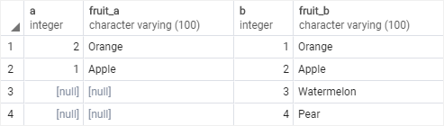
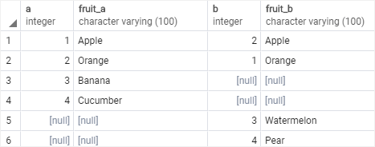
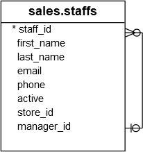
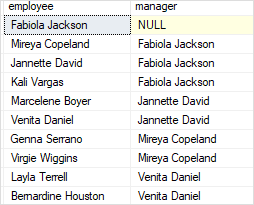

# Day 6
💥 🔹
## 💛 Session 09- Advanced Queries and Joins - Part 2


### 💥 JOINs 

Trong SQL, joins là phép kết hợp các hàng từ hai hoặc nhiều bảng dựa trên một điều kiện kết hợp. Joins cho phép bạn kết hợp dữ liệu từ các bảng liên quan nhau để tạo ra các kết quả kết hợp mới, giúp truy vấn dữ liệu từ nhiều nguồn trở nên linh hoạt và mạnh mẽ hơn.

Tìm hiểu về các phép JOINs qua ví dụ:

```sql
--Tạo bảng a
CREATE TABLE basket_a (
    a INT PRIMARY KEY,
    fruit_a VARCHAR (50) NOT NULL
);
--Tạo bảng b
CREATE TABLE basket_b (
    b INT PRIMARY KEY,
    fruit_b VARCHAR (50) NOT NULL
);
--Chèn dữ liệu vào bảng a
INSERT INTO basket_a (a, fruit_a)
VALUES
    (1, 'Apple'),
    (2, 'Orange'),
    (3, 'Banana'),
    (4, 'Cucumber');
--Chèn dữ liệu vào bảng b
INSERT INTO basket_b (b, fruit_b)
VALUES
    (1, 'Orange'),
    (2, 'Apple'),
    (3, 'Watermelon'),
    (4, 'Pear');
```

#### 🔹 INNER JOIN / JOIN

INNER JOIN là một loại phép nối (join) trong SQL, được sử dụng để kết hợp các hàng từ hai hoặc nhiều bảng dựa trên một điều kiện kết hợp. INNER JOIN chỉ trả về các hàng có giá trị khớp trong `cả hai bảng`.

```sql
SELECT
    a,
    fruit_a,
    b,
    fruit_b
FROM
    basket_a
INNER JOIN basket_b
    ON fruit_a = fruit_b;
```

Kết quả được



Phép nối Inner Join được biểu diễn với sơ đồ  Venn diagram


Ví dụ: Lấy danh sách sản phẩm bao gồm tên sản phẩm, danh mục sản phẩm, giá bán.

```sql
SELECT
    product_name,
    category_name,
    price
FROM
    dbo.products p
INNER JOIN dbo.categories c 
    ON c.category_id = p.category_id -- mối quan hệ giữ 2 bảng
ORDER BY
    product_name DESC;
```

Kết quả



Bảng `products` có trường khóa ngoại `category_id`, dựa vào đó bạn móc nối với Bảng `categories` để lấy tên danh mục dựa vào khóa chính  `category_id`


#### 🔹 OUTER JOIN

OUTER JOIN là một loại phép nối  được sử dụng để kết hợp các hàng từ hai hoặc nhiều bảng dựa trên một điều kiện kết hợp, nhưng khác với INNER JOIN, OUTER JOIN có thể bao gồm các hàng không khớp từ ít nhất một bảng.

Có ba loại OUTER JOIN chính: LEFT OUTER JOIN (hoặc LEFT JOIN), RIGHT OUTER JOIN (hoặc RIGHT JOIN), FULL OUTER JOIN (hoặc FULL JOIN)

#### 🔹 LEFT JOIN

Trả về tất cả các hàng từ bảng bên trái (left table) và các hàng khớp từ bảng bên phải (right table). Nếu không có hàng khớp trong bảng bên phải, các cột từ bảng bên phải sẽ có giá trị NULL trong kết quả.

```sql
SELECT
    a,
    fruit_a,
    b,
    fruit_b
FROM
    basket_a
LEFT JOIN basket_b 
   ON fruit_a = fruit_b;
```

Kết quả



Phép nối Left Join được biểu diễn với sơ đồ  Venn diagram


Ví dụ: Dựa vào mối quan hệ giữ `order_items` và `products` ==> Một sản phẩm có thể nằm trong nhiều đơn hàng



Hãy đưa ra thống kê sản phẩm thuộc đơn hàng nào ?

```sql
SELECT
    product_name,
    order_id
FROM
    dbo.products p
LEFT JOIN dbo.order_items o ON o.product_id = p.product_id
ORDER BY
    order_id;
```

Dựa vào qua hệ giữa 3 bảng sau: Bạn có thể lấy thêm nhiều thông tin hơn, bằng cách kết hợp hơn 1 phép LEFT JOIN.



Hãy đưa ra thống kê sản phẩm thuộc đơn hàng nào, kèm ngày bán ra ?

```sql
SELECT
    p.product_name,
    o.order_id,
    i.item_id,
    o.order_date
FROM
    production.products p
	LEFT JOIN sales.order_items i
		ON i.product_id = p.product_id
	LEFT JOIN sales.orders o
		ON o.order_id = i.order_id
ORDER BY
    order_id;
```


#### 🔹 RIGHT JOIN

Tương tự LEFT OUTER JOIN, nhưng trả về tất cả các hàng từ bảng bên phải (right table) và các hàng khớp từ bảng bên trái (left table). Nếu không có hàng khớp trong bảng bên trái, các cột từ bảng bên trái sẽ có giá trị NULL trong kết quả.

```sql
SELECT
    a,
    fruit_a,
    b,
    fruit_b
FROM
    basket_a
RIGHT JOIN basket_b ON fruit_a = fruit_b;
```

Kết quả



Phép nối Rigth Join được biểu diễn với sơ đồ  Venn diagram


Thực tế phép này ít xài, các lập trình viên có xu hướng chuyển table bên phải qua bên trái rồi dùng LEFT JOIN.

#### 🔹 FULL JOIN

Trả về tất cả các hàng từ cả hai bảng. Nếu không có hàng khớp, các cột tương ứng sẽ có giá trị NULL trong kết quả.

```sql
SELECT
    a,
    fruit_a,
    b,
    fruit_b
FROM
    basket_a
FULL OUTER JOIN basket_b 
    ON fruit_a = fruit_b;
```
Kết quả




Phép nối Full Join được biểu diễn với sơ đồ  Venn diagram


#### 🔹 SEFT JOIN

SELF JOIN là một phép nối mà bạn kết hợp một bảng với chính nó. Nó cho phép bạn kết nối các hàng trong cùng một bảng dựa trên một điều kiện kết hợp, và do đó, tạo ra một tập hợp mới các cặp hàng trong bảng đó.

Cú pháp:

```sql
SELECT t1.column_name, t2.column_name
FROM table_name t1
JOIN table_name t2 ON t1.column = t2.column;
```
Cùng quan sát table `staffs` chúng ta thấy có trường manager_id, là khóa ngoại nằm tham chiếu tới chính table `staffs`



Bạn có thể hiểu trong mô hình cây quản lý nhân sự: cấp trên <==> cấp dưới

Dựa vào trường `manager_id` dễ dàng tìm ra ai là quản lý của một người


```sql
SELECT
    e.first_name + ' ' + e.last_name employee,
    m.first_name + ' ' + m.last_name manager
FROM
    dbo.staffs e
LEFT JOIN dbo.staffs m ON m.staff_id = e.manager_id
ORDER BY
    manager;
```

Kết quả



---

### 💥 Common Table Expressions (CTEs)

Common Table Expression (CTE) là một công cụ trong SQL cho phép bạn tạo ra một bảng tạm thời mà có thể được sử dụng trong câu truy vấn chính. Nó cung cấp một cách để đặt tên và tham chiếu đến một truy vấn con trong câu truy vấn chính, giúp làm cho mã SQL dễ đọc, dễ hiểu và dễ bảo trì.

CTE thường được sử dụng trong các truy vấn phức tạp hoặc truy vấn có cấu trúc lồng nhau, nơi bạn muốn sử dụng kết quả của một truy vấn con nhiều lần hoặc trong các phần khác nhau của câu truy vấn chính.

Cú pháp của CTE bao gồm hai phần chính: phần WITH và phần truy vấn chính.

Phần WITH xác định tên của CTE và các cột (nếu cần) trong CTE. Đây là nơi bạn xác định truy vấn con và đặt tên cho nó. Ví dụ:

```sql
WITH cte_name (column1, column2, ...)
AS (
    -- Truy vấn con
    SELECT column1, column2, ...
    FROM table_name
    WHERE condition
)
```

Phần truy vấn chính sử dụng tên CTE đã định nghĩa trong phần WITH để tham chiếu đến kết quả của truy vấn con. Ví dụ:

```sql
SELECT *
FROM cte_name
WHERE condition;
```

CTE có thể được sử dụng trong nhiều truy vấn khác nhau như SELECT, INSERT, UPDATE, DELETE, hoặc kết hợp với các phép nối (JOIN) và các biểu thức khác trong SQL.

Lợi ích của CTE bao gồm:

1. Mã SQL dễ đọc: CTE giúp tạo ra mã SQL có cấu trúc rõ ràng và dễ đọc hơn, bằng cách tách biệt các phần truy vấn con và truy vấn chính.

2. Tái sử dụng mã: Bạn có thể sử dụng CTE nhiều lần trong cùng một câu truy vấn hoặc trong các câu truy vấn khác nhau, giúp giảm việc lặp lại mã SQL và tăng tính tái sử dụng.

3. Bảo trì dễ dàng: Khi cần thay đổi truy vấn con, bạn chỉ cần chỉnh sửa nó trong phần WITH, và tất cả các truy vấn chính sử dụng CTE sẽ được cập nhật tự động.

Ví dụ: Thống kê doanh thu bán ra theo nhân viên trong năm 2018

```sql
-- Truy vấn và tạo bảng ảo
WITH cte_sales_amounts (staff, sales, year) AS (
    SELECT    
        first_name + ' ' + last_name, 
        SUM(quantity * price * (1 - discount)),
        YEAR(order_date)
    FROM    
        dbo.orders o
    INNER JOIN dbo.order_items i ON i.order_id = o.order_id
    INNER JOIN dbo.staffs s ON s.staff_id = o.staff_id
    GROUP BY 
        first_name + ' ' + last_name,
        year(order_date)
)
-- Câu lệnh SELECT này phải thực hiện đồng thời với câu lệnh trên.
SELECT
    staff, 
    sales
FROM 
    cte_sales_amounts
WHERE
    year = 2018;
```
---

### 💥 Combining Data

#### 🔹 UNION

UNION là một câu lệnh SQL được sử dụng để kết hợp các kết quả của hai hoặc nhiều câu lệnh SELECT thành một tập kết quả duy nhất. Các bản ghi trong các tập kết quả được hợp nhất không có bất kỳ sự trùng lặp nào.


Khi sử dụng UNION trong câu lệnh SQL, dưới đây là một số lưu ý quan trọng mà bạn nên xem xét:

1. Số lượng và kiểu dữ liệu của các cột: Các câu lệnh SELECT trong UNION phải có cùng số lượng cột và cùng kiểu dữ liệu tương ứng. Nếu không, bạn cần sử dụng các biểu thức để đảm bảo rằng các cột có cùng số lượng và kiểu dữ liệu

1. Thứ tự cột: Kết quả của UNION phụ thuộc vào thứ tự của các cột trong câu lệnh SELECT đầu tiên. Vì vậy, hãy đảm bảo rằng các cột trong cả hai câu lệnh SELECT được sắp xếp theo cùng một thứ tự

1. Loại bỏ các bản ghi trùng lặp: UNION tự động loại bỏ các bản ghi trùng lặp trong kết quả cuối cùng. Nếu bạn muốn bao gồm các bản ghi trùng lặp, bạn có thể sử dụng UNION ALL thay vì UNION

1. Sự phù hợp về dữ liệu: Các cột trong các câu lệnh SELECT phải phù hợp về mặt dữ liệu. Ví dụ, cột đầu tiên trong câu lệnh SELECT thứ nhất phải có cùng kiểu dữ liệu với cột đầu tiên trong câu lệnh SELECT thứ hai và ngược lại

1. Hiệu suất: UNION có thể tạo ra một tập kết quả lớn và tốn tài nguyên. Hãy đảm bảo rằng sử dụng UNION chỉ khi cần thiết và kiểm tra hiệu suất của câu lệnh của bạn.


Ví dụ: Nếu kết quả truy vấn thông tin từ table `staffs` và `customer` thành một danh sách:


```sql
SELECT
    first_name, last_name
FROM dbo.staffs
UNION --Loại bỏ giá trị trùng lặp sau khi kết hợp
SELECT
    first_name, last_name
FROM
    dbo.customers;
```

Câu lệnh trên sẽ loại bỏ những records trùng lặp. Nếu bạn không muốn loại bỏ records trùng thì dùng `UNION ALL`

```sql
SELECT
    first_name, last_name
FROM dbo.staffs
UNION ALL -- Giữ giá trị trùng lặp sau khi kết hợp
SELECT
    first_name, last_name
FROM
    dbo.customers;
```

#### 🔹 INTERSECT

Dùng để lấy các bản ghi chung của 2 hoặc nhiều câu lệnh SELECT. Các câu lệnh SELECT phải có cùng số lượng cột và kiểu dữ liệu tương ứng.


Ví dụ có `order_items` và `products` ==> cả 2 đều cho trường product_id.


Dựa vào đó bạn có thể: Lấy ra danh sách những sản phẩm ĐÃ được bán ra.


```sql
SELECT
    product_id
FROM
    dbo.products
INTERSECT
SELECT
    product_id
FROM
    dbo.order_items;
```

#### 🔹 EXCEPT

Dùng để lấy các bản ghi của câu lệnh SELECT đầu tiên mà không có trong các câu lệnh SELECT sau. Các câu lệnh SELECT phải có cùng số lượng cột và kiểu dữ liệu tương ứng.


Dựa vào đó bạn có thể: Lấy ra danh sách những sản phẩm CHƯA được bán ra.

```sql
SELECT
    product_id
FROM
    dbo.products
EXCEPT
SELECT
    product_id
FROM
    dbo.order_items;
```

---


## 💛 Session 13 - Programming Transact-SQL

### 💥 Transact-SQL là gì ?

Transact-SQL (viết tắt là T-SQL) là một phần mở rộng của ngôn ngữ truy vấn SQL được phát triển dựa theo tiêu chuẩn ISO và ANSI (American National Standards Institute).

T-SQL là một ngôn ngữ truy vấn phổ biến được sử dụng trong hệ quản trị CSDL Microsoft SQL Server và Azure SQL Database. T-SQL là một phần mở rộng của ngôn ngữ SQL (Structured Query Language) với các tính năng bổ sung để hỗ trợ lập trình, xử lý dữ liệu và quản lý CSDL.

Dưới đây là một số điểm nổi bật về T-SQL:

1. Truy vấn dữ liệu: T-SQL cung cấp các câu lệnh như SELECT, INSERT, UPDATE và DELETE để truy vấn và thay đổi dữ liệu trong CSDL. Nó hỗ trợ các điều kiện, phép toán, và hàm tích hợp để lọc và xử lý dữ liệu theo nhu cầu.

2. Quản lý CSDL: T-SQL cung cấp các câu lệnh để tạo, sửa đổi và xóa các đối tượng CSDL như bảng, khóa ngoại, chỉ mục, thủ tục lưu trữ, chức năng và trigger. Nó cũng hỗ trợ các câu lệnh để quản lý quyền truy cập và an ninh CSDL.

3. Xử lý dữ liệu: T-SQL cung cấp các câu lệnh để thực hiện các phép tính và chức năng xử lý dữ liệu như tính toán, chuỗi kết hợp, chuyển đổi dữ liệu, phân trang và ghép nối.

4. Lập trình: T-SQL hỗ trợ các cấu trúc điều khiển như IF...ELSE, WHILE, và BEGIN...END để viết mã logic phức tạp. Nó cũng hỗ trợ biến, hằng số, tham số và các hàm người dùng để tạo các tác vụ lập trình.

5. Xử lý lỗi và gỡ lỗi: T-SQL cung cấp các cơ chế để xử lý lỗi và gỡ lỗi trong quá trình thực thi. Nó hỗ trợ các câu lệnh TRY...CATCH để bắt và xử lý các ngoại lệ trong quá trình thực thi mã.

### 💥 Transact-SQL Variables

Biến (Variables) là một đối tượng chứa một giá trị của một loại cụ thể, ví dụ: số nguyên, ngày tháng hoặc chuỗi ký tự khác nhau.


#### 🔹 Khai báo Biến

```sql
DECLARE @variable_name data_type [= value]  
```

Ví dụ:

```sql
DECLARE @model_year AS SMALLINT;
-- Hoặc khai báo nhiều biến trong 1 câu lệnh
DECLARE @model_year SMALLINT, 
        @product_name VARCHAR(MAX);
```

#### 🔹  Gán giá trị cho Biến

```sql
SET @model_year = 2018;
```

#### 🔹 Sử dụng Biến

```sql
SELECT
    product_name,
    model_year,
    price 
FROM 
    dbo.products
WHERE 
    model_year = @model_year
ORDER BY
    product_name;
```

Bạn có thể gán giá trị cho biến với một kết quả truy vấn

```sql
DECLARE @product_count INT;
SET @product_count = (
    SELECT 
        COUNT(*) 
    FROM 
        dbo.products 
);
```

#### 🔹 Xuất giá trị Biến


```sql
SELECT @product_count;
-- Hoặc
PRINT @product_count;
```


### 💥Synonyms

Synonyms trong SQL Server là một đối tượng CSDL được sử dụng để tạo ra một tên định danh thay thế cho một đối tượng khác trong cùng CSDL hoặc CSDL khác. Synonym cho phép bạn tham chiếu đến một đối tượng bằng một tên ngắn gọn và dễ nhớ, thay vì sử dụng tên đối tượng đầy đủ và phức tạp.

Ví dụ, để tạo một synonym có tên "ctm" để tham chiếu đến bảng "dbo.customers" trong cùng CSDL:

```sql
CREATE SYNONYM ctm
FOR dbo.customers;

-- Sau đó bạn có thể sử dụng
SELECT * FROM ctm --tên ngắn hơn
```

### 💥 Program Flow Statements

Như đã đề cập trên T-SQL là một ngôn ngữ lập trình mở rộng, cho nên nó cũng được trang bị các các câu lệnh điều khiển luồng chương trình như:

- IF...ELSE
- WHILE
- BREAK
- CONTINUE
- GOTO
- RETURN
- WAITFOR
- TRY...CATCH
- THROW
- BEGIN...END

Và một số câu lệnh khác.

#### 🔹  BEGIN...END

Khai báo một khối lệnh

```sql
BEGIN
    { sql_statement | statement_block}
END
```

#### 🔹  IF...ELSE

```sql
IF Boolean_expression
BEGIN
    -- Statement block executes when the Boolean expression is TRUE
END
ELSE
BEGIN
    -- Statement block executes when the Boolean expression is FALSE
END
```

Ví dụ: Xem năm 2028 có đạt chi tiêu doanh số bán ra không. Nếu có hãy in ra một lời chúc.

```sql
BEGIN
    DECLARE @sales INT;

    SELECT 
        @sales = SUM(price * quantity)
    FROM
        dbo.order_items AS i
        INNER JOIN dbo.orders o ON o.order_id = i.order_id
    WHERE
        YEAR(order_date) = 2018;

    SELECT @sales;

    IF @sales > 1000000
    BEGIN
        PRINT 'Great! The sales amount in 2018 is greater than 1,000,000';
    END
    ELSE
    BEGIN
        PRINT 'Sales amount in 2018 did not reach 1,000,000';
    END
END

```

Bạn hoàn toàn có thể lồng cách câu lênh IF...ELSE vào nhau như trong các ngôn ngữ lập trình khác

```sql
BEGIN
    DECLARE @x INT = 10,
            @y INT = 20;

    IF (@x > 0)
    BEGIN
        IF (@x < @y)
            PRINT 'x > 0 and x < y';
        ELSE
            PRINT 'x > 0 and x >= y';
    END			
END
```

#### 🔹  WHILE

Cú pháp

```sql
WHILE Boolean_expression   
     { sql_statement | statement_block} 
```
Ví dụ

```sql
DECLARE @counter INT = 1;

WHILE @counter <= 5
BEGIN
    PRINT @counter;
    SET @counter = @counter + 1;
END
```


#### 🔹 BREAK

BREAK được sử dụng để kết thúc một khối lệnh hoặc vòng lặp. Nó thường được sử dụng trong cấu trúc điều khiển như WHILE hoặc LOOP để thoát khỏi vòng lặp hoặc dừng việc thực thi các lệnh trong khối.


```sql
DECLARE @counter INT = 0;

WHILE @counter <= 5
BEGIN
    SET @counter = @counter + 1;
    IF @counter = 4
        BREAK; -- Bỏ qua những lệnh phía sau nó
    PRINT @counter;
END

```

#### 🔹 CONTINUE

CONTINUE được sử dụng để bỏ qua phần còn lại của vòng lặp hiện tại và chuyển đến lần lặp tiếp theo. Khi lệnh CONTINUE được thực thi, các lệnh sau nó trong vòng lặp sẽ bị bỏ qua và chương trình sẽ chuyển đến lần lặp tiếp theo của vòng lặp.

```sql
DECLARE @counter INT = 0;

WHILE @counter < 5
BEGIN
    SET @counter = @counter + 1;
    IF @counter = 3
        CONTINUE; --Tiếp tục vòng lặp, bỏ qua câu lệnh sau nó
    PRINT @counter;
END
```


#### 🔹 GOTO

GOTO được sử dụng để chuyển quyền điều khiển đến một điểm nhãn (label) cụ thể trong mã SQL. Nó cho phép nhảy tới một vị trí khác trong chương trình mà không cần tuân thủ thứ tự thực hiện các lệnh.

```sql
DECLARE @i int = 1
WHILE @i <= 10 BEGIN
    IF @i = 5 BEGIN
        GOTO label
    END
    PRINT @i
    SET @i = @i + 1
END
label:
PRINT 'Done'
```

Nếu gặp giá trị = 5, lập tức nhảy đến vị trí `label:` và chạy tiếp


#### 🔹 RETURN

Trả về giá trị, dùng trong function

```sql
CREATE FUNCTION udsf_GetFullName
    @FirstName nvarchar(50),
    @LastName nvarchar(50)
AS
BEGIN
    DECLARE @FullName nvarchar(100)
    SET @FullName = @FirstName + ' ' + @LastName
    RETURN @FullName
END
```


#### 🔹 WAITFOR

WAITFOR được sử dụng để tạm dừng thực thi một khối lệnh hoặc truy vấn trong một khoảng thời gian nhất định. Nó thường được sử dụng để tạo độ trễ hoặc đồng bộ hóa các hoạt động trong cơ sở dữ liệu.

```sql
PRINT 'Start';
WAITFOR DELAY '00:00:05'; --Dừng 5s rồi chạy lệnh Sau nó
PRINT 'End';
```


### 💥 Transact-SQL Functions

T-SQL (Transact-SQL) Functions là các hàm được cung cấp bởi Microsoft SQL Server và Azure SQL Database để thực hiện các thao tác xử lý dữ liệu, tính toán và truy vấn trong môi trường CSDL. T-SQL Functions cho phép bạn thực hiện các phép tính, chuyển đổi dữ liệu, truy xuất thông tin và thực hiện các tác vụ xử lý dữ liệu phức tạp.

Các nhóm Funtions trong SQL Server:

- Aggregate Functions
- Date Functions
- String Functions
- System Functions
- Window Functions

Xem chi tiết các sử dụng: https://www.sqlservertutorial.net/sql-server-functions/

Dựa vào cách thức trả về (return) của function, function được chia thành 2 loại:

#### 🔹  Scalar-valued functions

**Scalar-valued Functions**: nó nhận đầu vào và trả về một giá trị duy nhất.

**Tạo function**

Nhưng function người dùng tạo ra được gọi là  `User-defined function`

Cú pháp:

```sql
CREATE OR ALTER FUNCTION [schema_name.]function_name (parameter_list)
        RETURN data_type AS
        BEGIN
            statements
            RETURN value
        END
```

Ví dụ: Viết 1 function trả về FullName dựa vào  FirstName và LastName từ bảng customers

```sql
-- Dùng từ khóa CREATE FUNCTION
-- udsf_ prefix = User-defined Scalar function
CREATE FUNCTION udsf_GetFullName
(
    @FirstName nvarchar(50),
    @LastName nvarchar(50)
)
RETURNS nvarchar(100)
AS
BEGIN
    DECLARE @FullName nvarchar(100)
    SET @FullName = @FirstName + ' ' + @LastName
    RETURN @FullName
END
```

Sử dụng


```sql
SELECT dbo.udsf_GetFullName(first_name, last_name) AS full_name
FROM dbo.customers
```

Ví dụ: Viết 1 function trả về thành tiền sản phẩm

```sql
CREATE FUNCTION udsf_GetAmountProduct(@Price money, @Discount decimal(18, 2), @Quantity decimal(18, 2))
RETURNS decimal(18, 2)
AS
BEGIN
    RETURN (@Price * (100 - @Discount) / 100) * @Quantity
END
```

Sử dụng:

```sql
SELECT dbo.udsf_GetAmountProduct(price, discount, quantity) AS total_amount
FROM dbo.order_items
```


**Sửa function**


```sql
--Dùng từ khóa ALTER FUNCTION
ALTER FUNCTION udsf_GetFullName
(
    @FirstName nvarchar(50),
    @LastName nvarchar(50)
)
RETURNS nvarchar(100)
AS
BEGIN
    DECLARE @FullName nvarchar(100)
    SET @FullName = @FirstName + ' ' + @LastName
    RETURN @FullName
END
```

**Xóa function**

```sql
DROP FUNCTION [schema_name.]function_name;
```

#### 🔹 Table-valued Functions

**Table-valued Functions**: nó nhận đầu vào và trả về một bảng (table)


Ví dụ: Viết một Table-valued Functions trả về danh sách các sản phẩm có giảm giá (discount > 0)


```sql
CREATE FUNCTION udtf_PromotionProducts()
RETURNS TABLE -- return về một Table
AS
RETURN
(
    SELECT *
    FROM dbo.products
    WHERE discount > 0
)
```

Sử dụng funtion


```sql
SELECT * FROM dbo.udtf_PromotionProducts()
```


## Review Homeworks

Giải các bài tập homework theo nội dung vừa học, áp dụng view, store để tái sử dụng code