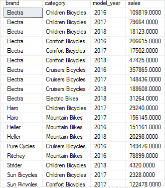

# Day 6

## 💛 Session 09- Advanced Queries and Joins - Part 1

### 💥 GROUP BY với WHERE

Mục đích của GROUP BY là nhóm các bản ghi có cùng giá trị của một hoặc nhiều cột. Khi kết hợp với WHERE, GROUP BY sẽ nhóm các bản ghi thỏa mãn điều kiện của WHERE.


Ví dụ: Liệt kê danh sách giảm giá của những sản phẩm có giá trên 2000

```sql
SELECT 
  discount, 
  COUNT(product_id) AS Total --- Đếm dựa vào ID và đặt tên là Total
FROM products
WHERE price > 2000
GROUP BY discount
ORDER BY discount ASC
```

Câu lệnh sẽ chạy mệnh đề WHERE trước, lọc ra những sản phẩm có giá > 2000 trước khi đem đi GROUP BY

---

### 💥 GROUP BY với NULL

Khi bạn sử dụng mệnh đề GROUP BY và có giá trị NULL trong cột được nhóm, các bản ghi với giá trị NULL sẽ được gom vào một nhóm duy nhất. Điều này có nghĩa là tất cả các bản ghi có giá trị NULL trong cột được nhóm sẽ tồn tại trong một nhóm riêng biệt.

Ví dụ: Lấy danh sách thành phố của khách hàng đã đặt hàng.

```sql
SELECT shipping_city
FROM orders
GROUP BY shipping_city
ORDER BY shipping_city
```

Bạn sẽ thấy giá trị NULL được liệt kê ra ở đầu danh sách.

---

### 💥 GROUP BY với ALL

Trong SQL Server, mệnh đề GROUP BY ALL được sử dụng để áp dụng phép nhóm cho tất cả các bản ghi trong bảng, bao gồm cả các bản ghi trùng lặp. Điều này có nghĩa là tất cả các bản ghi sẽ được coi là cùng một nhóm.

Dưới đây là một ví dụ để hiểu cách sử dụng mệnh đề GROUP BY ALL trong SQL Server:

Giả sử bạn có một bảng "Orders" với các cột "order_id", "customer_id" và "order_amount". Bạn muốn tính tổng số lượng đơn hàng và tổng số tiền cho tất cả các đơn hàng, bao gồm cả các đơn hàng trùng lặp:

```sql
SELECT order_id, customer_id, SUM(order_amount) AS TotalAmount
FROM orders
GROUP BY ALL order_id, customer_id;
```

Trong ví dụ trên, mệnh đề GROUP BY ALL được sử dụng để áp dụng phép nhóm cho tất cả các bản ghi trong bảng "orders". Kết quả trả về sẽ bao gồm tất cả các cặp order_id và customer_id có trong bảng, bất kể chúng có trùng lặp hay không. Tổng số tiền cho mỗi cặp order_id và customer_id sẽ được tính bằng hàm SUM(TotalAmount).

Lưu ý rằng mệnh đề GROUP BY ALL không phổ biến và thường không được sử dụng trong các trường hợp thông thường. Nó cung cấp một cách để xử lý các bản ghi trùng lặp trong quá trình nhóm dữ liệu.

---

### 💥 GROUPING SETS

là một cú pháp mở rộng của mệnh đề GROUP BY để cho phép bạn `nhóm dữ liệu theo nhiều tập hợp khác nhau trong một câu truy vấn duy nhất`. Nó cho phép bạn tạo các kết quả tổng hợp từ các nhóm dữ liệu khác nhau một cách thuận tiện.

Với GROUPING SETS, bạn có thể chỉ định một danh sách các cột hoặc biểu thức nhóm để tạo các tập hợp nhóm khác nhau. Cú pháp của GROUPING SETS như sau:

```sql
SELECT 
    column1, column2, ..., aggregate_function(column)
FROM table
GROUP BY 
    GROUPING SETS (column1, column2, ..., ())
```

Tìm hiểu qua ví dụ

Tạo một table mới `dbo.sales_summary`

```sql
SELECT
    b.brand_name AS brand,
    c.category_name AS category,
    p.model_year,
    round(
        SUM (
            i.quantity * i.price * (1 - i.discount)
        ),
        0
    ) sales INTO dbo.sales_summary
FROM
    dbo.order_items i
INNER JOIN dbo.products p ON p.product_id = i.product_id
INNER JOIN dbo.brands b ON b.brand_id = p.brand_id
INNER JOIN dbo.categories c ON c.category_id = p.category_id
GROUP BY
    b.brand_name,
    c.category_name,
    p.model_year
ORDER BY
    b.brand_name,
    c.category_name,
    p.model_year;
```
Bạn sẽ nhận được một bảng dữ liệu tổng hợp doanh thu theo `brand`, `categories` và `year_model`



Ví dụ: Từ đó hãy, Truy vấn trả về số tiền bán được nhóm theo thương hiệu và danh mục:

```sql
SELECT
    brand,
    category,
    SUM (sales) sales
FROM
    dbo.sales_summary
GROUP BY
    brand,
    category
ORDER BY
    brand,
    category;
```

Tương tự vậy: Chỉ nhóm theo `brand`

```sql
SELECT
    brand,
    SUM (sales) sales
FROM
    dbo.sales_summary
GROUP BY
    brand
ORDER BY
    brand;
```

Tương tự vậy: Chỉ nhóm theo `categories`

```sql
SELECT
    category,
    SUM (sales) sales
FROM
    dbo.sales_summary
GROUP BY
    category
ORDER BY
    category;
```
Và một nhóm tổng hợp: tổng doanh thu của tất cả `brand` và `categories`

```sql
SELECT
    SUM (sales) sales
FROM
    dbo.sales_summary;
```

Như vậy chúng ta có 4 nhóm dữ liệu:

```sql
(brand, category)
(brand)
(category)
()
```
Để có một báo cáo tổng hợp thông tin 4 nhóm trên bạn có thể dùng mệnh đề `UNION ALL` để nối lại như sau:

```sql
SELECT
    brand,
    category,
    SUM (sales) sales
FROM
    dbo.sales_summary
GROUP BY
    brand,
    category
UNION ALL
SELECT
    brand,
    NULL,
    SUM (sales) sales
FROM
    dbo.sales_summary
GROUP BY
    brand
UNION ALL
SELECT
    NULL,
    category,
    SUM (sales) sales
FROM
    dbo.sales_summary
GROUP BY
    category
UNION ALL
SELECT
    NULL,
    NULL,
    SUM (sales)
FROM
    dbo.sales_summary
ORDER BY brand, category;
```

==> Nhược điểm: Câu lênh truy vấn dài, phức tạp, hiệu suất truy vấn chậm

==> Bạn có thể fix vấn đề này bằng cách dùng GROUP với `GROUPING SETS`

```sql
SELECT
	brand,
	category,
	SUM (sales) sales
FROM
	dbo.sales_summary
GROUP BY
	GROUPING SETS (
		(brand, category),
		(brand),
		(category),
		()
	)
ORDER BY
	brand,
	category;
```
Hàm GROUPING cho biết liệu một cột được chỉ định trong mệnh đề GROUP BY có được tổng hợp hay không. Nó trả về 1 nếu được tổng hợp hoặc 0 nếu không được tổng hợp trong tập kết quả.

```sql
SELECT
    GROUPING(brand) grouping_brand,
    GROUPING(category) grouping_category,
    brand,
    category,
    SUM (sales) sales
FROM
    sales.sales_summary
GROUP BY
    GROUPING SETS (
        (brand, category),
        (brand),
        (category),
        ()
    )
ORDER BY
    brand,
    category;
```

Giá trị trong cột grouping_brand cho biết hàng có được tổng hợp hay không, 1 nghĩa là số tiền bán hàng được tổng hợp theo thương hiệu, 0 có nghĩa là số tiền bán hàng không được tổng hợp theo thương hiệu. Khái niệm tương tự được áp dụng cho cột grouping_category.

---

### 💥 GROUP BY với CUBE

Cú pháp CUBE sẽ tạo ra tất cả các tổ hợp có thể của các cột được chỉ định, bao gồm các nhóm theo từng cột riêng lẻ, các nhóm con của từng cột, các nhóm con của các tổ hợp cột, và tổng hợp toàn bộ dữ liệu.

Hay nói dễ hiểu hơn `CUBE` là cú pháp ngắn gọn để làm `GROUPING SETS`

```sql
SELECT
    d1,
    d2,
    d3,
    aggregate_function (c4)
FROM
    table_name
GROUP BY
    GROUPING SETS (
        (d1,d2,d3), 
        (d1,d2),
        (d1,d3),
        (d2,d3),
        (d1),
        (d2),
        (d3), 
        ()
     );
```
Rất dài dòng, thay vì thế dùng ngay `CUBE`

```sql
SELECT
    d1,
    d2,
    d3,
    aggregate_function (c4)
FROM
    table_name
GROUP BY
    CUBE (d1, d2, d3); -- Rút gọn lại còn 1 dòng
```

Từ ví dụ trên có thể rút gọn lại, cho kết quả giống nhau

```sql
SELECT
    brand,
    category,
    SUM (sales) sales
FROM
    dbo.sales_summary
GROUP BY
    CUBE(brand, category)
ORDER BY
	brand,
	category;
```


---


### 💥 GROUP BY với ROLLUP

ROLLUP là một mệnh đề con của mệnh đề GROUP BY cung cấp cách viết tắt để xác định nhiều nhóm nhóm. Không giống như mệnh đề con CUBE, ROLLUP không tạo ra tất cả các tập hợp nhóm có thể có dựa trên các cột thứ nguyên; CUBE tạo ra một tập hợp con trong số đó.

Khi tạo các tập hợp nhóm, ROLLUP giả định một hệ thống phân cấp giữa các cột thứ nguyên và chỉ tạo các tập hợp nhóm dựa trên hệ thống phân cấp này.

ROLLUP thường được sử dụng để tạo subtotals và totals cho mục đích báo cáo.

`CUBE (d1,d2,d3)` định nghĩa ra `8` grouping sets:

```sql
(d1, d2, d3)
(d1, d2)
(d2, d3)
(d1, d3)
(d1)
(d2)
(d3)
()
```
Trong khi `ROLLUP(d1,d2,d3)` tạo `4` grouping sets, theo cấu trúc phân cấp d1 > d2> d3

```sql
(d1, d2, d3)
(d1, d2)
(d1)
()
```

Cú pháp:

```sql
SELECT
    d1,
    d2,
    d3,
    aggregate_function(c4)
FROM
    table_name
GROUP BY
    ROLLUP (d1, d2, d3);
```

Nối tiếp ví dụ trên 

```sql
SELECT
    brand,
    category,
    SUM (sales) sales
FROM
    dbo.sales_summary
GROUP BY
    ROLLUP(brand, category);
```
Kết quả được canh theo cột brand:  brand > category

---

### 💥 GROUP BY WITH Aggregate Function

Khi kết hợp với các hàm tổng hợp như COUNT, SUM, AVG, MIN, MAX, GROUP BY sẽ nhóm các bản ghi có cùng giá trị của một hoặc nhiều cột và tính toán các hàm tổng hợp trên các nhóm này.

#### 🔹 COUNT

Dùng để đếm số lượng bản ghi trong một nhóm.

```sql
-- Đếm số lượng sản phẩm theo từng loại giá
SELECT
    price,
    COUNT(product_id) AS 'NumberOfProducts'
FROM products
GROUP BY price
```

#### 🔹 SUM

Dùng để tính tổng các giá trị trong một cột.

```sql
-- Tính tổng số lượng tồn kho theo từng nhóm category_id
SELECT
    category_id, 
    SUM(Stock) AS 'total_stock'
FROM products
GROUP BY category_id
```

#### 🔹 MIN

Dùng để lấy giá trị nhỏ nhất của các giá trị trong một cột.

```sql
-- Hiển thị sản phẩm có giá thấp nhất theo từng nhóm category_id
SELECT
    category_id, 
    MIN(price) AS 'min_price'
FROM products
GROUP BY category_id
```

#### 🔹 MIN

Dùng để lấy giá trị lớn nhất của các giá trị trong một cột.

```sql
-- Hiển thị sản phẩm có giá cao nhất theo từng nhóm category_id
SELECT
    category_id, 
    MAX(price) AS 'max_price'
FROM products
GROUP BY category_id
```

---

### 💥 Sub Query

Subquery (hoặc còn gọi là inner query hoặc nested query) là một câu truy vấn SELECT được nhúng bên trong một câu truy vấn khác. Nó cho phép bạn sử dụng kết quả của một câu truy vấn như là một tập dữ liệu đầu vào cho câu truy vấn chính.

Ví dụ: Liệt kê danh sách danh mục kèm số lượng sản phẩm có trong danh mục đó


```sql
SELECT
  c.*, (SELECT COUNT(product_id) FROM dbo.products AS P WHERE p.category_id = c.product_id) AS 'number_product'
FROM dbo.categories AS c
```

Ví dụ, bạn có thể sử dụng subquery để tìm tất cả các khách hàng có đơn hàng với tổng giá trị lớn hơn một ngưỡng nào đó:

```sql
SELECT customer_name
FROM dbo.customers
WHERE customer_id IN (
    SELECT customer_id
    FROM dbo.orders
    GROUP BY customer_id
    HAVING SUM(order_amount) > 1000
)
```

Ví dụ: Lấy thông tin đơn hàng của tất cả khách hàng ở `New York`

```sql
SELECT
    order_id,
    order_date,
    customer_id
FROM
    dbo.orders
WHERE
    customer_id IN (
        SELECT
            customer_id
        FROM
            dbo.customers
        WHERE
            city = 'New York'
    )
ORDER BY
    order_date DESC;
```

Để có hiệu suất truy vấn cao hơn, khuyến nghị nên chuyển subquery thành JOIN trong các trường hợp nhất định. Lý do là các hệ quản lý cơ sở dữ liệu thường tối ưu hóa truy vấn JOIN và có thể sử dụng các chỉ mục và kỹ thuật tham gia để tìm kiếm và kết hợp dữ liệu hiệu quả.

#### 🔹 Sub Query and ANY

Cú pháp

```sql
scalar_expression comparison_operator ANY (subquery)
```

- scalar_expression: biểu thức giá trị đơn
- comparison_operator: toán tử so sánh
- subquery: trả về một danh sách (v1, v2, … vn). `ANY` trả về `TRUE` nếu `scalar_expression` thõa điều kiện `comparison_operator` với MỘT TRONG các giá trị từ (v1, v2, … vn). Ngược lại trả về `FALSE`

Ví dụ

```sql
SELECT
    product_name,
    price
FROM
    dbo.products
WHERE
    -- Nếu price >= với bất kì giá trị nào
    -- trong kết quả SELECT thì WHERE thực thi
    price >= ANY (
        SELECT
            AVG (price)
        FROM
            dbo.products
        GROUP BY
            brand_id
    )
```


#### 🔹 Sub Query and ALL

ALL có cách dùng tương tự nhưng khác một chỗ là khi dùng `ALL` trả về `TRUE` nếu `scalar_expression` thõa điều kiện `comparison_operator` với TẤT CẢ giá trị từ (v1, v2, … vn). Ngược lại trả về `FALSE`


#### 🔹 Sub Query and EXISTS, NOT EXISTS 

Cú pháp

```sql
WHERE [NOT] EXISTS (subquery)
```
EXISTS trả về `TRUE` nếu `subquery` trả về kết quả; ngược lại trả về `FALSE`.

NOT EXISTS phủ định của EXISTS

Ví dụ: Lấy thông tin khách hàng, có đơn hàng mua vào năm 2017.

```sql
SELECT
    customer_id,
    first_name,
    last_name,
    city
FROM
    dbo.customers c
WHERE
    EXISTS (
        -- Đi tìm những khách hàng mua hàng năm 2017
        SELECT
            customer_id
        FROM
            dbo.orders o
        WHERE
            o.customer_id = c.customer_id
        AND YEAR (order_date) = 2017
    )
ORDER BY
    first_name,
    last_name;
```

Xem thêm: https://www.sqlservertutorial.net/sql-server-basics/sql-server-subquery/


## 💛 Session 09- Advanced Queries and Joins - Part 2

### 💥 JOINs

Trong SQL, joins là phép kết hợp các hàng từ hai hoặc nhiều bảng dựa trên một điều kiện kết hợp. Joins cho phép bạn kết hợp dữ liệu từ các bảng liên quan nhau để tạo ra các kết quả kết hợp mới, giúp truy vấn dữ liệu từ nhiều nguồn trở nên linh hoạt và mạnh mẽ hơn.

Tìm hiểu về các phép JOINs qua ví dụ:

```sql
--Tạo bảng a
CREATE TABLE basket_a (
    a INT PRIMARY KEY,
    fruit_a VARCHAR (50) NOT NULL
);
--Tạo bảng b
CREATE TABLE basket_b (
    b INT PRIMARY KEY,
    fruit_b VARCHAR (50) NOT NULL
);
--Chèn dữ liệu vào bảng a
INSERT INTO basket_a (a, fruit_a)
VALUES
    (1, 'Apple'),
    (2, 'Orange'),
    (3, 'Banana'),
    (4, 'Cucumber');
--Chèn dữ liệu vào bảng b
INSERT INTO basket_b (b, fruit_b)
VALUES
    (1, 'Orange'),
    (2, 'Apple'),
    (3, 'Watermelon'),
    (4, 'Pear');
```

#### 🔹 INNER JOIN / JOIN

INNER JOIN là một loại phép nối (join) trong SQL, được sử dụng để kết hợp các hàng từ hai hoặc nhiều bảng dựa trên một điều kiện kết hợp. INNER JOIN chỉ trả về các hàng có giá trị khớp trong `cả hai bảng`.

```sql
SELECT
    a,
    fruit_a,
    b,
    fruit_b
FROM
    basket_a
INNER JOIN basket_b
    ON fruit_a = fruit_b;
```

Kết quả được


Phép nối Inner Join được biểu diễn với sơ đồ  Venn diagram


Ví dụ: Lấy danh sách sản phẩm bao gồm tên sản phẩm, danh mục sản phẩm, giá bán.

```sql
SELECT
    product_name,
    category_name,
    price
FROM
    dbo.products p
INNER JOIN dbo.categories c 
    ON c.category_id = p.category_id -- mối quan hệ giữ 2 bảng
ORDER BY
    product_name DESC;
```

Kết quả


Bảng `products` có trường khóa ngoại `category_id`, dựa vào đó bạn móc nối với Bảng `categories` để lấy tên danh mục dựa vào khóa chính  `category_id`

#### 🔹 OUTER JOIN

OUTER JOIN là một loại phép nối  được sử dụng để kết hợp các hàng từ hai hoặc nhiều bảng dựa trên một điều kiện kết hợp, nhưng khác với INNER JOIN, OUTER JOIN có thể bao gồm các hàng không khớp từ ít nhất một bảng.

Có ba loại OUTER JOIN chính: LEFT OUTER JOIN (hoặc LEFT JOIN), RIGHT OUTER JOIN (hoặc RIGHT JOIN), FULL OUTER JOIN (hoặc FULL JOIN)

#### 🔹 LEFT JOIN

Trả về tất cả các hàng từ bảng bên trái (left table) và các hàng khớp từ bảng bên phải (right table). Nếu không có hàng khớp trong bảng bên phải, các cột từ bảng bên phải sẽ có giá trị NULL trong kết quả.

```sql
SELECT
    a,
    fruit_a,
    b,
    fruit_b
FROM
    basket_a
LEFT JOIN basket_b 
   ON fruit_a = fruit_b;
```

Kết quả


Phép nối Left Join được biểu diễn với sơ đồ  Venn diagram


Ví dụ: Dựa vào mối quan hệ giữ `order_items` và `products` ==> Một sản phẩm có thể nằm trong nhiều đơn hàng


Hãy đưa ra thống kê sản phẩm thuộc đơn hàng nào ?

```sql
SELECT
    product_name,
    order_id
FROM
    dbo.products p
LEFT JOIN dbo.order_items o ON o.product_id = p.product_id
ORDER BY
    order_id;
```

Dựa vào qua hệ giữa 3 bảng sau: Bạn có thể lấy thêm nhiều thông tin hơn, bằng cách kết hợp hơn 1 phép LEFT JOIN.


Hãy đưa ra thống kê sản phẩm thuộc đơn hàng nào, kèm ngày bán ra ?

```sql
SELECT
    p.product_name,
    o.order_id,
    i.item_id,
    o.order_date
FROM
    dbo.products p
 LEFT JOIN sales.order_items i
  ON i.product_id = p.product_id
 LEFT JOIN sales.orders o
  ON o.order_id = i.order_id
ORDER BY
    order_id;
```


**UPDATE Với JOIN**

Cú pháp:

```sql
UPDATE 
    t1
SET 
    t1.c1 = t2.c2,
    t1.c2 = expression,
    ...   
FROM 
    t1
    [INNER | LEFT] JOIN t2 ON join_predicate
WHERE 
    where_predicate;
```

Tạo dữ liệu demo

```sql
DROP TABLE IF EXISTS dbo.targets;

CREATE TABLE dbo.targets
(
    target_id  INT	PRIMARY KEY, 
    percentage DECIMAL(4, 2) 
        NOT NULL DEFAULT 0
);

INSERT INTO 
    dbo.targets(target_id, percentage)
VALUES
    (1,0.2),
    (2,0.3),
    (3,0.5),
    (4,0.6),
    (5,0.8);

CREATE TABLE dbo.commissions
(
    staff_id    INT PRIMARY KEY, 
    target_id   INT, 
    base_amount DECIMAL(10, 2) 
        NOT NULL DEFAULT 0, 
    commission  DECIMAL(10, 2) 
        NOT NULL DEFAULT 0, 
    FOREIGN KEY(target_id) 
        REFERENCES sales.targets(target_id), 
    FOREIGN KEY(staff_id) 
        REFERENCES sales.staffs(staff_id),
);

INSERT INTO 
    dbo.commissions(staff_id, base_amount, target_id)
VALUES
    (1,100000,2),
    (2,120000,1),
    (3,80000,3),
    (4,900000,4),
    (5,950000,5);
```

Yêu cầu Cập nhật tiền thưởng (trường commissions) ở table `commissions` theo công thức: `commissions = base_amount * percentage` mặc định nhân viên mới sẽ có mức chiết khấu percentage = 0.1


```sql
UPDATE 
    dbo.commissions
SET  
    dbo.commissions.commission = 
        c.base_amount  * COALESCE(t.percentage,0.1) -- COALESCE trả về 0.1 nếu percentage là NULL
FROM  
    dbo.commissions AS c
    LEFT JOIN dbo.targets t -- tham chiếu đến targets để lấy trường percentage
        ON c.target_id = t.target_id;
```

#### 🔹 RIGHT JOIN

Tương tự LEFT OUTER JOIN, nhưng trả về tất cả các hàng từ bảng bên phải (right table) và các hàng khớp từ bảng bên trái (left table). Nếu không có hàng khớp trong bảng bên trái, các cột từ bảng bên trái sẽ có giá trị NULL trong kết quả.

```sql
SELECT
    a,
    fruit_a,
    b,
    fruit_b
FROM
    basket_a
RIGHT JOIN basket_b ON fruit_a = fruit_b;
```

Kết quả


Phép nối Rigth Join được biểu diễn với sơ đồ  Venn diagram


Thực tế phép này ít xài, các lập trình viên có xu hướng chuyển table bên phải qua bên trái rồi dùng LEFT JOIN.

#### 🔹 FULL JOIN

Trả về tất cả các hàng từ cả hai bảng. Nếu không có hàng khớp, các cột tương ứng sẽ có giá trị NULL trong kết quả.

```sql
SELECT
    a,
    fruit_a,
    b,
    fruit_b
FROM
    basket_a
FULL OUTER JOIN basket_b 
    ON fruit_a = fruit_b;
```

Kết quả


Phép nối Full Join được biểu diễn với sơ đồ  Venn diagram


#### 🔹 SEFT JOIN

SELF JOIN là một phép nối mà bạn kết hợp một bảng với chính nó. Nó cho phép bạn kết nối các hàng trong cùng một bảng dựa trên một điều kiện kết hợp, và do đó, tạo ra một tập hợp mới các cặp hàng trong bảng đó.

Cú pháp:

```sql
SELECT t1.column_name, t2.column_name
FROM table_name t1
JOIN table_name t2 ON t1.column = t2.column;
```

Cùng quan sát table `staffs` chúng ta thấy có trường manager_id, là khóa ngoại nằm tham chiếu tới chính table `staffs`


Bạn có thể hiểu trong mô hình cây quản lý nhân sự: cấp trên <==> cấp dưới

Dựa vào trường `manager_id` dễ dàng tìm ra ai là quản lý của một người

```sql
SELECT
    e.first_name + ' ' + e.last_name employee,
    m.first_name + ' ' + m.last_name manager
FROM
    dbo.staffs e
LEFT JOIN dbo.staffs m ON m.staff_id = e.manager_id
ORDER BY
    manager;
```

Kết quả


---

### 💥 Common Table Expressions (CTEs)

Common Table Expression (CTE) là một công cụ trong SQL cho phép bạn tạo ra một bảng tạm thời mà có thể được sử dụng trong câu truy vấn chính. Nó cung cấp một cách để đặt tên và tham chiếu đến một truy vấn con trong câu truy vấn chính, giúp làm cho mã SQL dễ đọc, dễ hiểu và dễ bảo trì.

CTE thường được sử dụng trong các truy vấn phức tạp hoặc truy vấn có cấu trúc lồng nhau, nơi bạn muốn sử dụng kết quả của một truy vấn con nhiều lần hoặc trong các phần khác nhau của câu truy vấn chính.

Cú pháp của CTE bao gồm hai phần chính: phần WITH và phần truy vấn chính.

Phần WITH xác định tên của CTE và các cột (nếu cần) trong CTE. Đây là nơi bạn xác định truy vấn con và đặt tên cho nó. Ví dụ:

```sql
WITH cte_name (column1, column2, ...)
AS (
    -- Truy vấn con
    SELECT column1, column2, ...
    FROM table_name
    WHERE condition
)
```

Phần truy vấn chính sử dụng tên CTE đã định nghĩa trong phần WITH để tham chiếu đến kết quả của truy vấn con. Ví dụ:

```sql
SELECT *
FROM cte_name
WHERE condition;
```

CTE có thể được sử dụng trong nhiều truy vấn khác nhau như SELECT, INSERT, UPDATE, DELETE, hoặc kết hợp với các phép nối (JOIN) và các biểu thức khác trong SQL.

Lợi ích của CTE bao gồm:

1. Mã SQL dễ đọc: CTE giúp tạo ra mã SQL có cấu trúc rõ ràng và dễ đọc hơn, bằng cách tách biệt các phần truy vấn con và truy vấn chính.

2. Tái sử dụng mã: Bạn có thể sử dụng CTE nhiều lần trong cùng một câu truy vấn hoặc trong các câu truy vấn khác nhau, giúp giảm việc lặp lại mã SQL và tăng tính tái sử dụng.

3. Bảo trì dễ dàng: Khi cần thay đổi truy vấn con, bạn chỉ cần chỉnh sửa nó trong phần WITH, và tất cả các truy vấn chính sử dụng CTE sẽ được cập nhật tự động.

Ví dụ: Thống kê doanh thu bán ra theo nhân viên trong năm 2018

```sql
-- Truy vấn và tạo bảng ảo
WITH cte_sales_amounts (staff, sales, year) AS (
    SELECT    
        first_name + ' ' + last_name, 
        SUM(quantity * price * (1 - discount)),
        YEAR(order_date)
    FROM    
        dbo.orders o
    INNER JOIN dbo.order_items i ON i.order_id = o.order_id
    INNER JOIN dbo.staffs s ON s.staff_id = o.staff_id
    GROUP BY 
        first_name + ' ' + last_name,
        year(order_date)
)
-- Câu lệnh SELECT này phải thực hiện đồng thời với câu lệnh trên.
SELECT
    staff, 
    sales
FROM 
    cte_sales_amounts
WHERE
    year = 2018;
```

---

### 💥 Combining Data

#### 🔹 UNION

UNION là một câu lệnh SQL được sử dụng để kết hợp các kết quả của hai hoặc nhiều câu lệnh SELECT thành một tập kết quả duy nhất. Các bản ghi trong các tập kết quả được hợp nhất không có bất kỳ sự trùng lặp nào.


Khi sử dụng UNION trong câu lệnh SQL, dưới đây là một số lưu ý quan trọng mà bạn nên xem xét:

1. Số lượng và kiểu dữ liệu của các cột: Các câu lệnh SELECT trong UNION phải có cùng số lượng cột và cùng kiểu dữ liệu tương ứng. Nếu không, bạn cần sử dụng các biểu thức để đảm bảo rằng các cột có cùng số lượng và kiểu dữ liệu

1. Thứ tự cột: Kết quả của UNION phụ thuộc vào thứ tự của các cột trong câu lệnh SELECT đầu tiên. Vì vậy, hãy đảm bảo rằng các cột trong cả hai câu lệnh SELECT được sắp xếp theo cùng một thứ tự

1. Loại bỏ các bản ghi trùng lặp: UNION tự động loại bỏ các bản ghi trùng lặp trong kết quả cuối cùng. Nếu bạn muốn bao gồm các bản ghi trùng lặp, bạn có thể sử dụng UNION ALL thay vì UNION

1. Sự phù hợp về dữ liệu: Các cột trong các câu lệnh SELECT phải phù hợp về mặt dữ liệu. Ví dụ, cột đầu tiên trong câu lệnh SELECT thứ nhất phải có cùng kiểu dữ liệu với cột đầu tiên trong câu lệnh SELECT thứ hai và ngược lại

1. Hiệu suất: UNION có thể tạo ra một tập kết quả lớn và tốn tài nguyên. Hãy đảm bảo rằng sử dụng UNION chỉ khi cần thiết và kiểm tra hiệu suất của câu lệnh của bạn.

Ví dụ: Nếu kết quả truy vấn thông tin từ table `staffs` và `customer` thành một danh sách:

```sql
SELECT
    first_name, last_name
FROM dbo.staffs
UNION --Loại bỏ giá trị trùng lặp sau khi kết hợp
SELECT
    first_name, last_name
FROM
    dbo.customers;
```

Câu lệnh trên sẽ loại bỏ những records trùng lặp. Nếu bạn không muốn loại bỏ records trùng thì dùng `UNION ALL`

```sql
SELECT
    first_name, last_name
FROM dbo.staffs
UNION ALL -- Giữ giá trị trùng lặp sau khi kết hợp
SELECT
    first_name, last_name
FROM
    dbo.customers;
```

#### 🔹 INTERSECT

Dùng để lấy các bản ghi chung của 2 hoặc nhiều câu lệnh SELECT. Các câu lệnh SELECT phải có cùng số lượng cột và kiểu dữ liệu tương ứng.


Ví dụ có `order_items` và `products` ==> cả 2 đều cho trường product_id.


Dựa vào đó bạn có thể: Lấy ra danh sách những sản phẩm ĐÃ được bán ra.

```sql
SELECT
    product_id
FROM
    dbo.products
INTERSECT
SELECT
    product_id
FROM
    dbo.order_items;
```

#### 🔹 EXCEPT

Dùng để lấy các bản ghi của câu lệnh SELECT đầu tiên mà không có trong các câu lệnh SELECT sau. Các câu lệnh SELECT phải có cùng số lượng cột và kiểu dữ liệu tương ứng.


Dựa vào đó bạn có thể: Lấy ra danh sách những sản phẩm CHƯA được bán ra.

```sql
SELECT
    product_id
FROM
    dbo.products
EXCEPT
SELECT
    product_id
FROM
    dbo.order_items;
```

---

## 💛 Nguồn học Thêm

Xem từ Sesion 5, 6,8, 9: https://www.sqlservertutorial.net/sql-server-basics/

---

## 💛 SQL Cheet

Xem link: https://pbs.twimg.com/media/FrqM3ZkXwAA8G69?format=jpg&name=4096x4096