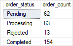

# Day 7

## 💛 Session 13 - Programming Transact-SQL

### 💥 Transact-SQL là gì ?

Transact-SQL (viết tắt là T-SQL) là một phần mở rộng của ngôn ngữ truy vấn SQL được phát triển dựa theo tiêu chuẩn ISO và ANSI (American National Standards Institute).

T-SQL là một ngôn ngữ truy vấn phổ biến được sử dụng trong hệ quản trị CSDL Microsoft SQL Server và Azure SQL Database. T-SQL là một phần mở rộng của ngôn ngữ SQL (Structured Query Language) với các tính năng bổ sung để hỗ trợ lập trình, xử lý dữ liệu và quản lý CSDL.

Dưới đây là một số điểm nổi bật về T-SQL:

1. Truy vấn dữ liệu: T-SQL cung cấp các câu lệnh như SELECT, INSERT, UPDATE và DELETE để truy vấn và thay đổi dữ liệu trong CSDL. Nó hỗ trợ các điều kiện, phép toán, và hàm tích hợp để lọc và xử lý dữ liệu theo nhu cầu.

2. Quản lý CSDL: T-SQL cung cấp các câu lệnh để tạo, sửa đổi và xóa các đối tượng CSDL như bảng, khóa ngoại, chỉ mục, thủ tục lưu trữ, chức năng và trigger. Nó cũng hỗ trợ các câu lệnh để quản lý quyền truy cập và an ninh CSDL.

3. Xử lý dữ liệu: T-SQL cung cấp các câu lệnh để thực hiện các phép tính và chức năng xử lý dữ liệu như tính toán, chuỗi kết hợp, chuyển đổi dữ liệu, phân trang và ghép nối.

4. Lập trình: T-SQL hỗ trợ các cấu trúc điều khiển như IF...ELSE, WHILE, và BEGIN...END để viết mã logic phức tạp. Nó cũng hỗ trợ biến, hằng số, tham số và các hàm người dùng để tạo các tác vụ lập trình.

5. Xử lý lỗi và gỡ lỗi: T-SQL cung cấp các cơ chế để xử lý lỗi và gỡ lỗi trong quá trình thực thi. Nó hỗ trợ các câu lệnh TRY...CATCH để bắt và xử lý các ngoại lệ trong quá trình thực thi mã.

---

### 💥 Transact-SQL Variables

Biến (Variables) là một đối tượng chứa một giá trị của một loại cụ thể, ví dụ: số nguyên, ngày tháng hoặc chuỗi ký tự khác nhau.


#### 🔹 Khai báo Biến

```sql
DECLARE @variable_name data_type [= value]  
```

Ví dụ:

```sql
DECLARE @model_year AS SMALLINT;
-- Hoặc khai báo nhiều biến trong 1 câu lệnh
DECLARE @model_year SMALLINT, 
        @product_name VARCHAR(MAX);
```

#### 🔹  Gán giá trị cho Biến

```sql
SET @model_year = 2018;
```

#### 🔹 Sử dụng Biến

```sql
SELECT
    product_name,
    model_year,
    price 
FROM 
    dbo.products
WHERE 
    model_year = @model_year
ORDER BY
    product_name;
```

Bạn có thể gán giá trị cho biến với một kết quả truy vấn

```sql
DECLARE @product_count INT;
SET @product_count = (
    SELECT 
        COUNT(*) 
    FROM 
        dbo.products 
);
```

#### 🔹 Xuất giá trị Biến


```sql
SELECT @product_count;
-- Hoặc
PRINT @product_count;
```

---

### 💥Synonyms

Synonyms trong SQL Server là một đối tượng CSDL được sử dụng để tạo ra một tên định danh thay thế cho một đối tượng khác trong cùng CSDL hoặc CSDL khác. Synonym cho phép bạn tham chiếu đến một đối tượng bằng một tên ngắn gọn và dễ nhớ, thay vì sử dụng tên đối tượng đầy đủ và phức tạp.

Ví dụ, để tạo một synonym có tên "ctm" để tham chiếu đến bảng "dbo.customers" trong cùng CSDL:

```sql
CREATE SYNONYM ctm
FOR dbo.customers;

-- Sau đó bạn có thể sử dụng
SELECT * FROM ctm --tên ngắn hơn
```
---

### 💥 Program Flow Statements

Như đã đề cập trên T-SQL là một ngôn ngữ lập trình mở rộng, cho nên nó cũng được trang bị các các câu lệnh điều khiển luồng chương trình như:

- IF...ELSE
- WHILE
- BREAK
- CONTINUE
- GOTO
- RETURN
- WAITFOR
- TRY...CATCH
- THROW
- BEGIN...END

Và một số câu lệnh khác.

#### 🔹  BEGIN...END

- Khai báo một khối lệnh. Khối lệnh là tập hộp các câu lệnh SQL thực hiện cùng với nhau
- Có thể lồng các khối lệnh vào nhau -- Nested Blocks

```sql
BEGIN
    { sql_statement | statement_block}
END
```

Ví dụ:

```sql
BEGIN
    SELECT
        product_id,
        product_name
    FROM
        dbo.products
    WHERE
        price > 100000;

    IF @@ROWCOUNT = 0
        -- In giá trị ra cửa sổ message
        PRINT 'No product with price greater than 100000 found';
END

```

#### 🔹  IF...ELSE

```sql
IF Boolean_expression
BEGIN
    -- Statement block executes when the Boolean expression is TRUE
END
ELSE
BEGIN
    -- Statement block executes when the Boolean expression is FALSE
END
```

Ví dụ: Xem năm 2028 có đạt chi tiêu doanh số bán ra không. Nếu có hãy in ra một lời chúc.

```sql
BEGIN
    DECLARE @sales INT;

    SELECT 
        @sales = SUM(price * quantity)
    FROM
        dbo.order_items AS i
        INNER JOIN dbo.orders o ON o.order_id = i.order_id
    WHERE
        YEAR(order_date) = 2018;

    SELECT @sales;

    IF @sales > 1000000
    BEGIN
        PRINT 'Great! The sales amount in 2018 is greater than 1,000,000';
    END
    ELSE
    BEGIN
        PRINT 'Sales amount in 2018 did not reach 1,000,000';
    END
END

```

Bạn hoàn toàn có thể lồng cách câu lênh IF...ELSE vào nhau như trong các ngôn ngữ lập trình khác

```sql
BEGIN
    DECLARE @x INT = 10,
            @y INT = 20;

    IF (@x > 0)
    BEGIN
        IF (@x < @y)
            PRINT 'x > 0 and x < y';
        ELSE
            PRINT 'x > 0 and x >= y';
    END			
END
```

#### 🔹  WHILE

Cú pháp

```sql
WHILE Boolean_expression   
     { sql_statement | statement_block} 
```
Ví dụ

```sql
DECLARE @counter INT = 1;

WHILE @counter <= 5
BEGIN
    PRINT @counter;
    SET @counter = @counter + 1;
END
```


#### 🔹 BREAK

BREAK được sử dụng để kết thúc một khối lệnh hoặc vòng lặp. Nó thường được sử dụng trong cấu trúc điều khiển như WHILE hoặc LOOP để thoát khỏi vòng lặp hoặc dừng việc thực thi các lệnh trong khối.


```sql
DECLARE @counter INT = 0;

WHILE @counter <= 5
BEGIN
    SET @counter = @counter + 1;
    IF @counter = 4
        BREAK; -- Bỏ qua những lệnh phía sau nó
    PRINT @counter;
END

```

#### 🔹 CONTINUE

CONTINUE được sử dụng để bỏ qua phần còn lại của vòng lặp hiện tại và chuyển đến lần lặp tiếp theo. Khi lệnh CONTINUE được thực thi, các lệnh sau nó trong vòng lặp sẽ bị bỏ qua và chương trình sẽ chuyển đến lần lặp tiếp theo của vòng lặp.

```sql
DECLARE @counter INT = 0;

WHILE @counter < 5
BEGIN
    SET @counter = @counter + 1;
    IF @counter = 3
        CONTINUE; --Tiếp tục vòng lặp, bỏ qua câu lệnh sau nó
    PRINT @counter;
END
```


#### 🔹 GOTO

GOTO được sử dụng để chuyển quyền điều khiển đến một điểm nhãn (label) cụ thể trong mã SQL. Nó cho phép nhảy tới một vị trí khác trong chương trình mà không cần tuân thủ thứ tự thực hiện các lệnh.

```sql
DECLARE @i int = 1
WHILE @i <= 10 BEGIN
    IF @i = 5 BEGIN
        GOTO label
    END
    PRINT @i
    SET @i = @i + 1
END
label:
PRINT 'Done'
```

Nếu gặp giá trị = 5, lập tức nhảy đến vị trí `label:` và chạy tiếp


#### 🔹 RETURN

Trả về giá trị, dùng trong function

```sql
CREATE FUNCTION udsf_GetFullName
    @FirstName nvarchar(50),
    @LastName nvarchar(50)
AS
BEGIN
    DECLARE @FullName nvarchar(100)
    SET @FullName = @FirstName + ' ' + @LastName
    RETURN @FullName
END
```


#### 🔹 WAITFOR

WAITFOR được sử dụng để tạm dừng thực thi một khối lệnh hoặc truy vấn trong một khoảng thời gian nhất định. Nó thường được sử dụng để tạo độ trễ hoặc đồng bộ hóa các hoạt động trong cơ sở dữ liệu.

```sql
PRINT 'Start';
WAITFOR DELAY '00:00:05'; --Dừng 5s rồi chạy lệnh Sau nó
PRINT 'End';
```

---

### 💥 Transact-SQL Functions

T-SQL (Transact-SQL) Functions là các hàm được cung cấp bởi Microsoft SQL Server và Azure SQL Database để thực hiện các thao tác xử lý dữ liệu, tính toán và truy vấn trong môi trường CSDL. T-SQL Functions cho phép bạn thực hiện các phép tính, chuyển đổi dữ liệu, truy xuất thông tin và thực hiện các tác vụ xử lý dữ liệu phức tạp.

Các nhóm Funtions trong SQL Server:

- Aggregate Functions
- Date Functions
- String Functions
- System Functions
- Window Functions

Xem chi tiết các sử dụng: https://www.sqlservertutorial.net/sql-server-functions/

Dựa vào cách thức trả về (return) của function, function được chia thành 2 loại:

#### 🔹  Scalar-valued functions

**Scalar-valued Functions**: nó nhận đầu vào và trả về một giá trị duy nhất.

**Tạo function**

Nhưng function người dùng tạo ra được gọi là  `User-defined function`

Cú pháp:

```sql
CREATE OR ALTER FUNCTION [schema_name.]function_name (parameter_list)
        RETURN data_type AS
        BEGIN
            statements
            RETURN value
        END
```

Ví dụ: Viết 1 function trả về FullName dựa vào  FirstName và LastName từ bảng customers

```sql
-- Dùng từ khóa CREATE FUNCTION
-- udsf_ prefix = User-defined Scalar function
CREATE FUNCTION udsf_GetFullName
(
    @FirstName nvarchar(50),
    @LastName nvarchar(50)
)
RETURNS nvarchar(100)
AS
BEGIN
    DECLARE @FullName nvarchar(100)
    SET @FullName = @FirstName + ' ' + @LastName
    RETURN @FullName
END
```

Sử dụng


```sql
SELECT dbo.udsf_GetFullName(first_name, last_name) AS full_name
FROM dbo.customers
```

Ví dụ: Viết 1 function trả về thành tiền sản phẩm

```sql
CREATE FUNCTION udsf_GetAmountProduct(@Price money, @Discount decimal(18, 2), @Quantity decimal(18, 2))
RETURNS decimal(18, 2)
AS
BEGIN
    RETURN (@Price * (100 - @Discount) / 100) * @Quantity
END
```

Sử dụng:

```sql
SELECT dbo.udsf_GetAmountProduct(price, discount, quantity) AS total_amount
FROM dbo.order_items
```


**Sửa function**


```sql
--Dùng từ khóa ALTER FUNCTION
ALTER FUNCTION udsf_GetFullName
(
    @FirstName nvarchar(50),
    @LastName nvarchar(50)
)
RETURNS nvarchar(100)
AS
BEGIN
    DECLARE @FullName nvarchar(100)
    SET @FullName = @FirstName + ' ' + @LastName
    RETURN @FullName
END
```

**Xóa function**

```sql
DROP FUNCTION [schema_name.]function_name;
```

#### 🔹 Table-valued Functions

**Table-valued Functions**: nó nhận đầu vào và trả về một bảng (table)


Ví dụ: Viết một Table-valued Functions trả về danh sách các sản phẩm có giảm giá (discount > 0)


```sql
CREATE FUNCTION udtf_PromotionProducts()
RETURNS TABLE -- return về một Table
AS
RETURN
(
    SELECT *
    FROM dbo.products
    WHERE discount > 0
)
```

Sử dụng funtion


```sql
SELECT * FROM dbo.udtf_PromotionProducts()
```
---

### 💥 Windown Functions

Window functions (còn được gọi là windowing functions) trong SQL Server là một tập hợp các hàm tích hợp sẵn cho phép bạn thực hiện các tính toán trên một tập hợp các hàng trong một kết quả truy vấn, dựa trên một cửa sổ hoặc phạm vi xác định.

Các window functions cho phép bạn thực hiện các tính toán như tính tổng, trung bình, lấy hàng đầu, hàng cuối, v.v. trên các tập hợp con của dữ liệu truy vấn. Một cửa sổ (window) là một tập hợp các hàng trong kết quả truy vấn, và nó có thể được xác định bằng cách sử dụng các mệnh đề ORDER BY và ROWS/RANGE BETWEEN trong cú pháp của window functions.

Cú pháp chung của một window function trong SQL Server là:

```
<window function> OVER (PARTITION BY <partitioning clause> ORDER BY <ordering clause> ROWS/RANGE BETWEEN <window frame start> AND <window frame end>)
```

Trong đó:
- `<window function>` là hàm tính toán được áp dụng lên cửa sổ.
- `<partitioning clause>` xác định cách chia dữ liệu thành các phân vùng (partitions) riêng biệt để tính toán trên mỗi phân vùng.
- `<ordering clause>` sắp xếp các hàng trong cửa sổ theo thứ tự cụ thể.
- `<window frame start>` và `<window frame end>` xác định phạm vi của cửa sổ dựa trên hàng hiện tại.

Ví dụ, một window function phổ biến là `ROW_NUMBER()` cho phép đánh số các hàng trong một cửa sổ dựa trên thứ tự xác định. Dưới đây là một ví dụ sử dụng window function `ROW_NUMBER()`:

```
SELECT 
  Col1, Col2, 
  ROW_NUMBER() OVER (ORDER BY Col1) AS RowNum
FROM 
  YourTable
```

Trong ví dụ trên, `ROW_NUMBER()` sẽ đánh số các hàng trong `YourTable` theo thứ tự tăng dần của cột `Col1`, và kết quả sẽ chứa cột mới `RowNum` chứa số thứ tự của mỗi hàng.


Ngoài ra SQL Server  còn hỗ trợ các loại funtions:

- Aggregate Functions
- Date Functions
- String Functions
- System Functions

Chi tiết xem tại: https://www.sqlservertutorial.net/sql-server-functions/

---

### 💥 Expressions

#### Mệnh đề CASE

**simple CASE expression**

Cú pháp:

```sql
CASE input   
    WHEN e1 THEN r1
    WHEN e2 THEN r2
    ...
    WHEN en THEN rn
    [ ELSE re ]   
END
```

Ví dụ:

```sql
SELECT    
    CASE order_status
        WHEN 1 THEN 'Pending'
        WHEN 2 THEN 'Processing'
        WHEN 3 THEN 'Rejected'
        WHEN 4 THEN 'Completed'
    END AS order_status, 
    COUNT(order_id) order_count
FROM    
    sales.orders
WHERE 
    YEAR(order_date) = 2018
GROUP BY 
    order_status;
```

Kết quả:




**searched CASE expression**

Cú pháp:

```sql
CASE  
    WHEN e1 THEN r1
    WHEN e2 THEN r2
    ...
    WHEN en THEN rn
    [ ELSE re ]   
END 
```

Ví dụ:

```sql
SELECT    
    o.order_id, 
    SUM(quantity * price) order_value,
    CASE
        WHEN SUM(quantity * price) <= 500 
            THEN 'Very Low'
        WHEN SUM(quantity * price) > 500 AND 
            SUM(quantity * price) <= 1000 
            THEN 'Low'
        WHEN SUM(quantity * price) > 1000 AND 
            SUM(quantity * price) <= 5000 
            THEN 'Medium'
        WHEN SUM(quantity * price) > 5000 AND 
            SUM(quantity * price) <= 10000 
            THEN 'High'
        WHEN SUM(quantity * price) > 10000 
            THEN 'Very High'
    END order_priority
FROM    
    dbo.orders o
INNER JOIN sales.order_items i ON i.order_id = o.order_id
WHERE 
    YEAR(order_date) = 2018
GROUP BY 
    o.order_id;

```

### COALESCE

COALESCE là một hàm dùng để trả về giá trị đầu tiên không null từ danh sách các biểu thức. Nó được sử dụng để xác định một giá trị mặc định hoặc thay thế khi giá trị ban đầu là null.

Ví dụ:

```sql
SELECT 
    COALESCE(NULL, 'Hi', 'Hello', NULL) result;
--Kết quả: Hi
```

Ví dụ thực tế:

```sql
SELECT 
    first_name, 
    last_name, 
    COALESCE(phone,'N/A') phone, 
    email
FROM 
    dbo.customers
ORDER BY 
    first_name, 
    last_name;
```

Trường phone nếu NULL thì trả về 'N/A', còn không thì lấy chính nó.

Xem thêm: https://www.sqlservertutorial.net/sql-server-basics/sql-server-coalesce/

#### NULLIF

NULLIF là một hàm được sử dụng để so sánh hai biểu thức. Nếu hai biểu thức bằng nhau, NULLIF sẽ trả về giá trị null. Nếu hai biểu thức không bằng nhau, NULLIF sẽ trả về giá trị của biểu thức đầu tiên.

Cú pháp:

```sql
NULLIF(expression1, expression2)
```

Ví dụ:

```sql
SELECT NULLIF(10, 10) result; --=> NULL
SELECT NULLIF(20, 10) result; --=> 20
SELECT NULLIF('Hello', 'Hi') result; --=> 'Hello'
```

Xem thêm: https://www.sqlservertutorial.net/sql-server-basics/sql-server-nullif/

---

## 💛 Session 15 - Error Handing

Tóm tắt nội dung:

1. Hiểu được cách thức hoạt động của error handling
1. Cách sử dụng TRY...CATCH
1. Cách sử dụng RAISEERROR, THROW
1. Cách sử dụng @@ERROR, ERROR_NUMBER, ERROR_SEVERITY, 
ERROR_STATE, ERROR_PROCEDURE, ERROR_LINE, ERROR_MESSAGE

---

### 💥 Các loại lỗi trong SQL Server

- Lỗi cú pháp (Syntax errors)
- Lỗi thời gian chạy (Runtime errors)

#### 🔹 Lỗi cú pháp (Syntax errors)
Là lỗi xảy ra khi câu lệnh SQL không được viết đúng cú pháp.

#### 🔹 Lỗi thời gian chạy (Runtime errors)

Là lỗi xảy ra khi câu lệnh SQL được viết đúng cú pháp nhưng không thể thực thi được do sai logic hoặc do dữ liệu không hợp lệ.

---

### 💥  TRY...CATCH
Là cấu trúc dùng để bắt lỗi trong SQL Server. Được giới thiệu từ phiên bản SQL Server 2005. Ví dụ:

Cú pháp:

```sql
BEGIN TRY  
   -- statements that may cause exceptions
END TRY 
BEGIN CATCH  
   -- statements that handle exception
END CATCH  

```

Ví dụ:


```sql
BEGIN
    BEGIN TRY
        SELECT 1/0 -- Chia một số cho 0
    END TRY
    BEGIN CATCH
        --Bắt lỗi, và hiển ra thành một table
        SELECT  
            ERROR_NUMBER() AS ErrorNumber  
            ,ERROR_SEVERITY() AS ErrorSeverity  
            ,ERROR_STATE() AS ErrorState  
            ,ERROR_PROCEDURE() AS ErrorProcedure  
            ,ERROR_LINE() AS ErrorLine  
            ,ERROR_MESSAGE() AS ErrorMessage;  
    END CATCH
END;
```

Bạn có thể dùng lại đoạn code bắt lỗi trên rất nhiều do vậy bạn có thể viết thành một Store.


```sql
CREATE PROC usp_report_error
AS
    SELECT   
        ERROR_NUMBER() AS ErrorNumber  
        ,ERROR_SEVERITY() AS ErrorSeverity  
        ,ERROR_STATE() AS ErrorState  
        ,ERROR_LINE () AS ErrorLine  
        ,ERROR_PROCEDURE() AS ErrorProcedure  
        ,ERROR_MESSAGE() AS ErrorMessage;  
GO;
```

Ví dụ trên bạn có thể rút gọn lại


```sql
BEGIN
    BEGIN TRY
        SELECT 1/0 -- Chia một số cho 0
    END TRY
    BEGIN CATCH
        --Bắt lỗi, và hiển ra thành một table
        -- report exception
        EXEC usp_report_error;
    END CATCH
END;
```

---

### 💥 RAISERROR

Là câu lệnh dùng để tạo ra một lỗi do người dùng tự định nghĩa. Ví dụ: Tạo một lỗi do người dùng tự định nghĩa

```sql
-- Cú pháp
RAISERROR(ErrorMessage, ErrorSeverity, ErrorState);
-- Ví dụ:
RAISERROR('This is a custom error', 16, 1)
```
Trong đó: severity level là một số nguyên 0 - 25

- 0–10 Informational messages
- 11–18 Errors
- 19–25 Fatal errors

state: là một số nguyên 0 - 255. hầu hết hay để là 1

Levels of severity: https://learn.microsoft.com/en-us/sql/relational-databases/errors-events/database-engine-error-severities?view=sql-server-ver16

---

### 💥  THROW

Là câu lệnh dùng để tạo ra một lỗi do người dùng tự định nghĩa. Được giới thiệu từ phiên bản SQL Server 2012. Do đơn giản hơn RAISERROR nên nên được ưu tiên sử dụng.

Ví dụ: Tạo một lỗi do người dùng tự định nghĩa

```sql
THROW 50000, 'This is a custom error', 1
```

Ví dụ 2:

```sql
-- Tạo table t1
CREATE TABLE t1(
    id int primary key
);
GO
--
BEGIN TRY
    INSERT INTO t1(id) VALUES(1);
    --  cause error
    INSERT INTO t1(id) VALUES(1);
END TRY
BEGIN CATCH
    PRINT('Raise the caught error again');
    THROW;
END CATCH

```

---

### 💥  Biến @@ERROR

Là một biến toàn cục, chứa mã lỗi của lỗi gần nhất xảy ra. Ví dụ:

```sql
SELECT 1/0
SELECT @@ERROR
```

Kết quả:

```text
Msg 8134, Level 16, State 1, Line 1
Divide by zero error encountered.
8134
```

### 💥  ERROR_NUMBER()

Là hàm trả về mã lỗi của lỗi gần nhất xảy ra.

### 💥  ERROR_SEVERITY()

Là hàm trả về mức độ nghiêm trọng của lỗi gần nhất xảy ra.

### 💥  ERROR_STATE()

Là hàm trả về trạng thái của lỗi gần nhất xảy ra.

### 💥  ERROR_PROCEDURE()

Là hàm trả về tên của stored procedure hay trigger gây ra lỗi gần nhất xảy ra.

### 💥  ERROR_LINE()

Là hàm trả về số dòng gây ra lỗi gần nhất xảy ra.

### 💥  ERROR_MESSAGE()

Là hàm trả về thông điệp lỗi gần nhất xảy ra.

---


## 💛 Review Homeworks

Giải các bài tập homework theo nội dung vừa học, áp dụng view, store để tái sử dụng code
