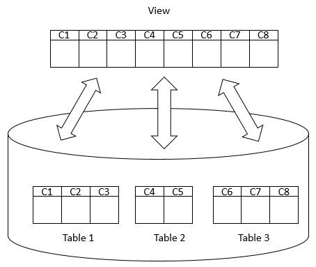

# Day 7


## 💛 Session 10- View, Stored Procedures and Querying Metadata

### 💥 View

Khái niệm "view" trong SQL Server đề cập đến một đối tượng CSDL ảo được tạo ra từ một hoặc nhiều bảng hoặc các view khác. Một view là một câu truy vấn SQL đã được đặt tên và lưu trữ trong CSDL, và nó có thể được sử dụng như một bảng thông thường để truy vấn dữ liệu.

View trong SQL Server hoạt động như một "cửa sổ ảo" cho phép người dùng nhìn vào dữ liệu từ các bảng gốc hoặc các view khác mà không cần truy cập trực tiếp vào các bảng đó. Khi tạo một view, bạn xác định các trường dữ liệu cần hiển thị và các điều kiện để lọc dữ liệu. Sau đó, bạn có thể truy vấn view như bạn truy vấn dữ liệu từ bất kỳ bảng nào.

Việc sử dụng view trong SQL Server có nhiều lợi ích. Dưới đây là một số ví dụ:

1. Đơn giản hóa truy vấn dữ liệu: View cho phép bạn định nghĩa các truy vấn phức tạp một lần và sau đó sử dụng lại chúng dễ dàng theo nhu cầu. Bạn có thể tạo view để hiển thị chỉ các trường dữ liệu cần thiết và ẩn các thông tin không cần thiết, giúp đơn giản hóa việc truy vấn và xử lý dữ liệu.

2. Bảo mật và quyền truy cập: Khi bạn sử dụng view, bạn có thể kiểm soát quyền truy cập vào dữ liệu. Bạn có thể cấu hình quyền truy cập vào view mà không cần cấu hình trực tiếp trên các bảng gốc. Điều này giúp bảo vệ dữ liệu và cung cấp mức độ bảo mật cao hơn cho hệ thống.

3. Đơn giản hóa quản lý dữ liệu: Khi cấu trúc CSDL thay đổi, bạn có thể thay đổi logic của view mà không cần thay đổi các ứng dụng sử dụng view đó. Điều này giảm thiểu sự phụ thuộc giữa ứng dụng và cấu trúc CSDL và đơn giản hóa quá trình quản lý và bảo trì dữ liệu.

Xem Doc: https://learn.microsoft.com/en-us/sql/relational-databases/views/views?view=sql-server-ver16


Ví dụ: Câu lệnh bên dưới trả về doanh số bán ra của mỗi sản phẩm theo ngày:

```sql
SELECT
    year(order_date) AS y,
    month(order_date) AS m,
    day(order_date) AS d,
    p.product_id,
    product_name,
    quantity * i.price AS sales
FROM
    dbo.orders AS o
INNER JOIN dbo.order_items AS i
    ON o.order_id = i.order_id
INNER JOIN dbo.products AS p
    ON p.product_id = i.product_id;
```

Và lần tới bạn lại muốn dùng lại kết quả truy vấn trê, hay thành viên trong TEAM của bạn cũng muốn dùng kết quả đó. Thì bạn có thể lưu thành file SQLQuery rồi thực thi. `Nhưng với cách này khi bạn backup data thì câu lệnh truy vấn không được kèm theo`.

SQL Server cung cấp cho bạn một cách khác HAY HO hơn là `VIEW`, và dĩ nhiên nó đươc backup kèm cùng với Database



- `View` là kết quả của một câu lênh truy vấn phức tạp lấy dữ liệu từ nhiều table.
- Kết quả đó: được `View` giữ lại để sử dụng cho lần sau. 
- Bạn có thể hiểu khi đó `View` như là một table, bạn có thể làm mọi thứ trên nó INSERT, UPDATE, DELETE từ View, thậm chí là đánh Index các cột.

---

#### 🔹 Tạo VIEW với `CREATE VIEW`

Cú pháp:

```sql
CREATE VIEW [OR ALTER] schema_name.view_name [(column_list)]
AS
    select_statement;
```
Trong đó:

- schema_name: là tên schema
- view_name: là tên bạn đặt cho view
- column_list: tùy chọn, là danh sách các cột như khi bạn tạo table
- select_statement: là câu lệnh truy vấn

Xem Doc: https://learn.microsoft.com/en-us/sql/relational-databases/views/create-views?view=sql-server-ver16

Từ ví dụ trên bạn tạo view như sau:

```sql
CREATE VIEW dbo.v_daily_sales --đặt tên với prefix v_
AS
SELECT
    year(order_date) AS y,
    month(order_date) AS m,
    day(order_date) AS d,
    p.product_id,
    product_name,
    quantity * i.price AS sales
FROM
    dbo.orders AS o
INNER JOIN dbo.order_items AS i
    ON o.order_id = i.order_id
INNER JOIN dbo.products AS p
    ON p.product_id = i.product_id;
--- ==> Kết quả nó tạo ra một table ảo, chứa kết quả của câu lệnh truy vấn SELECT
```
Sau đó bạn tái sử dụng kết quả truy vấn bằng cách:

```sql
-- SELECT mọi thứ từ một table ảo
SELECT * FROM dbo.v_daily_sales 
-- SELECT và sắp xếp
SELECT 
    * 
FROM 
    dbo.v_daily_sales
ORDER BY
    y, m, d, product_name;
```

Lưu ý: Câu lệnh SELECT trong View bạn không sử dụng mệnh ORDER BY để sắp xếp trước kết quả trả về.

Xem thêm: https://www.sqlservertutorial.net/sql-server-views/sql-server-create-view/

---

#### 🔹 Quy tắc Tạo VIEW

- Tên VIEW không được đặt trùng nhau, không trùng với tên table thật.
- Tên cột trong VIEW phải là duy nhất và không được trùng với tên cột trong các view hoặc bảng khác
- VIEW không thể tạo từ  temporary tables
- VIEW không thể có full-text index
- VIEW không thể chưa giá trị định nghĩa DEFAULT
- VIEW không thể dùng với ORDER BY trừ khi bạn dùng kèm với mệnh đề TOP
- VIEW chỉ tham chiếu tối đa 1.024 cột đến tabel thật
- VIEW không thể tạo khi dụng mệnh đề INTO

---

#### 🔹 Sửa VIEW với `ALTER VIEW`

Sử dụng từ khóa `ALTER VIEW`

```sql
ALTER VIEW dbo.v_daily_sales 
AS
SELECT
    year(order_date) AS y,
    month(order_date) AS m,
    day(order_date) AS d,
    p.product_id,
    p.product_name,
    p.discount,
    (i.quantity * i.price) AS sales
FROM
    dbo.orders AS o
INNER JOIN dbo.order_items AS i
    ON o.order_id = i.order_id
INNER JOIN dbo.products AS p
    ON p.product_id = i.product_id;
```

Xem Doc: https://learn.microsoft.com/en-us/sql/relational-databases/views/modify-views?view=sql-server-ver16

#### 🔹 Liệt kê danh sách VIEW

Bạn có thể xem danh sách bằng giao diện đồ họa trong SSMS. Hoặc dùng lệnh

```sql
SELECT * FROM sys.views
```

#### 🔹 Xóa VIEW

Bạn có thể xóa bằng giao diện đồ họa trong SSMS. Hoặc dùng lệnh


```sql
DROP VIEW IF EXISTS dbo.v_daily_sales
-- Xóa nhiều VIEW
DROP VIEW IF EXISTS 
    dbo.v_daily_sales, dbo.v_product_info
```

#### 🔹 Đổi tên VIEW 

Bạn có thể đổi tên bằng giao diện đồ họa trong SSMS. Hoặc dùng lệnh:

```sql
--Xóa đi
DROP VIEW [dbo].[v_daily_sales];
GO
--tạo lại View với tên mới
CREATE VIEW [dbo].[daily_sales]
AS 
<select_statement>
GO
--Hoặc
EXEC sp_rename 
    @objname = 'v_daily_sales',
    @newname = 'daily_sales';
```


#### 🔹 Các tùy chọn khi tạo VIEW

**WITH SCHEMABINDING**

Với việc sử dụng WITH SCHEMABINDING, view sẽ được ràng buộc với các đối tượng khác trong cơ sở dữ liệu. Nếu bạn thực hiện thay đổi cấu trúc của các đối tượng được ràng buộc (như thay đổi tên cột, tên bảng, ...), bạn sẽ không thể thực hiện được.


```sql
CREATE VIEW dbo.v_daily_sales
WITH SCHEMABINDING -- ràng buộc cấu trúc với các table tham chiếu
AS
SELECT
    year(order_date) AS y,
    month(order_date) AS m,
    day(order_date) AS d,
    p.product_id,
    p.product_name,
    p.discount,
    (i.quantity * i.price) AS sales
FROM
    dbo.orders AS o
INNER JOIN dbo.order_items AS i
    ON o.order_id = i.order_id
INNER JOIN dbo.products AS p
    ON p.product_id = i.product_id;
```

**WITH ENCRYPTION**

Với việc sử dụng WITH ENCRYPTION, mã nguồn của đối tượng sẽ được mã hóa và không thể đọc hoặc truy cập trực tiếp thông qua các công cụ SQL Server Management Studio (SSMS) hoặc các công cụ khác. Khi một đối tượng được mã hóa, SQL Server sẽ chỉ thực thi đối tượng đó mà không cung cấp truy cập vào mã nguồn.


```sql
CREATE VIEW dbo.v_daily_sales
WITH ENCRYPTION -- Mã hóa, ko cho xem cấu trúc của VIEW
AS
SELECT
    year(order_date) AS y,
    month(order_date) AS m,
    day(order_date) AS d,
    p.product_id,
    p.product_name,
    p.discount,
    (i.quantity * i.price) AS sales
FROM
    dbo.orders AS o
INNER JOIN dbo.order_items AS i
    ON o.order_id = i.order_id
INNER JOIN dbo.products AS p
    ON p.product_id = i.product_id;
```

**WITH CHECK OPTION**

WITH CHECK OPTION là một cấu hình được sử dụng trong câu lệnh CREATE VIEW để đảm bảo rằng các dòng dự liệu được chọn trong View cũng phải thỏa mãn điều kiện của View. Nếu bạn thêm hoặc cập nhật dữ liệu thông qua View, nó chỉ cho phép các thay đổi đáp ứng điều kiện của View.


```sql
CREATE VIEW dbo.v_daily_sales
AS
SELECT
    p.product_id,
    p.product_name,
    p.discount,
    year(order_date) AS y,
    month(order_date) AS m,
    day(order_date) AS d,
    (i.quantity * i.price) AS sales
FROM
    dbo.orders AS o
INNER JOIN dbo.order_items AS i
    ON o.order_id = i.order_id
INNER JOIN dbo.products AS p
    ON p.product_id = i.product_id
WHERE p.discount > 0.05 -- Nếu không thõa mãn WHERE thì VIEW sẽ không chạy được
WITH CHECK OPTION;
```

Khi đó bạn select từ view

```sql
SELECT * FROM dbo.v_daily_sales
```

Kết quả trả về là những records có `discount` > 0.05;

Nhưng bây giờ bạn đi thay đổi dữ liệu của VIEW bằng cách:

Ví dụ:

```sql
--Update
UPDATE dbo.v_daily_sales SET discount = 0.04 WHERE discount = 0.05
--Hoăc Insert mới 1 record
INSERT dbo.v_daily_sales (
    product_id,
    product_name,
    discount,
    y,
    m,
    d,
    sales
) VALUES (
    1,
    'Iphone',
    0.04,
    2018,
    1,
    1,
    200
)
```


Giã sử câu lệnh UPDATE và INSERT trên chạy được thì nó làm cho cột `discount` trong VIEW có chứa những giá trị < `0.05`. Khi đó mệnh đề WHERE của VIEW sẽ không chạy được vì không thõa điệu kiện. Vì `0.04` không thể > `0.05`.

Chính vì thế, mà VIEW sẽ ngăn không cho câu lệnh UPDATE, INSERT trên thực thi, để đảm bảo VIEW luôn luôn có tính khả dụng để CHẠY.

#### 🔹 Xem cấu trúc của VIEW 

Bạn có thể đổi tên bằng giao diện đồ họa trong SSMS. Hoặc dùng lệnh:

```sql
EXEC sp_helptext [v_daily_sales];
--OR
EXEC sp_helptext 'v_daily_sales';
```

---

### 💥 Stored Procedures

Trong SQL Server, Stored Procedures (thủ tục lưu trữ) là một khối mã SQL có thể được lưu trữ trong cơ sở dữ liệu. Một Stored Procedure là một tập hợp các câu lệnh SQL `được đặt tên` và gán một cách lưu trữ trong hệ thống quản lý cơ sở dữ liệu.

Stored Procedures được sử dụng để thực hiện các tác vụ hoặc thao tác dữ liệu phức tạp trong cơ sở dữ liệu. Chúng có thể chứa các câu lệnh SELECT, INSERT, UPDATE, DELETE, và các câu lệnh điều khiển như IF, WHILE, và các cấu trúc điều khiển khác. Một Stored Procedure có thể nhận đầu vào (tham số) và trả về giá trị đầu ra (kết quả).

Một số lợi ích của Stored Procedures trong SQL Server bao gồm:

1. Hiệu suất: Stored Procedures có thể được biên dịch và lưu trữ lại trong bộ nhớ của SQL Server. Khi được gọi, chúng không cần phải được phân tích và biên dịch lại từng lần thực thi, giúp cải thiện hiệu suất và tăng tốc độ thực thi.

2. Tái sử dụng: Stored Procedures có thể được sử dụng lại trong nhiều ứng dụng và truy vấn khác nhau. Chúng giúp đơn giản hóa việc phát triển ứng dụng và quản lý logic truy vấn trong cơ sở dữ liệu.

3. Bảo mật: Stored Procedures cung cấp một lớp bảo mật bổ sung bằng cách cho phép quản trị viên cấp quyền truy cập vào Stored Procedures mà không cần cấp quyền trực tiếp trên các bảng. Điều này giúp bảo vệ dữ liệu và kiểm soát quyền truy cập từ các ứng dụng và người dùng.

4. Quản lý dữ liệu: Stored Procedures cho phép bạn thực hiện các thao tác dữ liệu phức tạp, xử lý logic phức tạp và thực hiện các tác vụ như ghi log, kiểm tra dữ liệu, và xử lý lỗi. Chúng giúp đơn giản hóa quá trình quản lý và bảo trì dữ liệu.

#### 🔹 Tạo STORE


Cú pháp đầy đủ:

```sql
CREATE [ OR ALTER ] { PROC | PROCEDURE }
    [schema_name.] procedure_name [ ; number ]
    [ { @parameter_name [ type_schema_name. ] data_type }
        [ VARYING ] [ NULL ] [ = default ] [ OUT | OUTPUT | [READONLY]
    ] [ ,...n ]
[ WITH <procedure_option> [ ,...n ] ]
[ FOR REPLICATION ]
AS { [ BEGIN ] sql_statement [;] [ ...n ] [ END ] }
[;]

<procedure_option> ::=
    [ ENCRYPTION ]
    [ RECOMPILE ]
    [ EXECUTE AS Clause ]
```

Xem Doc: https://learn.microsoft.com/vi-vn/sql/relational-databases/stored-procedures/create-a-stored-procedure?view=sql-server-ver16


Ví dụ: Lấy danh sách sản phẩm

```sql
--Sử dụng từ khóa CREATE PROCEDURE
CREATE PROCEDURE usp_ProductList -- đặt tên với prefix usp_
AS
BEGIN
    SELECT 
        product_name, 
        price
    FROM 
        dbo.products
    ORDER BY 
        product_name;
END;
```
Sau khi tạo xong bạn có thể thấy store được lưu ở `Programmability > Stored Procedures`


#### 🔹 Sử dụng STORE

```sql
EXECUTE usp_ProductList
--Hoặc
EXEC usp_ProductList
```

#### 🔹 Tạo Store có tham số đầu vào

Ví dụ: Lấy danh sách sản phẩm có model_year > 2018

```sql
CREATE PROCEDURE usp_FindProductsByModelYear(@model_year INT)
AS
BEGIN
    SELECT
        product_name,
        price
    FROM 
        dbo.products
    WHERE
        model_year >= @model_year
    ORDER BY
        price;
END;
--Sử dụng Store khi có tham số
EXEC uspFindProductsByModelYear 2018;
```

#### 🔹 Tạo Store có tham số OUTPUT

Ví dụ: Lấy danh sách đơn hàng bán ra từ ngày đến ngày.

```sql
CREATE PROCEDURE usp_TotalOrderByRangeDate (
    @FromDate DATETIME, --tham số đầu vào
    @ToDate DATETIME, --tham số đầu vào
    @Total INT OUTPUT --Tham số đầu ra OUTPUT
)
AS
BEGIN
  SELECT @Total = COUNT(*) FROM orders WHERE CAST(order_date AS DATE)  BETWEEN @FromDate AND @ToDate
END;
--Sử dụng
DECLARE @TotalOrders INT;
EXEC usp_TotalOrderByRangeDate '2024-01-01', '2024-12-31', @TotalOrders OUTPUT;
SELECT @TotalOrders as TotalOrders;
```

Xem thêm: https://www.sqlservertutorial.net/sql-server-stored-procedures/sql-server-stored-procedure-parameters/

#### 🔹 Sửa STORE

```sql
--Sử dụng từ khóa CREATE PROCEDURE
ALTER PROCEDURE usp_ProductList -- đặt tên với prefix usp_
AS
BEGIN
    SELECT 
        product_id, --thêm mới
        product_name, --thêm mới
        price,
        discount
    FROM 
        dbo.products
    ORDER BY 
        product_id;
END;
```

#### 🔹 Xóa STORE

```sql
DROP PROCEDURE usp_ProductList;
--Hoặc
DROP PROC usp_ProductList;
```

#### 🔹  Các tùy chọn khi tạo stored procedure

**WITH ENCRYPTION**

Với việc sử dụng WITH ENCRYPTION, mã nguồn của đối tượng sẽ được mã hóa và không thể đọc hoặc truy cập trực tiếp thông qua các công cụ SQL Server Management Studio (SSMS) hoặc các công cụ khác. Khi một đối tượng được mã hóa, SQL Server sẽ chỉ thực thi đối tượng đó mà không cung cấp truy cập vào mã nguồn.

```sql
CREATE PROCEDURE usp_GetOrders
WITH ENCRYPTION
  @FromDate DATETIME,
  @ToDate DATETIME
AS
BEGIN
  SELECT o.*, od.product_id, od.quantity, od.price, od.discount
  FROM orders AS o
    INNER JOIN order_items AS od ON o.order_id = od.order_id
  WHERE o.order_date BETWEEN @FromDate AND @ToDate
END
```

**WITH RECOMPILE**

Với việc sử dụng WITH RECOMPILE, stored procedure sẽ được biên dịch lại mỗi khi thực thi. Điều này sẽ giúp tăng hiệu suất thực thi của stored procedure.

```sql
CREATE PROCEDURE usp_GetOrders
WITH RECOMPILE
  @FromDate DATETIME,
  @ToDate DATETIME
AS
BEGIN
  SELECT o.*, od.product_id, od.quantity, od.price, od.discount
  FROM orders AS o
    INNER JOIN order_items AS od ON o.order_id = od.order_id
  WHERE o.order_date BETWEEN @FromDate AND @ToDate
END
```

**WITH EXECUTE AS**

Với việc sử dụng WITH EXECUTE AS, stored procedure sẽ được thực thi với quyền của người dùng được chỉ định.

Tạo stored procedure và thực thi với quyền của người dùng được chỉ định

```sql
CREATE PROCEDURE usp_GetOrders
WITH EXECUTE AS 'dbo'
  @FromDate DATETIME,
  @ToDate DATETIME
AS
BEGIN
  SELECT o.*, od.product_id, od.quantity, od.price, od.discount
  FROM orders AS o
    INNER JOIN order_items AS od ON o.order_id = od.order_id
  WHERE o.order_date BETWEEN @FromDate AND @ToDate
END
```

---

#### 🔹 Stored procedure Có RETURN

Stored procedure (thủ tục lưu trữ) trong SQL có thể trả về một giá trị duy nhất. Điều này thường được sử dụng để trả về một mã trạng thái cho ứng dụng gọi stored procedure.

Để tạo một stored procedure trả về giá trị, bạn sử dụng từ khóa `RETURN` trong thân của stored procedure. Ví dụ:

```sql
CREATE PROCEDURE CheckOrderStatus
    @OrderId INT
AS
BEGIN
    IF EXISTS(SELECT 1 FROM Orders WHERE OrderId = @OrderId)
        RETURN 1 -- Order exists
    ELSE
        RETURN 0 -- Order does not exist
END;
```

Để gọi stored procedure này và nhận giá trị trả về, bạn có thể sử dụng câu lệnh sau:

```sql
DECLARE @Status INT
EXEC @Status = CheckOrderStatus 12345
SELECT @Status as Status
```

Trong đó, `12345` là ID của đơn hàng bạn muốn kiểm tra. Giá trị trả về sẽ được lưu trong biến `@Status`.

Lưu ý rằng, một stored procedure chỉ có thể trả về một giá trị duy nhất và kiểu dữ liệu của giá trị trả về phải là `INT`. Nếu bạn muốn trả về nhiều giá trị hoặc các kiểu dữ liệu khác, bạn nên sử dụng tham số OUTPUT.

Xem thêm: https://learn.microsoft.com/vi-vn/sql/relational-databases/stored-procedures/return-data-from-a-stored-procedure?view=sql-server-ver16

---

#### 🔹 Xem Cấu trúc của Stored procedure


```sql
EXEC sp_helptext N'dbo.uspLogError';  
--Hoặc
SELECT OBJECT_DEFINITION (OBJECT_ID(N'dbo.uspLogError'));
```


---

### 💥 Querying Metadata

Trong SQL Server, querying metadata (truy vấn siêu dữ liệu) là quá trình truy vấn thông tin về cấu trúc và thông tin liên quan đến cơ sở dữ liệu, bảng, cột, view, Stored Procedure và các đối tượng khác trong hệ thống quản lý cơ sở dữ liệu.

Thông tin metadata cung cấp mô tả về cấu trúc và đặc điểm của cơ sở dữ liệu, bảng, cột và các đối tượng khác trong cơ sở dữ liệu. Bằng cách truy vấn metadata, bạn có thể tìm hiểu về cấu trúc của cơ sở dữ liệu, xem thông tin về các đối tượng và thu thập thông tin để phân tích và quản lý cơ sở dữ liệu.

Có một số hệ thống bảng dữ liệu (system tables) và hàm metadata dành riêng trong SQL Server để truy vấn thông tin metadata. Dưới đây là một số ví dụ về cách truy vấn metadata trong SQL Server:

1. Truy vấn thông tin về bảng và cột: Bạn có thể sử dụng các hệ thống bảng như sys.tables, sys.columns để truy vấn thông tin về các bảng và cột trong cơ sở dữ liệu. Ví dụ:

```sql
SELECT *
FROM sys.tables
WHERE name = 'Tên_Bảng'

SELECT *
FROM sys.columns
WHERE object_id = OBJECT_ID('Tên_Bảng')
```

2. Truy vấn thông tin về Stored Procedure: Bạn có thể sử dụng hệ thống bảng như sys.procedures để truy vấn thông tin về các Stored Procedure trong cơ sở dữ liệu. Ví dụ:

```sql
SELECT *
FROM sys.procedures
WHERE name = 'Tên_Stored_Procedure'
```

3. Truy vấn thông tin về view: Bạn có thể sử dụng hệ thống bảng như sys.views để truy vấn thông tin về các view trong cơ sở dữ liệu. Ví dụ:

```sql
SELECT *
FROM sys.views
WHERE name = 'Tên_View'
```
4. Truy vấn thông tin về ràng buộc (constraints), chỉ mục (indexes) và khóa ngoại (foreign keys): Bạn có thể sử dụng các hệ thống bảng như sys.foreign_keys, sys.indexes, sys.key_constraints để truy vấn thông tin chi tiết về các ràng buộc, chỉ mục và khóa ngoại trong cơ sở dữ liệu.

Truy vấn metadata cung cấp cho bạn một cái nhìn tổng quan về cấu trúc và thông tin liên quan đến cơ sở dữ liệu và đối tượng trong SQL Server. Điều này giúp bạn hiểu rõ hơn về cấu trúc dữ liệu và có khả năng xây dựng các truy vấn và tác vụ phức tạp dựa trên thông tin metadata.

---


## 💛 Session 12 - Triggers

### 💥 Trigger là gì?

- Trigger là một đối tượng trong SQL Server, nó được sử dụng để thực thi một tập hợp các câu lệnh SQL khi một sự kiện xảy ra. Sự kiện có thể là một câu lệnh INSERT, UPDATE hoặc DELETE. Trigger có thể được kích hoạt trước hoặc sau khi sự kiện xảy ra.

- Không giống như stored procedure, trigger không được gọi bởi một ứng dụng hoặc một người dùng. Trigger được kích hoạt bởi một sự kiện như INSERT, UPDATE, DELETE và không thể được gọi như một stored procedure


Xem Doc: https://learn.microsoft.com/en-us/sql/t-sql/statements/create-trigger-transact-sql?view=sql-server-ver16
---

### 💥 DML Trigger

Là loại trigger được kích hoạt bởi các câu lệnh DML như INSERT, UPDATE hoặc DELETE. Có hai loại DML trigger:

- **After trigger**: được kích hoạt sau khi sự kiện xảy ra.
- **Instead of trigger**: được kích hoạt thay thế cho sự kiện.

> Lưu ý: Có 2 bảng inserted và deleted được sử dụng trong trigger. Bảng inserted chứa các bản ghi được thêm vào bởi câu lệnh INSERT hoặc UPDATE. Table deleted chứa các bản ghi bị xóa bởi câu lệnh DELETE hoặc UPDATE.

Thứ tự thực thi của các DML trigger:

- Các trigger INSTEAD OF được kích hoạt trước.
- Các trigger AFTER được kích hoạt sau.

Xem thêm: https://learn.microsoft.com/en-us/sql/relational-databases/triggers/dml-triggers?view=sql-server-ver16

#### 🔹 AFTER Trigger

Cú pháp:

```sql
CREATE [OR ALTER] TRIGGER [schema_name.]trigger_name
ON table_name
AFTER  {[INSERT],[UPDATE],[DELETE]}
[NOT FOR REPLICATION]
AS
BEGIN
    {sql_statements}
END;
```

Ví dụ: Tình huống gặp trong thực tế. Khi có đơn đặt hàng, và đơn đã xác nhận thanh toán thành công, thì phải cập nhật trạng thái tồn kho giảm đi = số lượng sản phẩm có trong đơn hàng đã mua.

Và theo cách thông thường: Khi gọi câu lệnh cập nhật xác nhận thanh toán thành công. Bạn làm tiếp câu lệnh cập nhật số lượng tồn kho.

Thay vì thế chúng ta có thể tạo một Trigger thực hiện cập nhật tồn kho một cách tự động (chạy ngầm) khi một đơn hàng được xác nhận thanh toán thành công.

```sql

CREATE TRIGGER trg_OrderItems_Update_ProductStock
ON order_items
AFTER INSERT
AS
BEGIN
    UPDATE stocks
        SET quantity = s.quantity - i.quantity
    FROM
       stocks as s
    INNER JOIN inserted AS i ON s.product_id = i.product_id
	INNER JOIN orders AS o ON o.order_id = i.order_id AND o.store_id = s.store_id;
END;
```

Ví dụ 2: Tạo một trigger AFTER để ngăn chặn việc cập nhật / xóa đơn hàng khi đơn hàng (orders) có trạng thái order_status = 4 (COMPLETED)


```sql
CREATE TRIGGER trg_Orders_Prevent_UpdateDelete
ON orders
AFTER UPDATE, DELETE -- Ngăn cách nhau bởi dấy phẩu khi có nhiều action
AS
BEGIN
    IF EXISTS (SELECT * FROM inserted WHERE [order_status] = 4)
    BEGIN
        PRINT 'Cannot update order having status = 4 (COMPLETED).'
        ROLLBACK -- Hủy lệnh UPDATE trước đó vào orders
    END

    IF EXISTS (SELECT * FROM deleted WHERE [order_status] = 4)
    BEGIN
        PRINT 'Cannot delete order having status = 4 (COMPLETED).'
        ROLLBACK -- Hủy lệnh DELETE trước đó vào orders
    END
END;
```

Ví dụ 3: Tạo một trigger AFTER để ngăn chặn việc cập nhật / thêm mới / xóa chi tiết đơn hàng (orders) có trạng thái order_status = 4 (COMPLETED)

```sql
CREATE OR ALTER TRIGGER trg_OrderItems_Prevent_InsertUpdateDelete
ON order_items
AFTER INSERT, UPDATE, DELETE
AS
BEGIN
    IF EXISTS (
        SELECT * FROM
        inserted AS oi INNER JOIN dbo.orders AS o ON oi.order_id = o.order_id
        WHERE [order_status] = 4
    )
    BEGIN
        PRINT 'Cannot insert or update order details having order''s status = 4 (COMPLETED).'
        ROLLBACK
    END

    IF EXISTS (
        SELECT * FROM
        deleted AS oi INNER JOIN dbo.orders AS o ON oi.order_id = o.order_id
    )
    BEGIN
        PRINT 'Cannot delete order details having order''s status = 4 (COMPLETED).'
        ROLLBACK
    END
END
```

#### 🔹 INSTEAD OF Trigger

INSTEAD OF trigger là một trigger cho phép bạn bỏ qua một câu lệnh INSERT, DELETE hoặc UPDATE đối với một bảng hoặc một view và thay vào đó thực thi các câu lệnh khác được định nghĩa trong trigger. Thực tế, việc INSERT, DELETE hoặc UPDATE không xảy ra.

```sql
CREATE OR ALTER TRIGGER [schema_name.]trigger_name
ON table_name
INSTEAD OF  {[INSERT],[UPDATE],[DELETE]}
[NOT FOR REPLICATION]
AS
BEGIN
    {sql_statements}
END
```


Ví dụ: Tạo một trigger INSTEAD OF để ngăn chặn việc thêm dữ liệu vào bảng customers

```sql
CREATE TRIGGER trg_customers_PreventInsert
ON customers
INSTEAD OF INSERT
AS
BEGIN
    PRINT 'Cannot insert data into the Customers table.'
END
```

---

### 💥 DDL Trigger

DDL Trigger được kích hoạt bởi sự kiện ở cấp độ Server hoặc Databse. 

Các sự kiện này được tạo ra bởi câu lệnh Transact-SQL thường bắt đầu bằng một trong các từ khóa sau: CREATE, ALTER, DROP, GRANT, DENY, REVOKE hoặc UPDATE STATISTICS.

Xem thêm: https://learn.microsoft.com/en-us/sql/relational-databases/triggers/ddl-triggers?view=sql-server-ver16

Các trigger DDL rất hữu ích trong các trường hợp sau:

- Ghi lại các thay đổi trong cấu trúc CSDL.
- Ngăn chặn một số thay đổi cụ thể trong cấu trúc CSDL.
- Phản hồi một thay đổi trong cấu trúc CSDL.


Lưu ý: Triggler loại này lưu ở `Databse Name --> Programmability --> Database Triggers`

Cấu trúc:

```sql
CREATE TRIGGER trigger_name
ON { DATABASE |  ALL SERVER}
[WITH ddl_trigger_option]
FOR {event_type | event_group }
AS {sql_statement}

```


Ví dụ: Tạo một trigger để ngăn chặn việc xóa bảng customers

```sql
CREATE TRIGGER trg_customers_Prevent_DropTable
ON DATABASE
FOR DROP_TABLE
AS
BEGIN
    IF EXISTS (SELECT * FROM sys.objects WHERE object_id = OBJECT_ID(N'[dbo].[customers]') AND type in (N'U'))
    BEGIN
        PRINT 'Cannot drop the table: Customers.'
        ROLLBACK
    END
END;
```

Ví dụ 2: Tạo một trigger để ghi nhật ký sửa đổi cấu trúc bảng customers

```sql
-- Tạo table logs trước
CREATE TABLE dbo.logs (
    ID INT IDENTITY(1,1) PRIMARY KEY,
    [Date] DATETIME,
    [User] NVARCHAR(100),
    [Host] NVARCHAR(100),
    [Action] NVARCHAR(100),
    [Table] NVARCHAR(100)
);

-- Thêm trigger
CREATE TRIGGER trg_customers_LogAlterTable
ON DATABASE
FOR ALTER_TABLE
AS
BEGIN
    IF EXISTS (SELECT * FROM sys.objects WHERE object_id = OBJECT_ID(N'[dbo].[customers]') AND type in (N'U'))
    BEGIN
        INSERT INTO dbo.logs ([Date], [User], [Host], [Action], [Table])
        SELECT GETDATE(), USER_NAME(), HOST_NAME(), 'ALTER TABLE', 'customers'
    END
END
```

---


### 💥 Logon Trigger

Xem Doc: https://learn.microsoft.com/en-us/sql/relational-databases/triggers/logon-triggers?view=sql-server-ver16


### 💥 Disable Trigger

Vô hiệu hóa hoạt động của một Trigger

```sql
DISABLE TRIGGER [schema_name.][trigger_name] 
ON [object_name | DATABASE | ALL SERVER]

```
Ví dụ:

```sql
DISABLE TRIGGER dbo.trg_customers_LogAlterTable 
ON dbo.customers;
```

Vô hiệu hóa tất cả trigger trên một table

```sql
DISABLE TRIGGER ALL ON table_name;
```


Vô hiệu hóa tất cả trigger trên một Databse

```sql
DISABLE TRIGGER ALL ON DATABASE;
```

---

### 💥 Enable Trigger

Kích hoạt lại Trigger

```sql
ENABLE TRIGGER [schema_name.][trigger_name] 
ON [object_name | DATABASE | ALL SERVER]
```

---

### 💥 List ALl Triggers

Liệt kê danh sách tất cả Triggers


```sql
SELECT  
    name,
    is_instead_of_trigger
FROM 
    sys.triggers  
WHERE 
    type = 'TR';
```

---

### 💥 Delete Trigger

Cú pháp:

```sql
DROP TRIGGER [ IF EXISTS ] trigger_name [ ,...n ]   
ON { DATABASE | ALL SERVER };
```

### 💥 Xem chi tiết Triggers

```sql
SELECT 
    definition   
FROM 
    sys.sql_modules  
WHERE 
    object_id = OBJECT_ID('dbo.trg_customers_LogAlterTable'); 
--- Hoăc
EXEC sp_helptext 'dbo.trg_customers_LogAlterTable' ;

```