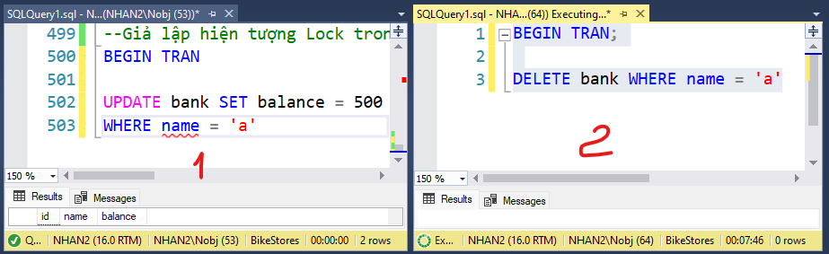
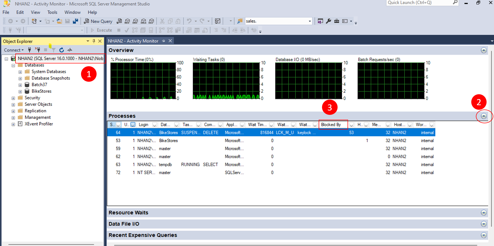
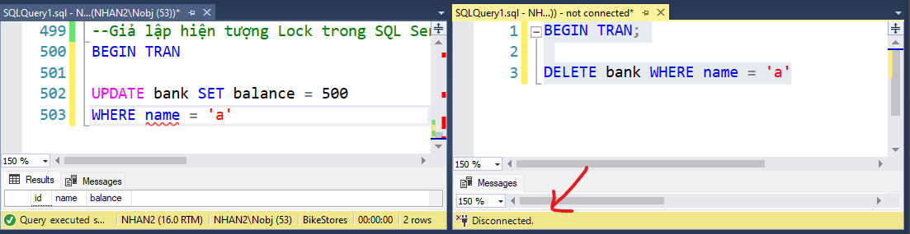

# Day 08 


## 💛 Session 14 - Transactions

### 💥 Transaction là gì?

Transaction là một tập hợp các hoạt động được thực hiện như một đơn vị không thể chia rời. Mục tiêu chính của transaction là đảm bảo tính toàn vẹn và nhất quán của dữ liệu trong cơ sở dữ liệu trong quá trình thực hiện các hoạt động.

Transaction được sử dụng để thực hiện các thay đổi dữ liệu trong cơ sở dữ liệu, bao gồm cả việc chèn, cập nhật và xóa dữ liệu. Một transaction bao gồm ít nhất hai hoặc nhiều hơn các hoạt động dữ liệu và được xem là một đơn vị làm việc hoàn chỉnh.

Nếu một hoặc nhiều hoạt động trong transaction gặp lỗi, toàn bộ transaction sẽ bị hủy và dữ liệu sẽ được phục hồi về trạng thái ban đầu.

Transaction được xác định bằng ba tính chất ACID:

1. Atomicity (Toàn vẹn): Transaction được coi là một đơn vị toàn vẹn không thể chia rời. Nếu một phần của transaction gặp lỗi, toàn bộ transaction sẽ bị hủy và dữ liệu sẽ trở về trạng thái ban đầu.

2. Consistency (Nhất quán): Một transaction phải đảm bảo rằng dữ liệu sẽ được đưa về trạng thái nhất quán sau khi hoàn thành. Nếu dữ liệu không tuân thủ các ràng buộc hoặc quy tắc, transaction sẽ bị hủy.

3. Isolation (Cô lập): Mỗi transaction phải thực hiện một cách cô lập và không bị tác động bởi các transaction khác đang thực hiện đồng thời. Điều này đảm bảo tính nhất quán của dữ liệu và tránh xảy ra xung đột.

4. Durability (Bền vững): Một khi một transaction đã được hoàn thành thành công, các thay đổi dữ liệu phải được lưu trữ vĩnh viễn và không bị mất trong trường hợp xảy ra sự cố hệ thống.


Các ứng dụng của transaction:

- Transaction được sử dụng để đảm bảo tính toàn vẹn của dữ liệu trong các ứng dụng doanh nghiệp.
- Transaction có thể được sử dụng để thực hiện các thao tác như: chuyển tiền, thanh toán hóa đơn, đặt hàng, ...


Trong SQL Server, có các chế độ thực hiện transaction như sau:

1. **Autocommit Transactions**: 

Mặc định là chế độ này.

Khi ở chế độ `Autocommit Transactions`, mỗi lệnh DML (Data Manipulation Language) như `INSERT`, `UPDATE`, `DELETE` tự động bắt đầu một transaction ngầm định. 

Nếu lệnh DML hoàn thành thành công, SQL Server sẽ tự động COMMIT transaction. Nếu có lỗi xảy ra, SQL Server sẽ tự động ROLLBACK transaction.

Lưu ý rằng các lệnh điều khiển transaction chỉ được sử dụng với các lệnh thao tác dữ liệu DML như `INSERT`, `UPDATE` và `DELETE`. Chúng không thể được sử dụng trong lệnh `CREATE TABLE` hoặc `DROP TABLE` vì các hoạt động này được tự động được commit trong cơ sở dữ liệu.


2. **Explicit Transactions**: Mỗi transaction explicit (tường minh) bắt đầu với câu lệnh `BEGIN TRANSACTION` và kết thúc bằng `ROLLBACK` hoặc `COMMIT` transaction.

3. **Implicit Transactions**: Một transaction mới được bắt đầu một cách ngầm định khi transaction trước đó hoàn thành, nhưng mỗi transaction được hoàn thành một cách rõ ràng với một câu lệnh `COMMIT` hoặc `ROLLBACK`.

4. **Batch-scoped Transactions**: Chỉ áp dụng cho các tập kết quả hoạt động đa dạng (MARS), một transaction SQL rõ ràng hoặc ngầm định bắt đầu dưới một phiên MARS trở thành một transaction phạm vi batch.

---

### 💥  Các lệnh quản lý transaction

- **BEGIN TRANSACTION** : Dùng để bắt đầu một transaction.

- **COMMIT TRANSACTION** : Dùng để xác nhận toàn bộ một transaction.

- **COMMIT WORK** : Dùng để đánh đấu kết thúc của transaction.

- **SAVE TRANSACTION** : Dùng để tạo một savepoint trong transaction.

- **ROLLBACK WORK** : Dùng để hủy bỏ một transaction.

- **ROLLBACK TRANSACTION** : Dùng để hủy bỏ toàn bộ một transaction.

- **ROLLBACK TRANSACTION [SavepointName]** : Dùng để hủy bỏ một savepoint trong transaction

---

Xem Thêm: <https://learn.microsoft.com/en-us/sql/t-sql/language-elements/begin-transaction-transact-sql?view=sql-server-ver16>

### 💥 Cách sử dụng transaction

Để bắt đầu một transaction bạn sử dụng từ khóa `BEGIN TRANSACTION` hoặc `BEGIN TRAN`

```sql
-- Bước 1:  start a transaction
BEGIN TRANSACTION; -- or BEGIN TRAN

-- Bước 2:  Các câu lênh truy vấn bắt đầu ở đây INSERT, UPDATE, and DELETE

-- =====================
-- Chạy xong các câu lệnh trên thì bạn kết thúc TRANSACTION với 1 trong 2 hình thức.
-- =====================

-- Bước 3 -  1. commit the transaction
-- Để xác nhận thay đổi dữ liệu
COMMIT;

-- Bước 3 - 2. rollback -- Hồi lại những thay đổi trong những câu lệnh truy vấn ở trên. (Hủy ko thực hiện nữa, trả lại trạng thái ban đầu lúc chưa chạy)
ROLLBACK;
```

Về bản chất các câu lệnh truy vấn trên nó chưa được ghi nhận thay đổi vào dữ liệu thật mà nó tạo ra dữ liệu tạm trước.

Sau đó dựa vào Bước 3, chờ bạn quyết định như thế nào với dữ liệu tạm đó, thì nó mới chính thức đi cập nhật thay đổi với dữ liệu thật.

Ví dụ: Tạo 2 bảng mới `invoices` và `invoice_items`

```sql
-- Hóa đơn
CREATE TABLE invoices (
  id int IDENTITY(1,1) PRIMARY KEY,
  customer_id int NOT NULL,
  total decimal(10, 2) NOT NULL DEFAULT 0 CHECK (total >= 0)
);
-- Chi tiết các mục ghi vào hóa đơn
CREATE TABLE invoice_items (
  id int IDENTITY(1,1),
  invoice_id int NOT NULL,
  item_name varchar(100) NOT NULL,
  amount decimal(18, 2) NOT NULL CHECK (amount >= 0),
  tax decimal(4, 2) NOT NULL CHECK (tax >= 0),
  PRIMARY KEY (id, invoice_id),
  FOREIGN KEY (invoice_id) REFERENCES invoices (id)
 ON UPDATE CASCADE
 ON DELETE CASCADE
);
```

Bây giờ chúng ta tạo một `TRANSACTION` thực hiện thêm mới dữ liệu vào cho 2 table cùng lúc:

```sql
-- Bước 1
BEGIN TRANSACTION; -- or BEGIN TRAN
-- Bước 2
-- Thêm vào invoices
INSERT INTO dbo.invoices (customer_id, total)
VALUES (100, 0);
-- Thêm vào invoice_items
 INSERT INTO dbo.invoice_items (invoice_id, item_name, amount, tax)
VALUES (1, 'Keyboard', 70, 0.08),
       (1, 'Mouse', 50, 0.08);
-- Thay đổi dữ liệu cho record đã chèn vào invoices
UPDATE dbo.invoices
SET total = (SELECT
  SUM(amount * (1 + tax))
FROM invoice_items
WHERE invoice_id = 1);

--Bước 3: xác nhận cho phép thay đổi dữ liệu
COMMIT TRANSACTION; -- or COMMIT
```

Kết quả của một tập hợp các câu lệnh truy vấn trên:

- Nếu 1 trong 3 câu lệnh THẤT BẠI ==> Tất cả sẽ đều THẤT BẠI, trả lại trạng thái ban đầu.
- Nếu cả 3 THÀNH CÔNG ==> TRANSACTION thành công, dữ liệu được cập nhật.


Bạn có thể TEST trường hợp thất bại với câu lệnh INSERT bị lỗi

```sql
--Check dữ liệu của 2 table trước khi thực hiện
select * from invoices
select * from invoice_items

-- Bước 1
BEGIN TRANSACTION; -- or BEGIN TRAN
-- Bước 2
-- Thêm vào invoices
INSERT INTO dbo.invoices (customer_id, total)
VALUES (100, 0);
--Trường ID đã khai báo IDENTITY nên bạn không thể khai báo chi tiết giá trị của id khi thêm mới
--Câu lệnh này sẽ gây lỗi IDENTITY_INSERT is set to OFF
 INSERT INTO dbo.invoice_items (id, invoice_id, item_name, amount, tax)
VALUES (3, 1, 'Keyboard v2 ', 70, 0.08),
       (4, 1, 'Mouse v2 ', 50, 0.08);
-- Thay đổi dữ liệu cho record đã chèn vào invoices
UPDATE dbo.invoices
SET total = (SELECT
  SUM(amount * (1 + tax))
FROM invoice_items
WHERE invoice_id = 1);

--Bước 3: xác nhận cho phép thay đổi dữ liệu
COMMIT TRANSACTION; -- or COMMIT


--Check dữ liệu của 2 table SAU khi thực hiện
select * from invoices
select * from invoice_items
```

Bạn có thể kiểm tra dữ liệu, Chỉ cần 1 trong 3 câu lệnh bị lỗi thì toàn bộ transaction sẽ bị hủy.


Ví dụ 2:

```sql
-- Bước 1
BEGIN TRANSACTION;
-- Bước 2
-- Thêm vào invoice_items

INSERT INTO dbo.invoice_items (invoice_id, item_name, amount, tax)
VALUES (1, 'Headphone', 80, 0.08),
       (1, 'Mainboard', 30, 0.08);

INSERT INTO dbo.invoice_items (invoice_id, item_name, amount, tax)
VALUES (1, 'TochPad', 20, 0.08),
       (1, 'Camera', 90, 0.08);

INSERT INTO dbo.invoice_items (invoice_id, item_name, amount, tax)
VALUES (1, 'Wifi', 120, 0.08),
       (1, 'Bluetooth', 20, 0.08);

--Bước 3: xác nhận HỦY thay đổi dữ liệu
ROLLBACK TRANSACTION;
```

- Các câu lệnh ở Bước 2: vẫn chạy, và đưa vào dữ liệu tạm
- Đến Bước 3, gặp câu lệnh `ROLLBACK` thì dữ liệu tạm bị HỦY, việc INSERT dữ liệu không được ghi nhận.

Ví dụ 3:

```sql
-- Bước 1
BEGIN TRANSACTION;
-- Bước 2
-- Thêm vào invoice_items

INSERT INTO dbo.invoice_items (invoice_id, item_name, amount, tax)
VALUES (1, 'Headphone', 80, 0.08),
       (1, 'Mainboard', 30, 0.08);

SAVE TRANSACTION Savepoint1

INSERT INTO dbo.invoice_items (invoice_id, item_name, amount, tax)
VALUES (1, 'TochPad', 20, 0.08),
       (1, 'Camera', 90, 0.08);

ROLLBACK TRANSACTION Savepoint1

INSERT INTO dbo.invoice_items (invoice_id, item_name, amount, tax)
VALUES (1, 'Wifi', 120, 0.08),
       (1, 'Bluetooth', 20, 0.08);

--Bước 3: xác nhận cho phép thay đổi dữ liệu
COMMIT TRANSACTION
```

`SAVE TRANSACTION` - Nó cho phép lưu lại trạng thái hiện tại của transaction và tiếp tục thực hiện các hoạt động trong transaction. Nếu sau đó có lỗi xảy ra, bạn có thể sử dụng lệnh ROLLBACK để hủy bỏ toàn bộ transaction hoặc sử dụng lệnh ROLLBACK TRANSACTION để hủy bỏ đến điểm đã được lưu trữ bởi SAVE TRANSACTION.

Ví dụ 4:

```sql

--Mô phỏng chuyển tiền ngân hàng từ người a, sang người b

--Tạo table bank
CREATE TABLE bank
(
    id INT IDENTITY(1,1) PRIMARY KEY,
    name NVARCHAR(20),
    balance DECIMAL(10,2)
)
--Ghi log giao dich
CREATE TABLE bank_log
(
    id INT IDENTITY(1,1) PRIMARY KEY,
    note NVARCHAR(500)
)

--chèn dữ liệu ban đầu cho a và b
INSERT bank
    (name,balance)
VALUES
    ('a', 250),
    ('b', 0)

/*
Để thực hiện chuyển 50USD từ a --> b cần các bước:
1. Trừ tiền người a: 50
2. Ghi log lịch sử transaction
3. Cộng tiền người b: 50
4. Ghi log lịch sử transaction

==> 4 bước trên được coi là 1 transaction trong ngân hàng
==> Chỉ cần 1 trong 4 lệnh trên lỗi thì transaction được coi là không thành công.
==> Trạng thái sẽ được khôi phục lại như khi chưa thực hiện transaction
*/

BEGIN TRANSACTION;

BEGIN TRY
    -- b1. Trừ tiền người a: 50
    UPDATE bank SET balance = balance - 50 WHERE name = 'a';

    -- b2. Ghi log lịch sử transaction
    INSERT INTO bank_log (note)
    VALUES ('Chuyen tien tu a sang 5, 50USD');

    -- b3. Cộng tiền người b: 50
    UPDATE bank SET balance = balance + 50 WHERE name = 'b';

    -- b4. Ghi log lịch sử transaction
    INSERT INTO bank_log (id, note)
    VALUES (2, 'Nhan tien tu nguoi a, 50USD');

    -- Nếu không có lỗi, xác nhận transaction
    COMMIT TRANSACTION;
END TRY
BEGIN CATCH
    -- Xử lý lỗi
    SELECT 
        ERROR_NUMBER() AS ErrorNumber,
        ERROR_MESSAGE() AS ErrorMessage;

    -- Nếu có lỗi, hủy bỏ transaction
    ROLLBACK TRANSACTION;
END CATCH

```

---

### 💥 Locks

Trong SQL Server, locks (khóa) là cơ chế được sử dụng để kiểm soát truy cập và sửa đổi dữ liệu trong quá trình thực hiện các transaction. Khi một transaction yêu cầu truy cập vào dữ liệu, SQL Server áp dụng các locks trên dữ liệu tương ứng để đảm bảo tính nhất quán và độc lập của dữ liệu trong môi trường đa người dùng.

Có nhiều loại lock khác nhau trong SQL Server, bao gồm:

1. Shared Lock (Shared Read Lock):
   - Được sử dụng khi transaction muốn đọc (truy vấn) dữ liệu.
   - Nhiều shared locks có thể được áp dụng trên cùng một dữ liệu.
   - Shared locks không ngăn được các shared locks khác trên cùng một dữ liệu.
   - Shared locks không cho phép exclusive lock được áp dụng lên dữ liệu.

2. Exclusive Lock (Write Lock):
   - Được sử dụng khi transaction muốn thay đổi (ghi) dữ liệu.
   - Không thể có bất kỳ shared locks hoặc exclusive locks khác trên cùng một dữ liệu.
   - Exclusive locks ngăn cả shared locks và exclusive locks khác.

3. Update Lock:
   - Được sử dụng trong các trường hợp cần đảm bảo rằng dữ liệu không được đọc hoặc chỉnh sửa trong quá trình thực hiện transaction.
   - Update locks được nâng cấp thành exclusive lock khi transaction cần thực hiện các thay đổi.

4. Intent Lock:
   - Là các locks nhỏ hơn được áp dụng trên các cấu trúc dữ liệu phức tạp hơn như bảng, trang, phân vùng.
   - Intent locks đại diện cho ý định của transaction để áp dụng shared locks hoặc exclusive locks trên các đối tượng con của cấu trúc dữ liệu.

5. Schema Lock:
   - Được sử dụng khi transaction thay đổi cấu trúc của cơ sở dữ liệu như tạo, sửa đổi hoặc xóa bảng, quyền truy cập, thủ tục lưu trữ, v.v.

SQL Server cũng hỗ trợ các mức độ khóa khác nhau như row-level locks (khóa mức hàng), page-level locks (khóa mức trang) và table-level locks (khóa mức bảng) để tối ưu hiệu suất và sử dụng tài nguyên. Hệ thống quản lý locks trong SQL Server đảm bảo tính nhất quán và độc lập của dữ liệu trong quá trình thực hiện các transaction đồng thời.

Ví dụ giả lập tình trạng Lock trong thực tế có thể xảy ra làm TREO CPU

1. Mở một cùng lúc 2 cửa sổ Query như sau



- Cửa sổ 1: chạy lệnh UPDATE số dư của người a
- Cửa sổ 2: Xóa người a

2. Bạn thực hiện tuần từ 1 xong đến 2. Bạn sẽ thấy trạng thái `Executing query...` xoay miết không ngừng. ==> Transaction này đã bị TREO.

Lí do là bên cửa sổ 1. Transaction đã chạy rồi, nhưng không có lệnh để đóng transaction lại. ==> Thể hiện transaction chưa thực hiện xong.

==> Đó là hiện tượng LOCKED


Làm sao để xử lý Lock để Server không bị ĐƠ (Quá tải CPU)

Bạn hãy mở thêm một instance Server mới

1. Kích phải lên instance chọn `Activity Monitor`



2. Xổ mục Processes ra để xem danh sách các tiến trình đang chạy
3. Tại mục 3, click đúp 2 lần vào cột `Blocked by` để sắp xếp giảm dần.

Như hình bạn thấy dòng `Session ID` 64 đang lock một session có giá trị 53.

Bạn có thể click phải lên các dòng và chọn `Detail` để xem chi tiết câu lệnh SQL đang thực hiện.

4. Để xử lí LOCK bạn có thể thực hiện `Kill Process` bằng cách click phải lên dòng bị lock. Trong trường hợp trên thì dòng `53` bị lock bởi `64`. Sau đó chọn `Kill Process`

5. Quay lại màn hình truy vấn trước đó. Bạn sẽ thấy cửa số 2 đã có trạng thái `disconect`. Kết nối này bị đóng.



---


## 💛 Session 12 - Triggers

### 💥 Trigger là gì?

- Trigger là một đối tượng trong SQL Server, nó được sử dụng để thực thi một tập hợp các câu lệnh SQL khi một sự kiện xảy ra. Sự kiện có thể là một câu lệnh INSERT, UPDATE hoặc DELETE. Trigger có thể được kích hoạt trước hoặc sau khi sự kiện xảy ra.

- Không giống như stored procedure, trigger không được gọi bởi một ứng dụng hoặc một người dùng. Trigger được kích hoạt bởi một sự kiện như INSERT, UPDATE, DELETE và không thể được gọi như một stored procedure


Xem Doc: https://learn.microsoft.com/en-us/sql/t-sql/statements/create-trigger-transact-sql?view=sql-server-ver16
---

### 💥 DML Trigger

Là loại trigger được kích hoạt bởi các câu lệnh DML như INSERT, UPDATE hoặc DELETE. Có hai loại DML trigger:

- **After trigger**: được kích hoạt sau khi sự kiện xảy ra.
- **Instead of trigger**: được kích hoạt thay thế cho sự kiện.

> Lưu ý: Có 2 bảng inserted và deleted được sử dụng trong trigger. Bảng inserted chứa các bản ghi được thêm vào bởi câu lệnh INSERT hoặc UPDATE. Table deleted chứa các bản ghi bị xóa bởi câu lệnh DELETE hoặc UPDATE.

Thứ tự thực thi của các DML trigger:

- Các trigger INSTEAD OF được kích hoạt trước.
- Các trigger AFTER được kích hoạt sau.

Xem thêm: https://learn.microsoft.com/en-us/sql/relational-databases/triggers/dml-triggers?view=sql-server-ver16

#### 🔹 AFTER Trigger

Cú pháp:

```sql
CREATE [OR ALTER] TRIGGER [schema_name.]trigger_name
ON table_name
AFTER  {[INSERT],[UPDATE],[DELETE]}
[NOT FOR REPLICATION]
AS
BEGIN
    {sql_statements}
END;
```

Ví dụ: Tình huống gặp trong thực tế. Khi có đơn đặt hàng, và đơn đã xác nhận thanh toán thành công, thì phải cập nhật trạng thái tồn kho giảm đi = số lượng sản phẩm có trong đơn hàng đã mua.

Và theo cách thông thường: Khi gọi câu lệnh cập nhật xác nhận thanh toán thành công. Bạn làm tiếp câu lệnh cập nhật số lượng tồn kho.

Thay vì thế chúng ta có thể tạo một Trigger thực hiện cập nhật tồn kho một cách tự động (chạy ngầm) khi một đơn hàng được xác nhận thanh toán thành công.

```sql

CREATE TRIGGER trg_OrderItems_Update_ProductStock
ON order_items
AFTER INSERT
AS
BEGIN
    BEGIN TRY
        UPDATE stocks
            SET quantity = s.quantity - i.quantity
        FROM
        stocks as s
        INNER JOIN inserted AS i ON s.product_id = i.product_id
        INNER JOIN orders AS o ON o.order_id = i.order_id AND o.store_id = s.store_id;
    END TRY
    BEGIN CATCH
        -- Nếu có lỗi xảy ra, hiển thị thông tin lỗi
        SELECT 
            ERROR_NUMBER() AS ErrorNumber,
            ERROR_MESSAGE() AS ErrorMessage;
    END CATCH
END;
```

---

Ví dụ 2: Tạo một trigger AFTER để ngăn chặn việc cập nhật / xóa đơn hàng khi đơn hàng (orders) có trạng thái order_status = 4 (COMPLETED)


```sql
CREATE TRIGGER trg_Orders_Prevent_UpdateDelete
ON orders
AFTER UPDATE, DELETE -- Ngăn cách nhau bởi dấy phẩu khi có nhiều action
AS
BEGIN
    IF EXISTS (SELECT * FROM inserted WHERE [order_status] = 4)
    BEGIN
        PRINT 'Cannot update order having status = 4 (COMPLETED).'
        ROLLBACK -- Hủy lệnh UPDATE trước đó vào orders
    END

    IF EXISTS (SELECT * FROM deleted WHERE [order_startus] = 4)
    BEGIN
        PRINT 'Cannot delete order having status = 4 (COMPLETED).'
        ROLLBACK -- Hủy lệnh DELETE trước đó vào orders
    END
END;
```

Trong SQL Server, mỗi lệnh DML (Data Manipulation Language) như `INSERT`, `UPDATE`, `DELETE` tự động bắt đầu một transaction ngầm định, nên không cần phải gọi `BEGIN TRANSACTION` trước khi gọi ROLLBACK trong trigger.

 Lệnh `ROLLBACK` sẽ hủy bỏ tất cả các thay đổi được thực hiện trong giao dịch hiện tại, bao gồm cả thay đổi được thực hiện bởi lệnh UPDATE hoặc DELETE đã kích hoạt trigger.

---

Ví dụ 3: Tạo một trigger AFTER để ngăn chặn việc cập nhật / thêm mới / xóa chi tiết đơn hàng (orders) có trạng thái order_status = 4 (COMPLETED)

```sql
CREATE OR ALTER TRIGGER trg_OrderItems_Prevent_InsertUpdateDelete
ON order_items
AFTER INSERT, UPDATE, DELETE
AS
BEGIN
    IF EXISTS (
        SELECT * FROM
        inserted AS oi INNER JOIN dbo.orders AS o ON oi.order_id = o.order_id
        WHERE [order_status] = 4
    )
    BEGIN
        PRINT 'Cannot insert or update order details having order''s status = 4 (COMPLETED).'
        ROLLBACK
    END

    IF EXISTS (
        SELECT * FROM
        deleted AS oi INNER JOIN dbo.orders AS o ON oi.order_id = o.order_id
    )
    BEGIN
        PRINT 'Cannot delete order details having order''s status = 4 (COMPLETED).'
        ROLLBACK
    END
END
```

#### 🔹 INSTEAD OF Trigger

INSTEAD OF trigger là một trigger cho phép bạn bỏ qua một câu lệnh INSERT, DELETE hoặc UPDATE đối với một bảng hoặc một view và thay vào đó thực thi các câu lệnh khác được định nghĩa trong trigger. Thực tế, việc INSERT, DELETE hoặc UPDATE không xảy ra.

```sql
CREATE OR ALTER TRIGGER [schema_name.]trigger_name
ON table_name
INSTEAD OF  {[INSERT],[UPDATE],[DELETE]}
[NOT FOR REPLICATION]
AS
BEGIN
    {sql_statements}
END
```


Ví dụ: Tạo một trigger INSTEAD OF để ngăn chặn việc thêm dữ liệu vào bảng customers

```sql
CREATE TRIGGER trg_customers_PreventInsert
ON customers
INSTEAD OF INSERT
AS
BEGIN
    PRINT 'Cannot insert data into the Customers table.'
END
```

---

### 💥 DDL Trigger

DDL Trigger được kích hoạt bởi sự kiện ở cấp độ Server hoặc Databse. 

Các sự kiện này được tạo ra bởi câu lệnh Transact-SQL thường bắt đầu bằng một trong các từ khóa sau: CREATE, ALTER, DROP, GRANT, DENY, REVOKE hoặc UPDATE STATISTICS.

Xem thêm: https://learn.microsoft.com/en-us/sql/relational-databases/triggers/ddl-triggers?view=sql-server-ver16

Các trigger DDL rất hữu ích trong các trường hợp sau:

- Ghi lại các thay đổi trong cấu trúc CSDL.
- Ngăn chặn một số thay đổi cụ thể trong cấu trúc CSDL.
- Phản hồi một thay đổi trong cấu trúc CSDL.


Lưu ý: Triggler loại này lưu ở `Databse Name --> Programmability --> Database Triggers`

Cấu trúc:

```sql
CREATE TRIGGER trigger_name
ON { DATABASE |  ALL SERVER}
[WITH ddl_trigger_option]
FOR {event_type | event_group }
AS {sql_statement}

```


Ví dụ: Tạo một trigger để ngăn chặn việc xóa bảng customers

```sql
CREATE TRIGGER trg_customers_Prevent_DropTable
ON DATABASE
FOR DROP_TABLE
AS
BEGIN
    IF EXISTS (SELECT * FROM sys.objects WHERE object_id = OBJECT_ID(N'[dbo].[customers]') AND type in (N'U'))
    BEGIN
        PRINT 'Cannot drop the table: Customers.'
        ROLLBACK
    END
END;
```

Ví dụ 2: Tạo một trigger để ghi nhật ký sửa đổi cấu trúc bảng customers

```sql
-- Tạo table logs trước
CREATE TABLE dbo.logs (
    ID INT IDENTITY(1,1) PRIMARY KEY,
    [Date] DATETIME,
    [User] NVARCHAR(100),
    [Host] NVARCHAR(100),
    [Action] NVARCHAR(100),
    [Table] NVARCHAR(100)
);

-- Thêm trigger
CREATE TRIGGER trg_customers_LogAlterTable
ON DATABASE
FOR ALTER_TABLE
AS
BEGIN
    IF EXISTS (SELECT * FROM sys.objects WHERE object_id = OBJECT_ID(N'[dbo].[customers]') AND type in (N'U'))
    BEGIN
        INSERT INTO dbo.logs ([Date], [User], [Host], [Action], [Table])
        SELECT GETDATE(), USER_NAME(), HOST_NAME(), 'ALTER TABLE', 'customers'
    END
END
```

---


### 💥 Logon Trigger

Xem Doc: https://learn.microsoft.com/en-us/sql/relational-databases/triggers/logon-triggers?view=sql-server-ver16


### 💥 Disable Trigger

Vô hiệu hóa hoạt động của một Trigger

```sql
DISABLE TRIGGER [schema_name.][trigger_name] 
ON [object_name | DATABASE | ALL SERVER]

```
Ví dụ:

```sql
DISABLE TRIGGER dbo.trg_customers_LogAlterTable 
ON dbo.customers;
```

Vô hiệu hóa tất cả trigger trên một table

```sql
DISABLE TRIGGER ALL ON table_name;
```


Vô hiệu hóa tất cả trigger trên một Databse

```sql
DISABLE TRIGGER ALL ON DATABASE;
```

---

### 💥 Enable Trigger

Kích hoạt lại Trigger

```sql
ENABLE TRIGGER [schema_name.][trigger_name] 
ON [object_name | DATABASE | ALL SERVER]
```

---

### 💥 List ALl Triggers

Liệt kê danh sách tất cả Triggers


```sql
SELECT  
    name,
    is_instead_of_trigger
FROM 
    sys.triggers  
WHERE 
    type = 'TR';
```

---

### 💥 Delete Trigger

Cú pháp:

```sql
DROP TRIGGER [ IF EXISTS ] trigger_name [ ,...n ]   
ON { DATABASE | ALL SERVER };
```

### 💥 Xem chi tiết Triggers

```sql
SELECT 
    definition   
FROM 
    sys.sql_modules  
WHERE 
    object_id = OBJECT_ID('dbo.trg_customers_LogAlterTable'); 
--- Hoăc
EXEC sp_helptext 'dbo.trg_customers_LogAlterTable' ;

```

## 💛 Nguồn học Thêm

Xem từ:

- https://www.sqlservertutorial.net/sql-server-triggers/