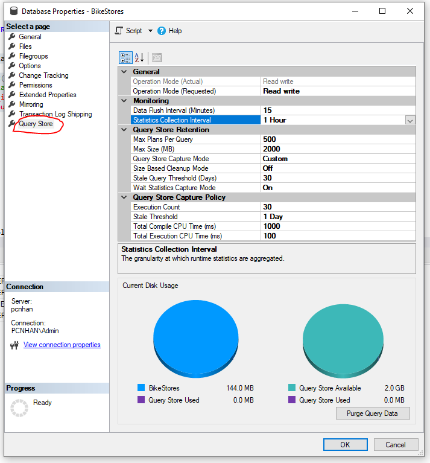

# Day 9


## 💛 Session 16 - Enhancements in SQL Server 2019

Xem link: https://learn.microsoft.com/en-us/sql/sql-server/what-s-new-in-sql-server-2019?view=sql-server-ver16

### 💥 Verbose Truncation Warnings

Khái niệm "Verbose Truncation Warnings" có thể được hiểu là một cách thức hoạt động hoặc một tính năng trong việc cắt giảm (truncation) thông báo dài hay chi tiết (verbose warnings) trong lập trình hoặc các ngôn ngữ lập trình.

```sql
CREATE TABLE [dbo].[tbl_Color](
    [Color ID] [int] IDENTITY(1,1) NOT NULL,
    [Color Name] [varchar](3) NULL
) ON [PRIMARY]
GO
 
INSERT INTO [dbo].[tbl_Color]
           ([Color Name])
     VALUES
           ('Red'),
           ('Blue'), -- Vượt quá độ dài đã khai báo
           ('Green') --
GO
```

==> Khi chạy lênh trên bạn sẽ SQL Server 2019 báo lỗi cánh báo độ dài dữ liệu vượt quá cấu trúc dữ liệu đã khai báo.


### 💥 Verbose Truncation Warnings

Vulnerability Assessment (đánh giá lỗ hổng) là quá trình xác định, đánh giá và đo lường các lỗ hổng bảo mật trong hệ thống, mạng, ứng dụng hoặc công nghệ thông tin. Mục tiêu của Vulnerability Assessment là tìm ra các điểm yếu và lỗ hổng trong hệ thống và đưa ra các khuyến nghị về biện pháp bảo mật để giảm thiểu nguy cơ xâm nhập hoặc tấn công.


Click phải lên `Database` của bạn, sau đó chọn `Tasks` --> `Chọn Vulnerability assessment` =>  `Scan for Vulnerabilities`...


Quét xong bạn sẽ nhận được một báo cáo


Chi tiết xem: https://learn.microsoft.com/en-us/sql/relational-databases/security/sql-vulnerability-assessment?view=sql-server-ver16

### 💥 Big Data Clusters

Big Data Clusters trong SQL Server là một tính năng mới được giới thiệu từ phiên bản SQL Server 2019. Nó cung cấp khả năng tích hợp và quản lý dữ liệu lớn (big data) từ nhiều nguồn khác nhau trong một môi trường SQL Server duy nhất.

Big Data Clusters cho phép người dùng lưu trữ và truy vấn dữ liệu từ các nguồn bên ngoài, chẳng hạn như dữ liệu Hadoop, Apache Spark, và dữ liệu có cấu trúc khác. Nó cung cấp một lớp trừu tượng trên dữ liệu Big Data, cho phép người dùng truy vấn và xử lý dữ liệu lớn bằng cách sử dụng ngôn ngữ truy vấn SQL quen thuộc.

Big Data Clusters trong SQL Server cũng cung cấp tính năng Scale-Out, cho phép mở rộng ngang dữ liệu và công việc xử lý trên nhiều nút (nodes) trong một cụm (cluster). Điều này giúp tăng khả năng xử lý và hiệu suất khi làm việc với dữ liệu lớn.


### 💥 JSON Data

JSON (JavaScript Object Notation) là một định dạng dữ liệu phổ biến được sử dụng để truyền và lưu trữ dữ liệu có cấu trúc. SQL Server hỗ trợ lưu trữ và xử lý dữ liệu JSON bằng cách cung cấp các tính năng và hàm liên quan.

Trong SQL Server, JSON data là một kiểu dữ liệu mới được giới thiệu từ phiên bản SQL Server 2016 trở đi. Nó cho phép bạn lưu trữ dữ liệu JSON trong các cột JSON trong bảng SQL Server. Các cột JSON có thể chứa các đối tượng JSON, mảng JSON hoặc giá trị JSON đơn.

Dưới đây là một số tính năng và hàm quan trọng liên quan đến JSON data trong SQL Server:

1. JSON Functions: SQL Server cung cấp một loạt các hàm để xử lý và truy vấn dữ liệu JSON. Một số hàm quan trọng bao gồm JSON_VALUE, JSON_QUERY, JSON_MODIFY và JSON_EXISTS. Các hàm này cho phép bạn trích xuất, chèn, cập nhật và kiểm tra sự tồn tại của các giá trị JSON.

2. JSON Indexing: SQL Server cung cấp khả năng tạo chỉ mục trên các cột JSON, cho phép tìm kiếm và truy cập dữ liệu JSON một cách hiệu quả. Chỉ mục JSON giúp tăng tốc truy vấn và cải thiện hiệu suất khi làm việc với JSON data.

3. JSON Schema Validation: SQL Server hỗ trợ xác thực JSON data bằng cách sử dụng JSON schema. Bằng cách định nghĩa một JSON schema, bạn có thể kiểm tra tính hợp lệ của dữ liệu JSON và đảm bảo rằng nó tuân theo một cấu trúc nhất định.

4. FOR JSON Clause: SQL Server cung cấp mệnh đề FOR JSON để truy vấn dữ liệu từ cơ sở dữ liệu và xuất kết quả dưới dạng JSON. Mệnh đề này cho phép bạn truy vấn dữ liệu từ các bảng SQL Server và định dạng kết quả trả về dưới dạng JSON.

Các hàm JSON trong SQL Server:  

#### 🔹 FOR JSON PATH

Dùng để chuyển kết quả của một câu lệnh SELECT thành một đối tượng JSON. Ví dụ:

```sql
SELECT
    O.*,
    (SELECT * FROM customers AS C WHERE O.customer_id = C.customer_id FOR JSON PATH, WITHOUT_ARRAY_WRAPPER) AS customer,
    (SELECT * FROM staffs AS S WHERE O.staff_id = S.staff_id FOR JSON PATH, WITHOUT_ARRAY_WRAPPER) AS staffs
FROM orders AS O
```

#### 🔹 Hàm JSON_VALUE

Dùng để trích xuất một giá trị từ một đối tượng JSON. Ví dụ: Trích xuất giá trị của thuộc tính name từ đối tượng JSON {"name": "John", "age": 30}

```sql
SELECT JSON_VALUE('{"name": "John", "age": 30}', '$.name') AS name
```

#### 🔹 Hàm JSON_QUERY

Dùng để trích xuất một đối tượng JSON từ một đối tượng JSON. Ví dụ: Trích xuất đối tượng JSON `{"name": "John", "age": 30} từ đối tượng JSON {"name": "John", "age": 30, "address": {"street": "123 Main St.", "city": "New York"}}`

```sql
SELECT JSON_QUERY('{"name": "John", "age": 30, "address": {"street": "123 Main St.", "city": "New York"}}', '$.address') AS address
```

#### 🔹 Hàm JSON_MODIFY

Dùng để thay đổi một giá trị trong một đối tượng JSON. Ví dụ: Thay đổi giá trị của thuộc tính name từ John thành Jane trong đối tượng JSON {"name": "John", "age": 30}

```sql
SELECT JSON_MODIFY('{"name": "John", "age": 30}', '$.name', 'Jane') AS name
```

#### 🔹 Hàm ISJSON

Dùng để kiểm tra một chuỗi có phải là một đối tượng JSON hay không. Ví dụ: Kiểm tra chuỗi {"name": "John", "age": 30} có phải là một đối tượng JSON hay không

```sql
SELECT ISJSON('{"name": "John", "age": 30}') AS is_json
```

#### 🔹 Hàm OPENJSON

Dùng để chuyển một đối tượng JSON thành một bảng. Ví dụ: Chuyển đối tượng JSON {"name": "John", "age": 30} thành bảng

```sql
SELECT * FROM OPENJSON('{"name": "John", "age": 30}')
```

#### 🔹 Các vị dụ thao tác với dữ liệu JSON

Trong SQL Server, bạn có thể thực hiện các thao tác thêm mới, sửa, xóa và cập nhật dữ liệu JSON bằng cách sử dụng các hàm và toán tử JSON tích hợp. Dưới đây là các ví dụ về cách thực hiện các thao tác này.

1. Thêm mới dữ liệu JSON:
   Để thêm mới dữ liệu JSON vào một cột kiểu dữ liệu JSON trong SQL Server, bạn có thể sử dụng toán tử `JSON_MODIFY()` hoặc hàm `JSON_VALUE()`. Ví dụ:

   ````sql
   -- Thêm mới một đối tượng JSON vào cột 'jsonData'
   UPDATE YourTable
   SET jsonData = JSON_MODIFY(jsonData, '$.name', 'John', '$.age', 25)

   -- Thêm mới một mảng JSON vào cột 'jsonData'
   UPDATE YourTable
   SET jsonData = JSON_MODIFY(jsonData, 'append $', JSON_QUERY('{"name": "John", "age": 25}'))
   ```

2. Sửa dữ liệu JSON:
   Để sửa đổi các giá trị trong dữ liệu JSON, bạn có thể sử dụng toán tử `JSON_MODIFY()`. Ví dụ:

   ````sql
   -- Sửa đổi giá trị của thuộc tính 'name' trong cột 'jsonData'
   UPDATE YourTable
   SET jsonData = JSON_MODIFY(jsonData, '$.name', 'Jane')
   WHERE ID = 1
   ```

3. Xóa dữ liệu JSON:
   Để xóa một thuộc tính hoặc một phần tử trong dữ liệu JSON, bạn có thể sử dụng toán tử `JSON_MODIFY()` hoặc hàm `JSON_REMOVE()`. Ví dụ:

   ````sql
   -- Xóa thuộc tính 'name' trong cột 'jsonData'
   UPDATE YourTable
   SET jsonData = JSON_MODIFY(jsonData, '$.name', NULL)
   WHERE ID = 1

   -- Xóa phần tử thứ hai trong một mảng JSON
   UPDATE YourTable
   SET jsonData = JSON_REMOVE(jsonData, '$[1]')
   WHERE ID = 1
   ```

4. Cập nhật dữ liệu JSON:
   Để cập nhật dữ liệu JSON, bạn có thể kết hợp các phép toán JSON như `JSON_MODIFY()`, `JSON_VALUE()`, và các toán tử SQL thông thường như `UPDATE`, `SET`, và `WHERE`. Ví dụ:

   ````sql
   -- Cập nhật giá trị của thuộc tính 'age' trong cột 'jsonData'
   UPDATE YourTable
   SET jsonData = JSON_MODIFY(jsonData, '$.age', JSON_VALUE(jsonData, '$.age') + 1)
   WHERE ID = 1
   ```


---

## 💛 Session 17 - PolyBase, Query Store, and Stretch Database

### 💥 PolyBase

PolyBase là một tính năng trong SQL Server, được giới thiệu từ phiên bản SQL Server 2016 trở đi. Nó cung cấp khả năng truy vấn và tích hợp dữ liệu từ các nguồn dữ liệu bên ngoài SQL Server, bao gồm dữ liệu trong các hệ thống Hadoop, Azure Blob Storage, Oracle, Teradata và nhiều nguồn dữ liệu khác.

PolyBase cho phép người dùng truy vấn dữ liệu từ các nguồn khác nhau thông qua ngôn ngữ truy vấn SQL tiêu chuẩn và cung cấp một giao diện đơn giản để làm việc với các nguồn dữ liệu không liên quan. Nó tận dụng sự mạnh mẽ của SQL Server để xử lý và truy vấn dữ liệu từ các nguồn khác nhau như một phần của một truy vấn SQL duy nhất.

PolyBase cho phép tạo các bảng bên trong SQL Server có thể truy vấn trực tiếp dữ liệu từ các nguồn bên ngoài. Nó cung cấp các trình điều khiển (drivers) để kết nối và truy vấn dữ liệu từ các nguồn khác nhau, và các truy vấn PolyBase có thể được viết giống như các truy vấn SQL thông thường.

Ví dụ, bạn có thể tạo một bảng trong SQL Server và sử dụng PolyBase để truy vấn dữ liệu từ Hadoop. Bằng cách sử dụng câu lệnh SELECT thông thường, bạn có thể kết hợp dữ liệu từ bảng trong SQL Server và dữ liệu từ Hadoop trong cùng một truy vấn.

PolyBase cũng cung cấp khả năng tối ưu hóa truy vấn và truyền dữ liệu song song giữa SQL Server và các nguồn dữ liệu bên ngoài, giúp cải thiện hiệu suất và khả năng mở rộng của hệ thống.

Tóm lại, PolyBase là một tính năng quan trọng trong SQL Server, cho phép truy vấn và tích hợp dữ liệu từ các nguồn dữ liệu không liên quan vào SQL Server bằng cách sử dụng ngôn ngữ truy vấn SQL tiêu chuẩn. Nó mở ra khả năng kết hợp và phân tích dữ liệu từ nhiều nguồn khác nhau trong một môi trường SQL Server đơn giản và hiệu quả.

---

### 💥 Query Store

Query Store là một tính năng trong SQL Server từ phiên bản SQL Server 2016 trở đi, được thiết kế để giúp quản lý và tối ưu hóa hiệu suất các truy vấn trong cơ sở dữ liệu. Nó giám sát, lưu trữ và phân tích thông tin về các truy vấn được thực thi trong SQL Server, cho phép người quản trị và nhà phát triển dễ dàng xem và phân tích các hoạt động truy vấn.

Các khái niệm quan trọng trong Query Store bao gồm:

1. Query Store Database: Query Store sử dụng một cơ sở dữ liệu riêng gọi là Query Store Database để lưu trữ thông tin về các truy vấn. Cơ sở dữ liệu này tồn tại bên trong SQL Server và được quản lý tự động bởi hệ thống.

2. Query Store Data: Query Store thu thập và lưu trữ các dữ liệu liên quan đến các truy vấn, bao gồm thông tin về kế hoạch truy vấn, thống kê, thời gian thực thi, và tài nguyên sử dụng. Các dữ liệu này được lưu trữ trong các bảng và chế độ xem (views) trong Query Store Database.

3. Query Store Configuration: Query Store cung cấp các tùy chọn cấu hình để điều chỉnh cách nó hoạt động. Các tùy chọn này bao gồm cấu hình khoảng thời gian lưu trữ dữ liệu, mức độ chi tiết của thông tin thu thập, và các cấu hình khác liên quan đến quản lý truy vấn.

4. Query Store Reports: Query Store cung cấp các báo cáo và giao diện đồ họa để hiển thị và phân tích thông tin về các truy vấn. Các báo cáo này cho phép người dùng xem các truy vấn được thực thi, thay đổi kế hoạch truy vấn, tài nguyên sử dụng, và các thống kê liên quan khác.

5. Query Performance Insights: Query Store giúp cung cấp cái nhìn sâu sắc về hiệu suất truy vấn. Nó cho phép người dùng xác định các truy vấn chậm, truy vấn tiêu tốn nhiều tài nguyên, truy vấn đã thay đổi kế hoạch thực thi, và các vấn đề khác liên quan đến hiệu suất.

Tóm lại, Query Store là một tính năng quan trọng trong SQL Server, giúp quản lý và tối ưu hóa hiệu suất các truy vấn. Nó thu thập thông tin về các truy vấn và cung cấp cơ sở dữ liệu, cấu hình, báo cáo và giao diện để phân tích và giám sát hiệu suất truy vấn.

#### Kích hoạt bằng giao diện đồ họa

Trong SQL Server Management Studio, bạn có thể kích hoạt Query Store bằng click phải lên `Database` của bạn, sau đó chọn `Properties` --> `Query Store`.

Sau đó tại dòng `Operation Mode (Requested)` --> chọn `Read Write`




**Operation Mode**

Giá trị hợp lệ bao gồm OFF, READ_ONLY và READ_WRITE. OFF tắt Query Store. Trong chế độ READ_WRITE, Query Store thu thập và lưu trữ thông tin về kế hoạch truy vấn và thống kê thực thi thời gian chạy. Trong chế độ READ_ONLY, thông tin có thể được đọc từ Query Store, nhưng thông tin mới không được thêm vào. Nếu không gian cấp phát tối đa của Query Store đã được sử dụng hết, chế độ hoạt động của Query Store sẽ chuyển sang chế độ READ_ONLY.

**Operation Mode (Actual)**

Lấy chế độ hoạt động thực tế của Query Store.

**Operation Mode (Requested)**

Lấy và đặt chế độ hoạt động mong muốn của Query Store.

**Data Flush Interval (Minutes)**

Xác định tần suất mà dữ liệu được ghi vào Query Store được lưu trữ xuống đĩa. Để tối ưu hóa hiệu suất, dữ liệu được thu thập bởi Query Store được ghi bất đồng bộ xuống đĩa. Tần suất mà việc truyền này bất đồng bộ xảy ra được cấu hình.

**Statistics Collection Interval (Minutes)**
Lấy và đặt giá trị khoảng thời gian thu thập thống kê.

**Max Size (MB)**

Lấy và đặt tổng không gian được cấp phát cho Query Store.

**Query Store Capture Mode**

- None: không thu thập các truy vấn mới.

- All: thu thập tất cả các truy vấn.

- Auto: thu thập các truy vấn dựa trên sử dụng tài nguyên.
- Custom: chế độ tùy chỉnh hơn


**Stale Query Threshold (Days)**

Lấy và đặt ngưỡng truy vấn đã lỗi thời. Cấu hình đối số STALE_QUERY_THRESHOLD_DAYS để chỉ định số ngày giữ lại dữ liệu trong Query Store.

**Purge Query Data**

Xóa nội dung của Query Store.

Xem thêm: 

- [https://learn.microsoft.com/en-us/sql/relational-databases/performance/manage-the-query-store?view=sql-server-ver16&tabs=tsql](https://learn.microsoft.com/en-us/sql/relational-databases/performance/manage-the-query-store?view=sql-server-ver16&tabs=tsql)

- [https://www.sqlshack.com/sql-server-query-store-overview/](https://www.sqlshack.com/sql-server-query-store-overview/)
---

#### Kích hoạt bằng T-SQL


```sql
ALTER DATABASE [QueryStoreDB]
SET QUERY_STORE = ON
    (
      OPERATION_MODE = READ_WRITE,
      CLEANUP_POLICY = ( STALE_QUERY_THRESHOLD_DAYS = 90 ),
      DATA_FLUSH_INTERVAL_SECONDS = 900,
      MAX_STORAGE_SIZE_MB = 1000,
      INTERVAL_LENGTH_MINUTES = 60,
      SIZE_BASED_CLEANUP_MODE = AUTO,
      QUERY_CAPTURE_MODE = CUSTOM,
      QUERY_CAPTURE_POLICY = (
        STALE_CAPTURE_POLICY_THRESHOLD = 24 HOURS,
        EXECUTION_COUNT = 30,
        TOTAL_COMPILE_CPU_TIME_MS = 1000,
        TOTAL_EXECUTION_CPU_TIME_MS = 100
      )
    );
```

Trong đó:

| Cấu hình                 | Mô tả                                                                                                          | Giá trị mặc định                                    | Ghi chú                           |
|-------------------------|----------------------------------------------------------------------------------------------------------------|----------------------------------------------------|----------------------------------|
| MAX_STORAGE_SIZE_MB     | Xác định giới hạn dung lượng dữ liệu mà Query Store có thể sử dụng trong cơ sở dữ liệu khách hàng                | 100 trước SQL Server 2019 (15.x)<br>1000 từ SQL Server 2019 (15.x) | Áp dụng cho cơ sở dữ liệu mới |
| INTERVAL_LENGTH_MINUTES | Xác định thời gian mỗi khoảng thời gian trong đó thống kê thời gian chạy của các kế hoạch truy vấn được tổng hợp và lưu trữ. Mỗi kế hoạch truy vấn hoạt động có tối đa một hàng cho một khoảng thời gian được xác định bằng cấu hình này | 60                                                 | Áp dụng cho cơ sở dữ liệu mới |
| STALE_QUERY_THRESHOLD_DAYS | Chính sách dựa trên thời gian điều khiển thời gian lưu giữ của thống kê thời gian chạy và các truy vấn không hoạt động | 30                                                 | Áp dụng cho cơ sở dữ liệu mới và cơ sở dữ liệu có cài đặt mặc định trước đó (367) |
| SIZE_BASED_CLEANUP_MODE | Xác định liệu việc làm sạch dữ liệu tự động diễn ra khi kích thước dữ liệu Query Store tiến gần đến giới hạn | AUTO                                               | Áp dụng cho tất cả cơ sở dữ liệu |
| QUERY_CAPTURE_MODE | Xác định liệu tất cả các truy vấn hay chỉ một phần truy vấn được theo dõi | AUTO                                               | Áp dụng cho tất cả cơ sở dữ liệu |
| DATA_FLUSH_INTERVAL_SECONDS | Xác định khoảng thời gian tối đa mà các thống kê thời gian chạy đã được ghi nhớ trong bộ nhớ trước khi lưu xuống đĩa | 900                                                | Áp dụng cho cơ sở dữ liệu mới |

Lưu ý rằng các cấu hình này có thể khác nhau tùy thuộc vào phiên bản và cài đặt cụ thể của SQL Server.

---

### 💥 Stretch Database

Stretch Database là một tính năng có sẵn trong SQL Server từ phiên bản SQL Server 2016 trở đi, được thiết kế để mở rộng khả năng lưu trữ dữ liệu và cải thiện hiệu suất truy vấn trong SQL Server bằng cách tự động chuyển dữ liệu giữa cơ sở dữ liệu local và Azure SQL Database.

Khái niệm chính trong Stretch Database bao gồm:

1. Local Database: Đây là cơ sở dữ liệu SQL Server chứa dữ liệu của bạn trên môi trường nội bộ. Dữ liệu trong Local Database được tổ chức và quản lý như bình thường.

2. Azure SQL Database: Đây là một dịch vụ cơ sở dữ liệu quản lý của Microsoft chạy trên nền tảng điện toán đám mây Azure. Azure SQL Database là nơi dữ liệu bên ngoài được chuyển đến và lưu trữ.

3. Stretch Database Table: Stretch Database cho phép bạn chọn các bảng trong Local Database để chuyển dữ liệu lên Azure SQL Database. Những bảng này gọi là Stretch Database Tables. Dữ liệu trong các bảng này được chia thành hai phần: một phần lưu trữ trong Local Database và một phần được chuyển lên Azure SQL Database.

4. Data Migration: Khi bạn chọn một bảng là Stretch Database Table, dữ liệu trong bảng đó sẽ được chuyển lên Azure SQL Database theo một quy trình tự động. Dữ liệu cũ được lưu trữ trong Local Database, trong khi dữ liệu mới và thay đổi được gửi đến Azure SQL Database.

5. Transparent Data Access: Một khi dữ liệu đã được chuyển lên Azure SQL Database, bạn vẫn có thể truy cập và truy vấn dữ liệu đó thông qua Local Database. Stretch Database sẽ tự động xử lý việc truy xuất dữ liệu từ cả hai nơi mà không đòi hỏi sự can thiệp từ phía người dùng.

Stretch Database là một công cụ hữu ích để quản lý dữ liệu lớn trong SQL Server bằng cách tận dụng điện toán đám mây. Nó giúp mở rộng khả năng lưu trữ và cải thiện hiệu suất truy vấn bằng cách tự động chuyển dữ liệu giữa Local Database và Azure SQL Database.