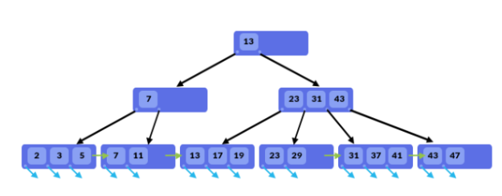
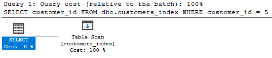
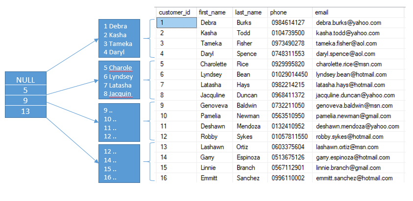
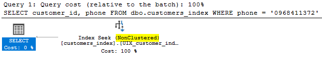
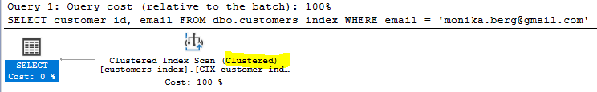
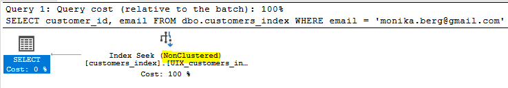
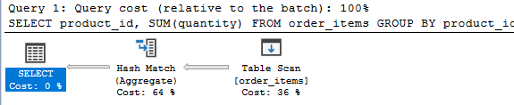
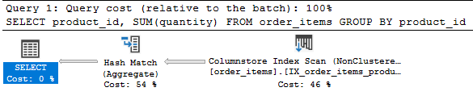

# Day 10

## 💛 Session 11 - Indexes

Xem thêm bài viết: https://www.sqlservertutorial.net/sql-server-indexes/

Trong SQL Server, indexs (chỉ mục) là cấu trúc dữ liệu được sử dụng để tăng tốc độ truy vấn và tìm kiếm dữ liệu trong cơ sở dữ liệu. Chúng giúp tối ưu hóa hiệu suất truy vấn bằng cách tạo ra một cấu trúc dữ liệu phụ bên cạnh bảng gốc, có thể được sắp xếp và tìm kiếm nhanh hơn.

Các loại indexs mà SQL Server hỗ trợ: https://learn.microsoft.com/en-us/sql/relational-databases/indexes/indexes?view=sql-server-ver16

Trước khi đi vào từng loại index hãy tạo một table để như sau:

```sql
-- Tạo cấu trúc bảng customers_test
CREATE TABLE dbo.customers_test (
	[customer_id] [int]  NOT NULL,
	[first_name] [nvarchar](255) NOT NULL,
	[last_name] [nvarchar](255) NOT NULL,
	[phone] [varchar](25) NOT NULL,
	[email] [varchar](150) NOT NULL,
	[birthday] [date] NULL,
	[street] [nvarchar](255) NOT NULL,
	[city] [nvarchar](50) NOT NULL,
	[state] [nvarchar](50) NOT NULL,
	[zip_code] [varchar](5) NULL,
);
-- Xõa dữ liệu nếu có
DELETE FROM dbo.customer_index
-- Đổ dữ liệu từ table customers, sắp xếp theo birthday
INSERT INTO dbo.customer_index
SELECT [customer_id], [first_name], [last_name], [phone], [email],
       CONVERT(date, [birthday], 103), [street], [city], [state], [zip_code]
FROM dbo.customers ORDER BY [birthday],[first_name];
--Check xem có index không
EXEC sp_helpindex 'customer_index';
-- Xem dữ liệu hiện tại
SELECT * FROM dbo.customer_index
```


### 💥  Cấu trúc B-TREE

Là một cấu trúc dữ liệu được sử dụng để lưu trữ dữ liệu trong cơ sở dữ liệu. 



Các đặc điểm của B-Tree Index:

- Dữ liệu index được tổ chức và lưu trữ theo dạng tree, tức là có root, branch, leaf.
- Giá trị của các node được tổ chức tăng dần từ trái qua phải.
- B-Tree index được sử dụng trong các biểu thức so sánh dạng: =, >, >=, <, <=, BETWEEN và LIKE. ⇒ Có thể tối ưu tốt cho câu lệnh ORDER BY
-  Khi truy vấn dữ liệu thì CSDL sẽ không scan dữ liệu trên toàn bộ bảng để tìm dữ liệu, việc tìm kiếm trong B-Tree là 1 quá trình đệ quy, bắt đầu từ root node và tìm kiếm tới branch và leaf, đến khi tìm được tất cả dữ liệu – thỏa mãn với điều kiện truy vấn thì mới dùng lại.


### 💥 Heap Structures

- Heap là một cấu trúc bảng không có `Clustered index`
- Các dòng không được sắp xếp theo thứ tự nào cả


==> Dữ liệu mẫu `customers_test` trên chính là cấu trúc Heap. Tập dữ liệu không có thứ tự.


Nhìn vào bảng dữ liệu trong hình dưới đây và bạn hãy trả lời truy vấn "tìm nhân viên có customer_id bằng 5". Bạn sẽ làm thế nào?
- Bạn sẽ phải tìm trong bảng dữ liệu trên: duyệt qua từng dòng và tìm customer_id = 5.
- Nếu dòng dữ liệu của customer_id = 5 nằm ở vị trí thứ 2 - 3 thì nhanh chóng tìm thấy nó.
- Nhưng nếu nó nằm ở cuối cùng của bảng dữ liệu thì sao ? Bạn sẽ phải mất một ít thời gian, `chi phí thực hiện` việc tìm kiếm đó.

Test một câu lệnh truy vấn

```sql
SELECT customer_id FROM dbo.customers_index WHERE customer_id = 5
```

Xem chiến lược thực thi và phân tích bạn sẽ thấy:


Kết quả:



- Table Scan: Hành động --> quét toàn bộ table
- Estimated Opertator Cost: Chi phí thực thi (0.0315382) 
- ...Rows to be Read: 1445 dòng

### 💥 Clustered index

https://learn.microsoft.com/en-us/sql/relational-databases/indexes/clustered-and-nonclustered-indexes-described?view=sql-server-ver16

Trong cơ sở dữ liệu, một "clustered index" (chỉ mục gom cụm) là một loại chỉ mục được tạo ra để sắp xếp và lưu trữ dữ liệu trong một bảng theo một thứ tự nhất định. Khi một clustered index được tạo, dữ liệu trong bảng sẽ được tổ chức thành một cấu trúc gom cụm dựa trên giá trị của chỉ mục đó.

Một bảng chỉ có thể có một clustered index duy nhất. Khi tạo clustered index, dữ liệu trong bảng được sắp xếp theo giá trị của chỉ mục. Chính vì vậy, clustered index ảnh hưởng trực tiếp đến vị trí lưu trữ của dữ liệu trong bảng.

Với một clustered index, việc tìm kiếm dữ liệu dựa trên giá trị chỉ mục được thực hiện nhanh chóng, vì dữ liệu đã được sắp xếp theo thứ tự của chỉ mục. Khi một truy vấn truy cập dữ liệu dựa trên clustered index, hệ quản trị cơ sở dữ liệu có thể sử dụng việc gom cụm để tìm kiếm dữ liệu hiệu quả hơn.

Tuy nhiên, việc thay đổi dữ liệu trong một bảng có clustered index có thể phức tạp hơn. Khi dữ liệu được thay đổi, các hàng có thể phải được di chuyển lại trong bảng để duy trì thứ tự của chỉ mục. Điều này có thể ảnh hưởng đến hiệu suất ghi và cập nhật dữ liệu.

Clustered index thường được sử dụng trong các truy vấn phân trang, truy vấn dựa trên phạm vi giá trị và các truy vấn sắp xếp dữ liệu.

Cú pháp:

```sql
CREATE CLUSTERED INDEX index_name
ON schema_name.table_name (column_list);  
```


Ví dụ

```sql
--Tạo clustered index
CREATE CLUSTERED INDEX CIX_customers_index_id
ON customers_index (customer_id ASC);
```

Sau khi tạo xong bạn có thể nó được lưu ở tại mục indexs của chính table đó


Lưu ý: Bạn cũng có thể tạo bằng giao diện đồ họa, bằng cách click chuột phải lên mục `indexs` --> Chọn `New Index` --> chọn loại index muốn tạo.

Quay trở lại với vụ dụ trên. Bây giờ bạn đánh `clustered index` trên trường customer_id.

- Bạn sẽ có được một bảng dữ liệu được đánh số thứ tự rõ ràng.
- Những dòng dữ liệu trong bảng được gom nhóm lại với nhau tạo thành page, một page có kích thước 8KB và tùy thuộc vào kích thước của mỗi dòng mà chứa được số lượng tương ứng. Giả dụ bảng NhanVien trên có kích thước 2000 bytes cho mỗi dòng, nên mỗi page sẽ chứa được 4 dòng như hình bên dưới.



- Do vậy để tìm kiếm customer_id = 5. hệ thống sẽ dễ đang dự đoán được `5` ở vị trí nào.

Test một câu lệnh truy vấn trên:

```sql
SELECT customer_id FROM dbo.customers_index WHERE customer_id = 5
```

Xem chiến lược thực thi và phân tích bạn sẽ thấy:


- Clustered Index seek: Hành động --> quét chỉ mục
- Estimated Opertator Cost: Chi phí thực thi (0.003283)  
- ...Rows to be Read: 1 dòng duy nhất

Tóm lại clustered index trong SQL Server có các đặc điểm sau:

- Dữ liệu của bảng sẽ được sắp xếp theo thứ tự clustered key
- Sử dụng cấu trúc B-Tree để tạo ra các cấp độ lưu trữ key hỗ trợ tìm kiếm
- Index có level càng cao thì việc tìm kiếm càng tốn thời gian hơn
- Level của index phụ thuộc vào độ lớn dữ liệu trong bảng và kích thước của index key


### 💥  Nonclustered index

Trong cơ sở dữ liệu, một "nonclustered index" (chỉ mục không gom cụm) là một loại chỉ mục được tạo ra để cải thiện hiệu suất tìm kiếm và truy xuất dữ liệu trong một bảng. Nonclustered index lưu trữ dữ liệu chỉ mục riêng biệt và không sắp xếp dữ liệu trong bảng dựa trên chỉ mục đó.

Khi tạo một nonclustered index, hệ quản trị cơ sở dữ liệu sẽ tạo ra một bảng thứ hai để lưu trữ chỉ mục. Bảng này chứa các cột chỉ mục và các con trỏ đến bản gốc của dữ liệu trong bảng chính. Chỉ mục này giúp tìm kiếm nhanh chóng các giá trị dựa trên các cột chỉ mục đã được xác định.

Với một nonclustered index, khi thực hiện một truy vấn tìm kiếm dữ liệu dựa trên cột có chỉ mục, hệ quản trị cơ sở dữ liệu sẽ sử dụng chỉ mục để tìm kiếm dữ liệu một cách hiệu quả. Nó có thể giúp giảm thời gian truy cập và tìm kiếm dữ liệu trong các truy vấn phức tạp.

Một bảng có thể có nhiều nonclustered index được tạo ra trên các cột khác nhau để hỗ trợ các truy vấn khác nhau. Tuy nhiên, việc tạo quá nhiều chỉ mục có thể ảnh hưởng đến hiệu suất ghi và cập nhật dữ liệu, vì khi dữ liệu thay đổi, các chỉ mục cần được cập nhật tương ứng.

Nonclustered index thường được sử dụng trong các truy vấn tìm kiếm, phân trang và sắp xếp dữ liệu.

Cú pháp:

```sql
CREATE [NONCLUSTERED] INDEX index_name
ON table_name(column_list);
```

Cũng Quay lại với vị dụ trên.

Bây giờ, nếu câu truy vấn muốn tìm khách hàng theo `phone` thì thế nào? liệu index ở phần trước có giúp được không?

```sql
SELECT customer_id, phone FROM dbo.customers_index WHERE phone = '0968411372'
```

Kế hoạch thưc thi:


Xem chi tiết chiến lược thực thi:

- Clustered Index seek: Hành động --> quét chỉ mục
- Estimated Opertator Cost: Chi phí thực thi (0.0256122) 
- ...Rows to be Read: 1445 dòng

Qua đó thấy chí phí cao hơn, và nó phải tìm tất cả các dòng.

Vậy thử hỏi bạn có thể tạo thêm một `clustered index` cho cột `phone` như đã tạo với `customer_id` không ? Hiển nhiên là không vì SQL Server không cho phép bạn tạo hơn 1 clustered index trên một table.

Bạn có thể tối ưu bằng cách tạo `non-clustered index`

- Để có thể sắp xếp `phone`  mà không làm mất đi thứ tự tập dữ liệu theo `customer_id`. SQL Server nhân bản dữ liệu của bảng  thành một tập khác rồi tổ chức sắp xếp index theo `phone` ==> Dung lượng Database sẽ phìn to lên.
- Việc nhân bản này chỉ thực hiện trên các cột được chỉ định trong câu lệnh tạo `non-clustered index`

```sql
CREATE UNIQUE NONCLUSTERED INDEX UIX_customer_index_phone ON customers_index (phone)
```

Sau đó chạy lại truy vấn

```sql
SELECT customer_id, phone FROM dbo.customers_index WHERE phone = '0968411372'
```

Kế hoạch thưc thi đã khác, sử dụng NonClustered:



Chi tiết ra:

- Estimated Opertator Cost: Chi phí thực thi (0.00032831) 
- ...Rows to be Read: 1 dòng

Ví dụ tiếp: Bạn cần lấy thêm `first_name` như sau thì sao ? Không lẻ lại đi tạo một `nonclustered index` cho trường first_name nữa ? KHÔNG NÊN !!!

```sql
SELECT customer_id, phone, first_name FROM dbo.customers_index WHERE phone = '0968411372'
```

Phân tích chiến lược thực thi khi có thêm `first_name`


- Đâu tiên: Bạn cần lấy `customer_id`, `phone`, `first_name`. SQL Server sẽ truy cập đến `nonclustered index để` để lấy dữ liệu, nhưng không có cột first_name.
- Tiếp theo: Lúc này nó dùng `customer_id`  để quay về `clustered index ` lấy thêm cột `first_name` của dòng tương ứng. Hành động này gọi là key lookup và nó tốn chi phí để thực hiện nên tổng chi phí chung của câu truy vấn sẽ tăng lên.

Bạn có thể rê chuột lên `Nested Loops` xem kết quản chung sau khi gộp 2 hành đồng lại.

- Estimated Opertator Cost: Chi phí thực thi (0.0065704) 
- ...Rows to be Read: 1 dòng


Để tiết kiệm được chi phí truy vấn `key lookup` bằng cách sử dụng `covering index`.

### 💥   Covering index

Covering index là khi nonclustered index có thể thỏa mãn tất cả các cột cần select của một câu truy vấn.

Với trường hợp trên bạn có 2 cách để nhét thêm `first_name` vào nonclustered index. Một là thêm nó vào dữ liệu ở node lá (leaf node). Hai là cho nó tham gia vào danh sách index key {phone, firt_name}

Bằng cách sử dụng mệnh đề INCLUDE khi tạo nonclustered index. Chúng ta có thể chỉ định những cột nào sẽ được thêm vào index đó. Script dưới đây xóa index hiện có và tạo lại để thêm cột `first_name` vào

Chạy lại truy vấn xem chiến lược thực thi


- Estimated Opertator Cost: Chi phí thực thi (0.0032831) 
- ...Rows to be Read: 1 dòng

Việc sử dụng `INCLUDE` cho phép thêm các cột bổ sung vào chỉ mục, mà không ảnh hưởng đến việc sắp xếp hoặc tìm kiếm. Điều này giúp tránh việc phải truy xuất dữ liệu từ bảng gốc khi chỉ cần truy vấn dữ liệu từ chỉ mục, cải thiện hiệu suất truy vấn.

Xem thêm: https://learn.microsoft.com/en-us/sql/relational-databases/indexes/create-indexes-with-included-columns?view=sql-server-ver16

### 💥   Unique index

Trong cơ sở dữ liệu, một "unique index" (chỉ mục duy nhất) là một loại chỉ mục được tạo ra để đảm bảo tính duy nhất của các giá trị trong một cột hoặc một nhóm cột trong một bảng dữ liệu. Unique index đảm bảo rằng không có hai bản ghi nào trong cơ sở dữ liệu có cùng giá trị cho cột hoặc nhóm cột được chỉ mục.

Xem thêm: https://learn.microsoft.com/en-us/sql/relational-databases/indexes/create-unique-indexes?view=sql-server-ver16

Mục đích chính của unique index là ngăn chặn việc xuất hiện các giá trị trùng lặp trong một cột hoặc nhóm cột quan trọng. Khi một unique index được áp dụng cho một cột, hệ quản trị cơ sở dữ liệu sẽ kiểm tra tự động mỗi khi có thay đổi dữ liệu, đảm bảo rằng không có giá trị trùng lặp nào được chèn vào cột đó.

Unique index cũng có thể cung cấp một cách nhanh chóng để tìm kiếm dữ liệu theo giá trị duy nhất. Khi một unique index được tạo trên một cột, việc tìm kiếm dữ liệu dựa trên giá trị của cột đó sẽ nhanh chóng hơn do việc tạo chỉ mục.

Đôi khi unique index cũng được gọi là "unique constraint" (ràng buộc duy nhất), bởi vì nó tạo ra một ràng buộc trên dữ liệu đảm bảo tính duy nhất.

Cú pháp:

```sql
CREATE UNIQUE INDEX index_name
ON table_name(column_list);
```

Bạn cần truy vấn

```sql
SELECT customer_id, email FROM dbo.customers_index WHERE email = 'monika.berg@gmail.com'
```

Chạy truy vấn xem chiến lược thực thi



- Sử dụng hành động `index scan` trên chỉ mục Clustered
- Estimated Opertator Cost: Chi phí thực thi (0.0256122) 
- ...Rows to be Read: 1445 dòng

Ta thấy nó không tận dụng được Clustered index đã đánh trên trường customer_id. Nên phải tìm tất cả các dòng.

Đặc tính email là duy nhất, nên bạn có thể đánh chỉ mục `unique` cho trường email.


```sql
CREATE UNIQUE INDEX UIX_customers_index_email
ON dbo.customers_index(email);
```

Chạy lại truy vấn xem chiến lược thực thi



- Sử dụng hành động `index seek` trên chỉ mục NonClustered
- Estimated Opertator Cost: Chi phí thực thi (0.003125) 
- ...Rows to be Read: 1 dòng


Trường hợp bạn cần WHERE thêm các trường khác như:

```sql
SELECT customer_id, email, first_name, last_name FROM dbo.customers_index WHERE email = 'monika.berg@gmail.com' AND first_name = 'Monika' AND last_name = 'Berg'
```

Bạn có thể nhét thêm `first_name`, `last_name` và nonclureds index cùng với email như sau:

```sql
CREATE UNIQUE INDEX UIX_customers_index_email
ON dbo.customers_index(email)
INCLUDE(first_name,last_name);
```

- `first_name,last_name` là danh sách các cột khác (không phải các cột chỉ mục) mà bạn muốn bao gồm trong chỉ mục để cung cấp các dữ liệu bổ sung cho truy vấn. Các cột này không được sắp xếp và không tham gia vào việc tìm kiếm theo.


### 💥  Full-text

https://learn.microsoft.com/en-us/sql/relational-databases/search/populate-full-text-indexes?view=sql-server-ver16

Full-text search (tìm kiếm toàn văn bản) trong SQL Server là một tính năng cho phép tìm kiếm và truy vấn dữ liệu dựa trên nội dung của văn bản, bao gồm cả từ đơn, cụm từ và các biểu thức tìm kiếm phức tạp. Tính năng full-text search được thiết kế để cung cấp khả năng tìm kiếm nhanh chóng và hiệu quả trong các cơ sở dữ liệu lớn chứa dữ liệu văn bản.

Khi kích hoạt full-text search cho một cơ sở dữ liệu hoặc bảng trong SQL Server, hệ thống sẽ xây dựng và duy trì một chỉ mục toàn văn bản (full-text index) dựa trên các cột chứa dữ liệu văn bản. Chỉ mục này sẽ phân tích và lưu trữ thông tin về từ và cụm từ trong dữ liệu văn bản, tạo nên một cơ sở dữ liệu toàn văn bản riêng biệt.

Lợi ích chính của full-text search trong SQL Server bao gồm:

- Tìm kiếm nhanh chóng: Chỉ mục toàn văn bản giúp cải thiện hiệu suất tìm kiếm và truy vấn dữ liệu văn bản. Nó sử dụng các thuật toán tối ưu để tìm kiếm và truy xuất kết quả nhanh chóng.

- Tìm kiếm đa dạng: Full-text search hỗ trợ các biểu thức tìm kiếm phức tạp như tìm kiếm theo từ đơn, cụm từ, kết hợp các điều kiện tìm kiếm, sử dụng các toán tử logic, và tìm kiếm gần giống (fuzzy search).

- Xếp hạng kết quả: Khi tìm kiếm dựa trên full-text search, kết quả trả về có thể được xếp hạng theo độ phù hợp với yêu cầu tìm kiếm. Điều này giúp hiển thị các kết quả quan trọng hơn đầu tiên và cung cấp khả năng tùy chỉnh xếp hạng.

Full-text search được sử dụng trong các ứng dụng nhu cầu tìm kiếm văn bản phong phú, như hệ thống blog, hệ thống quản lý nội dung, diễn đàn, trang web thương mại điện tử và các ứng dụng có nhu cầu tìm kiếm dựa trên nội dung văn bản mạnh

### 💥  Columnstore index

Columnstore index (chỉ mục cột) là một loại chỉ mục trong cơ sở dữ liệu, được thiết kế đặc biệt để tối ưu hóa truy vấn phân tích dữ liệu trong các hệ thống quản lý cơ sở dữ liệu. Columnstore index lưu trữ và quản lý dữ liệu theo cột (columnar storage) thay vì theo hàng như trong chỉ mục truyền thống.

Xem thêm: https://learn.microsoft.com/en-us/sql/relational-databases/indexes/columnstore-indexes-overview?view=sql-server-ver16

Với columnstore index, dữ liệu trong một bảng được tổ chức và lưu trữ theo cột, tức là các giá trị trong một cột được lưu trữ liên tiếp trong bộ nhớ hoặc đĩa. Điều này mang lại nhiều lợi ích về hiệu suất khi truy vấn dữ liệu.

Một trong những lợi ích chính của columnstore index là khả năng nén dữ liệu. Do các giá trị trong một cột thường có tính chất tương tự và lặp lại, columnstore index có thể nén dữ liệu hiệu quả hơn so với chỉ mục truyền thống. Điều này giúp giảm dung lượng lưu trữ cần thiết và cải thiện hiệu suất truy vấn.

Columnstore index cũng cung cấp khả năng xử lý dữ liệu hàng loạt (batch processing) cho các truy vấn phân tích dữ liệu. Khi truy vấn được thực thi, columnstore index có thể đọc và xử lý các cột liên tiếp, giúp tối ưu hóa việc truy cập dữ liệu và thực hiện các phép tính trên dữ liệu một cách hiệu quả.

Columnstore index thường được sử dụng trong các hệ thống quản lý cơ sở dữ liệu dành cho phân tích dữ liệu (data analytics), nơi hiệu suất truy vấn và xử lý dữ liệu là yếu tố quan trọng. Nó thường được áp dụng trong các tình huống có khối lượng dữ liệu lớn và các truy vấn phức tạp.

Ví dụ: Thông kê số lượng bán ra theo từng sản phẩm

```sql
SELECT product_id, SUM(quantity) FROM order_items
GROUP BY product_id
```

Phân tích kế hoạch thực thi



- Sử dụng hành động `table scan` 
- Estimated Opertator Cost: Chi phí thực thi 0.0247736
- ...Rows to be Read: 4723 dòng

Tạo index kết hợp 

```sql
CREATE COLUMNSTORE INDEX IX_order_items_productID_quantity_ColumnStore
ON order_items (product_id,quantity);
```

Chạy lại truy vấn xem chiến lược thực thi



- Sử dụng hành động `columnstore index scan` 
- Estimated Opertator Cost: Chi phí thực thi 0.0036602
- ...Rows to be Read: 4723 dòng

```code
Chênh lệch = |(0.0036602 - 0.0247736) / 0.0247736| * 100
Chênh lệch ≈ 85.23% 
==> Tăng tốc được  ≈ 85.23%
```

### 💥   Filtered index

Filtered index trong SQL Server là một loại chỉ mục có điều kiện, chỉ lưu trữ và xử lý dữ liệu cho một phần nhỏ của các hàng trong một bảng dựa trên một điều kiện được xác định trước. Nó cho phép bạn tạo chỉ mục trên một tập hợp con của dữ liệu trong bảng thay vì toàn bộ dữ liệu.

Xem thêm: https://learn.microsoft.com/en-us/sql/relational-databases/indexes/create-filtered-indexes?view=sql-server-ver16

Khi tạo filtered index, bạn chỉ định một điều kiện WHERE để chỉ định các hàng nào sẽ được lưu trữ trong chỉ mục. Chỉ các hàng thỏa mãn điều kiện này mới được lưu trữ trong filtered index, trong khi các hàng không thỏa mãn điều kiện sẽ không được đưa vào chỉ mục.

Ví dụ

```sql
CREATE INDEX ix_cust_phone
ON dbo.customers(phone)
INCLUDE (first_name, last_name)
WHERE phone IS NOT NULL;
```

Lợi ích chính của filtered index bao gồm:

Giảm kích thước chỉ mục: Vì chỉ mục chỉ lưu trữ các hàng thỏa mãn điều kiện, nó có thể giảm kích thước của chỉ mục so với chỉ mục truyền thống, giảm không gian lưu trữ và tối ưu hóa hiệu suất truy vấn.

Cải thiện hiệu suất truy vấn: Filtered index giúp cung cấp một chỉ mục nhỏ hơn để tìm kiếm nhanh chóng dữ liệu thỏa mãn điều kiện được xác định. Nó cải thiện hiệu suất truy vấn bằng cách giảm số lượng bảng dữ liệu cần được quét và chỉ tập trung vào các hàng quan trọng.

Giảm tải và tối ưu hóa dữ liệu: Với filtered index, các hoạt động ghi và cập nhật chỉ cần thay đổi dữ liệu trong chỉ mục mà thỏa mãn điều kiện, giảm tải và tối ưu hóa quá trình ghi dữ liệu.

Filtered index thường được sử dụng trong các tình huống như:

Có một phần nhỏ dữ liệu trong bảng mà thường được truy cập hơn so với phần còn lại.
Các truy vấn thường xuyên yêu cầu dữ liệu thỏa mãn một điều kiện cụ thể.
Các bảng có kích thước lớn và tối ưu hóa hiệu suất truy vấn là yếu tố quan trọng.

### 💥  Spatial index

Spatial index trong SQL Server là một loại chỉ mục được thiết kế đặc biệt để hỗ trợ việc lưu trữ, truy vấn và xử lý dữ liệu không gian (dữ liệu liên quan đến vị trí và hình học). Nó cho phép tối ưu hóa truy vấn dựa trên thông tin không gian, như tìm kiếm các vị trí trong phạm vi, tính toán khoảng cách, xác định tương tác giữa các đối tượng không gian, và nhiều hoạt động không gian khác.

Xem thêm: https://learn.microsoft.com/en-us/sql/relational-databases/spatial/spatial-indexes-overview?view=sql-server-ver16

Spatial index sử dụng các thuật toán và cấu trúc dữ liệu đặc biệt để hiệu quả trong việc lưu trữ và truy vấn dữ liệu không gian. Chỉ mục này sẽ tổ chức dữ liệu không gian thành các tầng (levels) và quadtree (một cấu trúc dữ liệu phân chia không gian), cho phép tìm kiếm nhanh chóng các đối tượng không gian.

Lợi ích chính của spatial index trong SQL Server bao gồm:

- Hiệu suất truy vấn: Spatial index cải thiện hiệu suất truy vấn dữ liệu không gian bằng cách giảm số lượng dữ liệu cần được quét và tập trung vào khu vực chứa các đối tượng không gian quan trọng.

- Tìm kiếm nhanh chóng: Với spatial index, bạn có thể tìm kiếm các vị trí trong phạm vi, tính toán khoảng cách, xác định tương tác giữa các đối tượng không gian một cách hiệu quả và nhanh chóng.

Hỗ trợ các hoạt động không gian phức tạp: Spatial index cho phép thực hiện các hoạt động phức tạp như tìm kiếm đối tượng gần nhất, tính toán đường đi ngắn nhất, tìm kiếm đối tượng theo hình dạng, v.v.

Spatial index được sử dụng trong các ứng dụng liên quan đến dữ liệu không gian như hệ thống thông tin địa lý (GIS), quản lý tài sản, phân tích địa lý, và bất kỳ ứng dụng nào có nhu cầu truy vấn và xử lý dữ liệu không gian.

### 💥   XML index

https://learn.microsoft.com/en-us/sql/relational-databases/xml/xml-indexes-sql-server?view=sql-server-ver16

XML index trong SQL Server là một loại chỉ mục được tạo ra để tối ưu hóa việc truy vấn và xử lý dữ liệu XML trong cơ sở dữ liệu. Khi một XML index được tạo, nó cung cấp cấu trúc và cách lưu trữ dữ liệu XML để hỗ trợ các truy vấn XML hiệu quả.

XML index trong SQL Server có hai loại chính:

- Primary XML index: Đây là loại chỉ mục được tạo tự động cho cột XML trong bảng khi sử dụng tính năng XML trong SQL Server. Primary XML index sẽ tạo ra một cấu trúc đặc biệt để lưu trữ và tối ưu hóa việc truy vấn dữ liệu XML.

- Secondary XML index: Đây là loại chỉ mục được tạo thủ công trên một cột XML đã có primary XML index. Secondary XML index cung cấp một cấu trúc lưu trữ khác để tối ưu hóa các truy vấn XML khác nhau, ví dụ: truy vấn theo giá trị của các thuộc tính trong XML, truy vấn theo vị trí (path) của các thành phần trong XML, và truy vấn sử dụng các hàm XML.

Lợi ích chính của XML index trong SQL Server bao gồm:

- Hiệu suất truy vấn: XML index giúp cải thiện hiệu suất truy vấn dữ liệu XML bằng cách tạo ra một cấu trúc lưu trữ và cách truy xuất tối ưu cho dữ liệu XML. Nó giúp giảm số lượng dữ liệu cần quét và tập trung vào các phần quan trọng của dữ liệu XML.

- Truy vấn phức tạp: XML index hỗ trợ các truy vấn XML phức tạp như truy vấn theo giá trị thuộc tính, truy vấn theo vị trí thành phần, và truy vấn sử dụng các hàm XML. Nó cung cấp khả năng tìm kiếm nhanh chóng và hiệu quả trong dữ liệu XML phong phú.

XML index được sử dụng trong các ứng dụng liên quan đến dữ liệu XML như hệ thống quản lý nội dung, dịch vụ web, tích hợp dữ liệu từ các nguồn XML, và các ứng dụng có nhu cầu truy vấn và xử lý dữ liệu XML mạnh.

Để tạo, xóa và đổi tên index trong SQL Server, bạn có thể sử dụng các câu lệnh SQL sau đây:

1. Tạo index:
   - Tạo Clustered Index:
     ```sql
     CREATE CLUSTERED INDEX [IndexName] ON [TableName] ([Column1], [Column2], ...)
     ```
   - Tạo Nonclustered Index:
     ```sql
     CREATE NONCLUSTERED INDEX [IndexName] ON [TableName] ([Column1], [Column2], ...)
     ```
   - Tạo Unique Index:
     ```sql
     CREATE UNIQUE INDEX [IndexName] ON [TableName] ([Column1], [Column2], ...)
     ```
   - Tạo Columnstore Index:
     ```sql
     CREATE CLUSTERED COLUMNSTORE INDEX [IndexName] ON [TableName]
     ```
   - Tạo Full-Text Index:
     ```sql
     CREATE FULLTEXT INDEX ON [TableName] ([Column1], [Column2], ...)
     ```
   - Tạo Spatial Index:
     ```sql
     CREATE SPATIAL INDEX [IndexName] ON [TableName] ([Column1])
     ```

2. Xóa index:
   - Xóa index:
     ```sql
     DROP INDEX [IndexName] ON [TableName]
     ```
   - Xóa clustered index:
     ```sql
     ALTER TABLE [TableName] DROP CONSTRAINT [IndexName]
     ```

3. Đổi tên index:
   - Đổi tên index:
     ```sql
     EXEC sp_rename '[TableName].[OldIndexName]', '[NewIndexName]', 'INDEX'
     ```
   - Đổi tên clustered index:
     ```sql
     EXEC sp_rename '[TableName].[OldIndexName]', '[NewIndexName]', 'OBJECT'
     ```

Lưu ý: Trước khi thực hiện các thay đổi trên index, hãy đảm bảo rằng bạn có quyền thực hiện các câu lệnh CREATE, ALTER và DROP trên cơ sở dữ liệu và bảng tương ứng. Hãy cẩn thận khi xóa hoặc đổi tên index, vì nó có thể ảnh hưởng đến hiệu suất và tính khả dụng của cơ sở dữ liệu.

#### 🔹 Check thời gian thực hiện truy vấn

Trong SQL Server, bạn có thể sử dụng các câu lệnh và chức năng để kiểm tra thời gian thực hiện của một truy vấn ==> Để lựa chọn xem cách nào cho hiệu suất TỐI ƯU HƠN.


Dưới đây là một số phương pháp phổ biến để làm điều này:

1. Kiểm tra thời gian và tài nguyên của một truy vấn:
   
     ```sql
      --Để xem thời gian thực hiện truy vấn
      SET STATISTICS TIME ON;
      --Để xem tài nguyên thực hiện truy vấn
      SET STATISTICS IO ON;
      -- Truy vấn SQL của bạn ở đây
      -- ....

      --Tắt đi sau khi truy vấn thực hiện
      SET STATISTICS TIME OFF;
      SET STATISTICS IO OFF;
     ```
   

2. Sử dụng hàm GETDATE():
   - Trước khi thực thi truy vấn, ghi lại thời điểm bắt đầu bằng cách sử dụng hàm GETDATE():
     ```sql
     DECLARE @StartTime DATETIME;
     SET @StartTime = GETDATE();
     ```
   - Sau khi thực thi truy vấn, ghi lại thời điểm kết thúc:
     ```sql
     DECLARE @EndTime DATETIME;
     SET @EndTime = GETDATE();
     ```
   - Để tính thời gian thực hiện, sử dụng phép tính:
     ```sql
     DECLARE @ExecutionTime FLOAT;
     SET @ExecutionTime = DATEDIFF(MILLISECOND, @StartTime, @EndTime) / 1000.0;
     PRINT 'Execution Time: ' + CAST(@ExecutionTime AS NVARCHAR(20)) + ' seconds';
     ```

3. Sử dụng Dynamic Management Views (DMV):
   - DMV là các bảng hệ thống trong SQL Server cung cấp thông tin về hệ thống và các hoạt động diễn ra trong nó.
   - Bạn có thể sử dụng DMV sys.dm_exec_requests để kiểm tra thời gian thực hiện của một truy vấn:
     ```sql
     SELECT start_time, total_elapsed_time
     FROM sys.dm_exec_requests
     WHERE session_id = @@SPID;
     ```
   - Trong kết quả, cột start_time là thời điểm bắt đầu thực hiện truy vấn và cột total_elapsed_time là tổng thời gian đã trôi qua tính bằng mili giây.

Lưu ý rằng cách thức và chi tiết cụ thể để kiểm tra thời gian thực hiện có thể thay đổi tùy thuộc vào phiên bản SQL Server và cấu hình hệ thống. Vì vậy, hãy kiểm tra tài liệu và tài nguyên thích hợp của Microsoft hoặc phiên bản SQL Server bạn đang sử dụng để biết thêm chi tiết.

#### 🔹 Lợi ích việc đánh indexs

Chỉ mục (index) trong SQL Server được sử dụng để cải thiện hiệu suất truy vấn và tìm kiếm dữ liệu trong cơ sở dữ liệu. Dưới đây là một số lợi ích chính của việc sử dụng chỉ mục trong SQL Server:

1. Tăng tốc độ truy vấn: Chỉ mục giúp tăng tốc độ truy vấn bằng cách tạo ra một cấu trúc dữ liệu tối ưu cho việc tìm kiếm và sắp xếp. Khi truy vấn được thực hiện trên các cột chỉ mục, hệ thống có thể sử dụng chỉ mục để nhanh chóng định vị các bản ghi phù hợp, giảm thiểu số lượng bản ghi cần xem xét và tăng tốc độ truy vấn.

2. Giảm tải và tối ưu hóa tài nguyên: Chỉ mục giúp giảm tải và tối ưu hóa tài nguyên hệ thống bằng cách giảm số lượng bản ghi cần phải xem xét trong quá trình truy vấn. Thay vì quét toàn bộ bảng, chỉ mục cho phép hệ thống tìm kiếm nhanh chóng và hiệu quả hơn, giảm thiểu thời gian và công suất CPU cần thiết.

3. Cải thiện hiệu suất ghi dữ liệu: Mặc dù chỉ mục thêm phức tạp hơn cho việc ghi dữ liệu, nhưng nó cung cấp lợi ích cho hiệu suất ghi dữ liệu. Bởi vì chỉ mục có cấu trúc tối ưu hóa, việc thêm mới hoặc cập nhật dữ liệu có thể được thực hiện nhanh chóng hơn.

4. Hỗ trợ ràng buộc duy nhất: Chỉ mục duy nhất (UNIQUE INDEX) được sử dụng để áp đặt ràng buộc duy nhất trên một hoặc nhiều cột trong bảng. Điều này đảm bảo rằng các giá trị trong cột chỉ mục không được phép trùng lặp, giúp bảo đảm tính toàn vẹn dữ liệu.

5. Khả năng tìm kiếm và sắp xếp dữ liệu: Chỉ mục cho phép tìm kiếm và sắp xếp dữ liệu theo cách tối ưu. Bạn có thể tạo chỉ mục trên một hoặc nhiều cột, cho phép tìm kiếm nhanh chóng và hiệu quả dựa trên các tiêu chí tìm kiếm cụ thể.

#### 🔹 Nhược điểm việc đánh indexs

Mặc dù chỉ mục trong SQL Server mang lại nhiều lợi ích cho hiệu suất truy vấn và tìm kiếm dữ liệu, nhưng cũng có một số nhược điểm cần xem xét:

1. Chiếm không gian lưu trữ: Mỗi chỉ mục sẽ chiếm một lượng không gian lưu trữ trên đĩa. Nếu có quá nhiều chỉ mục hoặc chỉ mục quá lớn, nó có thể dẫn đến sự lãng phí không gian và làm tăng yêu cầu lưu trữ cho cơ sở dữ liệu.

2. Yêu cầu thời gian và tài nguyên để cập nhật: Khi dữ liệu trong bảng thay đổi, chỉ mục cũng cần được cập nhật để đảm bảo tính toàn vẹn và hiệu suất truy vấn. Việc cập nhật chỉ mục có thể tốn thời gian và tài nguyên, đặc biệt là khi thực hiện các thao tác chèn, cập nhật hoặc xóa dữ liệu lớn.

3. Ảnh hưởng đến hiệu suất ghi dữ liệu: Việc thêm mới hoặc cập nhật dữ liệu trong bảng có chỉ mục có thể yêu cầu thời gian và tài nguyên hơn so với bảng không có chỉ mục. Khi thực hiện các thao tác ghi dữ liệu đồng thời trong nhiều chỉ mục, có thể xảy ra xung đột và ảnh hưởng đến hiệu suất ghi dữ liệu.

4. Quản lý chỉ mục: Khi cơ sở dữ liệu có nhiều chỉ mục, việc quản lý và duy trì các chỉ mục trở nên phức tạp hơn. Cần đảm bảo rằng chỉ mục được tạo và duy trì đúng cách để đảm bảo tính toàn vẹn và hiệu suất của hệ thống.

5. Có thể làm chậm thao tác ghi dữ liệu: Khi có nhiều chỉ mục trên một bảng, việc thêm mới, cập nhật hoặc xóa dữ liệu có thể yêu cầu cập nhật và tái cấu trúc nhiều chỉ mục. Điều này có thể làm chậm thời gian thực hiện các thao tác ghi dữ liệu.

Vì vậy, khi sử dụng chỉ mục, cần cân nhắc kỹ lưỡng và thiết kế chỉ mục phù hợp với mục đích và yêu cầu của ứng dụng. Nên xem xét sự cân đối giữa hiệu suất truy vấn và yêu cầu lưu trữ, và đảm bảo rằng việc sử dụng chỉ mục mang lại lợi ích đáng kể cho hệ thống.


#### 🔹 Những điều cần nhớ khi tạo index trong SQL

- Tránh đánh chỉ mục những bảng/cột được sử dụng nhiều: Càng đánh chỉ mục nhiều trên bảng, tác động tới hiệu quả chèn, cập nhật, xóa và hợp nhất lệnh càng lớn bởi toàn bộ index phải được chỉnh sửa phù hợp. Điều đó có nghĩa SQL Server phải tách trang, chuyển dữ liệu xung quanh và phải làm việc đó cho toàn bộ index bị ảnh hưởng bởi các lệnh DML.
- Thu hẹp các khóa index bất cứ khi nào có thể: Liên tục thu hẹp index, chỉ một số cột nếu có thể. Những khóa số chính xác là những khóa index SQL hiệu quả nhất. Những khóa này cần ít dung lượng lưu trữ và chi phí bảo trì hơn.
- Dùng index được nhóm trên các cột duy nhất - Xem xét các cột là duy nhất hay chứa nhiều giá trị riêng và tránh dùng chúng trên những cột thay đổi thường xuyên.
- Index không theo nhóm trên cột được tìm kiếm thường xuyên.


## 💛 Session 07- Azure SQL


### 💥 Giới thiệu SQL Azure

SQL Azure là một dịch vụ cơ sở dữ liệu quan hệ dựa trên đám mây, thúc đẩy các công nghệ SQL Server hiện có. Microsoft SQL Azure mở rộng chức năng của Microsoft SQL Server để phát triển các ứng dụng dựa trên web, có khả năng mở rộng và được phân phối. SQL Azure cho phép người dùng thực hiện các truy vấn quan hệ, hoạt động tìm kiếm và đồng bộ hóa dữ liệu với người dùng di động và các office từ xa. SQL Azure có thể lưu trữ và lấy cả dữ liệu có cấu trúc và phi cấu trúc.


Quy trình hoạt động của SQL Azure được giải thích trong mô hình như được trình bày bên dưới:


### 💥  Mô hình hoạt động của SQL Azure

Ba đối tượng cốt lõi trong mô hình hoạt động của SQL Azure như sau:

1. Tài khoản

Đầu tiên phải tạo một tài khoản SQL Azure. Tài khoản này được tạo ra cho mục đích thanh toán. Thuê bao tài khoản được ghi lại và đo lường, được tính tiền theo lượng sử dụng. Sau khi tài khoản người dùng được tạo ra, các yêu cầu cần phải được cung cấp cho cơ sở dữ liệu SQL Azure, bao gồm số lượng cơ sở dữ liệu cần thiết, kích thước cơ sở dữ liệu, v.v...

2. Server

Máy chủ SQL Azure là đối tượng giúp tương tác giữa tài khoản và cơ sở dữ liệu. Sau khi tài khoản được đăng ký, cơ sở dữ liệu được cấu hình sử dụng máy chủ SQL Azure. Các thiết lập khác như thiết lập tường lửa và gán tên miền (DNS) cũng được cấu hình trong máy chủ SQL Azure.

3. Database

Cơ sở dữ liệu SQL Azure lưu trữ tất cả dữ liệu theo cách tương tự như bất kỳ cơ sở dữ liệu SQL Server tại chỗ. Mặc dù lưu trữ bằng công nghệ đám mây, cơ sở dữ liệu SQL Azure có tất cả các chức năng của một RDBMS bình thường như table, view, query, function, thiết lập bảo mật, v.v...

Ngoài những đối tượng cốt lõi thì còn một đối tượng bổ sung trong SQL Azure. Đối tượng này là công nghệ Đồng bộ dữ liệu SQL Azure. Công nghệ Đồng bộ dữ liệu SQL Azure được xây dựng trên Microsoft Sync Framework và cơ sở dữ liệu SQL Azure.

SQL Azure Data Sync giúp đồng bộ hóa dữ liệu trên SQL Server cục bộ với các dữ liệu trên SQL Azure như được trình bày trong hình dưới:

Data Sync còn có khả năng quản lý dữ liệu giúp chia sẻ dữ liệu dễ dàng giữa các cơ sở dữ liệu SQL khác nhau. Data Sync không chỉ được sử dụng để đồng bộ hóa tại chỗ với SQL Azure, mà còn để đồng bộ hóa một tài khoản SQL Azure với tài khoản khác.

### 💥  Các lợi ích của SQL Azure

1. Chi phí thấp hơn

SQL Azure cung cấp một số hàm tương tự như trên SQL Server tại chỗ với chi phí thấp hơn so với SQL Server tại chỗ. Ngoài ra, khi SQL Azure trên nền tảng đám mây, nó có thể được truy cập từ bất kỳ vị trí nào. Do đó, không có thêm chi phí cần thiết để phát triển một cơ sở hạ tầng CNTT chuyên dụng và phòng ban để quản lý cơ sở dữ liệu.

2. Sử dụng TDS

TDS được sử dụng trong các cơ sở dữ liệu SQL Server tại chỗ cho các thư viện máy khách. Do đó, hầu hết các nhà phát triển đã quen thuộc với TDS và cách sử dụng tiện ích này. Cùng một loại giao diện TDS được sử dụng trong SQL Azure để xây dựng các thư viện máy khách. Do đó, các nhà phát triển làm việc trên SQL Azure dễ dàng hơn

3. Biện pháp chuyển đổi dự phòng tự động

SQL Azure lưu trữ nhiều bản sao dữ liệu trên các vị trí vật lý khác nhau. Thậm chí khi có lỗi phần cứng do sử dụng nhiều hoặc tải quá mức, SQL Azure giúp duy trì các hoạt động kinh doanh bằng cách cung cấp khả năng sẵn sàng của dữ liệu thông qua các địa điểm vật lý khác.

4. Tính linh hoạt trong việc sử dụng dịch vụ

Ngay cả các tổ chức nhỏ cũng có thể sử dụng SQL Azure bởi mô hình định giá cho SQL Azure được dựa trên khả năng lưu trữ được tổ chức sử dụng. Nếu tổ chức cần lưu trữ nhiều hơn, giá có thể thay đổi cho phù hợp với nhu cầu. Điều này giúp các tổ chức có được sự linh hoạt trong việc đầu tư tùy thuộc vào việc sử dụng dịch vụ.

5. Hỗ trợ Transact-SQL

Do SQL Azure hoàn toàn dựa trên mô hình cơ sở dữ liệu quan hệ, nó cũng hỗ trợ các hoạt động và truy vấn Transact-SQL. Khái niệm này cũng tương tự như hoạt động của các SQL Server tại chỗ. Do đó, các quản trị viên không cần bất kỳ đào tạo hoặc hỗ trợ bổ sung nào để sử dụng SQL Azure

### 💥  Sự khác biệt giữa SQL Azure và SQL Server

Một số khác biệt quan trọng khác giữa SQL Azure và SQL Server phía khách hàng như sau:

- Các công cụ – SQL Server phía khách hàng cung cấp một số công cụ để theo dõi và quản lý. Tất cả những công cụ này có thể không được hỗ trợ bởi SQL Azure bởi có một số tập hợp công cụ hạn chế có sẵn trong phiên bản này
- Sao lưu – Sao lưu và phục hồi chức năng phải được hỗ trợ trong SQL Server phía khách hàng để khắc phục thảm họa. Đối với SQL Azure, do tất cả các dữ liệu là trên nền tảng điện toán đám mây, sao lưu và phục hồi là không cần thiết
- Câu lệnh USE – Câu lệnh USE không được SQL Azure hỗ trợ. Do đó, người dùng không thể chuyển đổi giữa các cơ sở dữ liệu trong SQL Azure so với SQL Server phía khách hàng.
- Xác thực – SQL Azure chỉ hỗ trợ xác thực SQL Server và SQL Server phía khách hàng hỗ trợ cả xác thực SQL Server và xác thực của Windows
Hỗ trợ Transact-SQL – Không phải tất cả các chức năng - Transact-SQL đều được SQL Azure hỗ trợ
Tài khoản và đăng nhập – Trong SQL Azure, các tài khoản quản trị được tạo ra trong cổng thông tin quản lý Azure. Do đó, không có thông tin đăng nhập người dùng mức thể hiện cấp riêng biệt
- Tường lửa – Các thiết lập tường lửa cho các cổng và địa chỉ IP cho phép có thể được quản lý trên máy chủ vật lý cho SQL Server phía khách hàng. Bởi cơ sở dữ liệu SQL Azure có mặt trên điện toán đám mây, xác thực thông qua các thông tin đăng nhập là phương pháp duy nhất để xác minh người dùng
