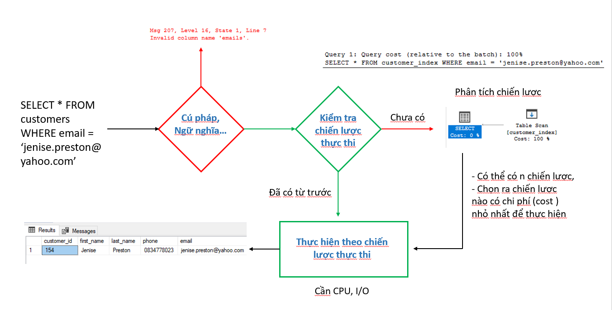

# Improve SQL QueryPerformance

## 1. 💛 Kiến trúc của SQL Server

Một số điểm cần nắm trong kiến trúc vật lý SQL Server

- **TempDB Database**
  - Nên tạo nhiều file TempFile (Nếu để 1 dễ gây tắc nghẽn I/O)
  - Ưu tiên lưu file ở phân vùng ổ cứng  đọc ghi cao nhất
  - Temp table có thể tối ưu ==> đánh index

- **Data File**
  - .MDF file (Bắt buộc)
  - .NDF file (Không Bắt buộc)

Nên tạo ra nhiều các file group có chung 1 nghiệp vụ Logic lưu vào `.NDF file`. Ví dụ: HR, SALE... --> hr.ndf

Mặc định chỉ có 1 nhóm group file PRIMARY

Khi tạo bảng --> chỉ định bảng đó lưu vào file group nào

```sql
CREATE TABLE employee (
    employee_id int PRIMARY KEY IDENTITY(1,1) NOT NULL,
    first_name nvarchar(50)
) on HR
```
=> Không lưu dữ liệu vào .dmf mặc định

- **Transaction Log**
    - Phải có chiến lược backup Transaction log định kỳ
    - Để tránh nó phình to, vì nó chỉ lưu vào 1 file duy nhất khi dùng thời gian lâu


## 💛 Câu lệnh thực hiện như thế nào? 

Cần biết khi thực hiện một truy vấn SQL thì quá trình câu lệnh đó diễn ra như thế nào ? Nắm thì mới can thiệp được vào nó và tím cách tối ưu,





### 💥 Tổng quan cách thực hiện của câu lệnh

Khi thực hiện một câu lệnh thì SQL server xử lý câu lệnh đó theo các bước:

1. 1️⃣ Check cú pháp, ngữ nghĩa

- Nếu ĐÚNG --> Chạy tiếp --> Kiểm tra chiến lược thực thi
- Nếu SAI --> Báo lỗi

2. 2️⃣ Kiểm tra chiến lược thực thi

Để biết được nó phải thực thi những gì để đúng theo yêu cầu của câu lệnh truy vấn. Biết phải tìm gì, tìm ở đâu.

- Nếu Chưa có --> Chạy tiếp --> Phân tích chiến lược thực thi
- Nếu Có rồi --> Chạy tiếp --> Thực hiện theo chiến lược thực thi

3. 3️⃣ Phân tích chiến lược thực thi

Có rất nhiều chiến lược thực thi được đưa ra, và hệ thống sẽ chọn chiến lược nào có chi phí thực thi (cost) nhỏ nhất để thực hiện. Dựa trên giải thuật, thuật toán truy vấn, cấu trúc dữ liệu...

4. 4️⃣ Thực hiện theo chiến lược

Truy vấn và lưu trữ thay đổi dữ liệu. Liên quan đến CPU và I/O

5. 5️⃣ Trả về kết quả


Trong các bước trên thì bước 3,4 là tốn tài nguyên và có thể gây CHẬM.


###  💥 Phân tích chi tiết chiến lược thực thi

Làm sao để biết lúc nào thì SQL Server tạo mới một chiến lược thực thi, lúc nào thì nó sử dụng lại chiến lược thực thi.

#### 🔹 Thuật ngữ cần nắm

Trong kế hoạch thực thi ước tính (Estimated Execution Plan) của SQL Server, có một số thuật ngữ quan trọng mà bạn có thể gặp. Dưới đây là một số thuật ngữ phổ biến và giải thích tương ứng:

1. Operator: Một toán tử (operator) trong kế hoạch thực thi đại diện cho một hoạt động cụ thể mà SQL Server thực hiện trong truy vấn. Ví dụ: Scan, Seek, Join, Filter, Sort, Aggregates, và nhiều hơn nữa.

2. Estimated Number of Rows: Đây là số hàng dự kiến mà mỗi toán tử sẽ sản xuất hoặc xử lý. Số hàng này được dự đoán dựa trên thông tin thống kê và ước tính của SQL Server.

3. Estimated Operator Cost: Đây là ước tính chi phí tính toán của mỗi toán tử. SQL Server sử dụng các công thức và thống kê để tính toán chi phí ước lượng dựa trên số lượng hàng dự kiến và loại hoạt động.

4. Cardinality Estimation: Đây là quá trình ước tính số lượng và phân phối các giá trị duy nhất trong một cột hoặc tập hợp các cột. Cardinality Estimation có vai trò quan trọng trong việc đưa ra ước tính số hàng và lựa chọn phương pháp thực thi tối ưu cho truy vấn.

5. Index Seek: Một toán tử Index Seek được sử dụng để tìm kiếm các bản ghi trong một chỉ mục dựa trên điều kiện tìm kiếm. Nó hiệu quả hơn so với toán tử Scan nếu chỉ một số lượng nhỏ bản ghi phù hợp.

6. Index Scan: Một toán tử Index Scan được sử dụng để quét toàn bộ chỉ mục một cách tuần tự để tìm kiếm các bản ghi phù hợp với điều kiện tìm kiếm. Đây là một phương pháp tốn nhiều tài nguyên hơn so với Index Seek.

7. Nested Loops Join: Đây là một phương pháp tham gia (join) trong đó SQL Server duyệt qua một bảng (bên trong) cho mỗi hàng trong bảng khác (bên ngoài) để tìm các cặp khớp. Phương pháp này hiệu quả khi một bảng có số lượng hàng nhỏ và có một chỉ mục hợp lý.

8. Hash Match Join: Đây là một phương pháp tham gia (join) trong đó SQL Server tạo và sử dụng một bảng băm (hash table) để tìm các cặp khớp giữa hai bảng. Phương pháp này thích hợp khi cả hai bảng có kích thước lớn và không có chỉ mục hợp lý.


#### 🔹 CHUẨN BỊ DỮ LIỆU TEST

```sql
-- Tạo cấu trúc bảng customers_test
CREATE TABLE dbo.customers_test (
	[customer_id] [int]  NOT NULL,
	[first_name] [nvarchar](255) NOT NULL,
	[last_name] [nvarchar](255) NOT NULL,
	[phone] [varchar](25) NOT NULL,
	[email] [varchar](150) NOT NULL,
	[birthday] [date] NULL,
	[street] [nvarchar](255) NOT NULL,
	[city] [nvarchar](50) NOT NULL,
	[state] [nvarchar](50) NOT NULL,
	[zip_code] [varchar](5) NULL,
);
-- Đổ dữ liệu từ table customers, sắp xếp theo birthday
INSERT INTO dbo.customer_index
SELECT [customer_id], [first_name], [last_name], [phone], [email],
       CONVERT(date, [birthday], 103), [street], [city], [state], [zip_code]
FROM dbo.customers ORDER BY [birthday],[first_name];
 --Xem indexs hiện có
EXEC sp_helpindex 'customers_test';
--/// TẠO RA ĐỘ CHÊNH LỆCH DỮ LIỆU ///
--Cập nhật tất cả first_name = Softech
UPDATE customers_test SET first_name = 'Softech'
-- Cập nhật 1 bản ghi với first_name = 'Aptech'
UPDATE customers_test SET first_name = 'Aptech' WHERE customer_id = 1
-- Xóa ALL cache --> để đảm bảo tính khách quan
DBCC FREEPROCCACHE;

--
-- Thực hiện lần lượt 3 lệnh dưới để hệ thống ghi nhận
-- Check xem với 3 lệnh này thì lệnh nào chiến lược thực thi
-- được sử dụng lại, lệnh nào thì không
--

--SQL 1;
SELECT * FROM customers_test WHERE first_name = 'Softech'
--SQL 2;
SELECT * FROM customers_test 
WHERE first_name = 'Softech'
--SQL 3;
SELECT * FROM customers_test WHERE first_name = 'Aptech'

-- CHECK
SELECT usecounts, TEXT, query_plan
FROM sys.dm_exec_cached_plans 
CROSS APPLY sys.dm_exec_sql_text(plan_handle)  sqltext
CROSS APPLY sys.dm_exec_query_plan(plan_handle)  queryplan
WHERE text LIKE '%FROM customer_index%'
AND text NOT LIKE '%SELECT usecounts%'

-----
-- Table có Non-Clustered index trên cột first_name
---
CREATE INDEX IDX_customers_test_firstName 
on customers_test(first_name)

--Kiểm tra để đảm bảo index đã được tạo

-- Kiểm tra thứ tự dữ liệu sau khi có index

-- Xóa ALL cache --> để đảm bảo tính khách quan
DBCC FREEPROCCACHE;

-- Chạy lại các câu lệnh sau khi có index


-- Xóa All index
-- Tạo index kết hợp first_name và email
-- Thử tạo với 2 TH: (first_name, email) | ( email, first_name)
```


Để xem chiến lược thực thi (execution plan) của một truy vấn trong SQL Server, bạn có thể sử dụng lệnh sau:

```sql
SET SHOWPLAN_TEXT ON;
GO
-- Đặt truy vấn của bạn ở đây
GO
SET SHOWPLAN_TEXT OFF;
```

Trong lệnh trên, bạn cần thay thế phần "-- Đặt truy vấn của bạn ở đây" bằng truy vấn mà bạn muốn xem chiến lược thực thi của nó.

Khi thực thi lệnh trên, SQL Server sẽ hiển thị kết quả dưới dạng văn bản, cho thấy chi tiết về cách truy vấn sẽ được thực hiện và các phép toán được sử dụng trong quá trình thực thi. Kết quả này giúp bạn hiểu cách truy vấn được xử lý và có thể giúp trong việc tối ưu hóa và cải thiện hiệu suất của truy vấn.

Dưới đây là một ví dụ về việc sử dụng lệnh "SET STATISTICS ON" để xem thông tin thống kê về thực thi của một truy vấn:

```sql
-- Bật thu thập thông tin thống kê
SET STATISTICS IO ON;
SET STATISTICS TIME ON;

-- Thực thi truy vấn
SELECT * FROM Customers WHERE Country = 'USA';

-- Tắt thu thập thông tin thống kê
SET STATISTICS IO OFF;
SET STATISTICS TIME OFF;
```

Trong ví dụ trên, chúng ta bật thu thập thông tin thống kê bằng cách sử dụng lệnh "SET STATISTICS IO ON" và "SET STATISTICS TIME ON". Sau đó, chúng ta thực thi một truy vấn đơn giản để lấy tất cả các khách hàng từ nước Mỹ. Cuối cùng, chúng ta tắt thu thập thông tin thống kê bằng cách sử dụng lệnh "SET STATISTICS IO OFF" và "SET STATISTICS TIME OFF".

Khi chạy truy vấn và thu thập thông tin thống kê, kết quả sẽ hiển thị trong cửa sổ kết quả. Ví dụ:

```
Table 'Customers'. Scan count 1, logical reads 10, physical reads 0, read-ahead reads 0, lob logical reads 0, lob physical reads 0, lob read-ahead reads 0.
SQL Server Execution Times:
   CPU time = 0 ms,  elapsed time = 5 ms.
```

Trong kết quả trên, "logical reads" cho biết số lần đọc trang logic từ bộ nhớ, "physical reads" cho biết số lần đọc trang vật lý từ đĩa, "CPU time" cho biết thời gian CPU mà truy vấn đã sử dụng, và "elapsed time" cho biết thời gian thực tế mà truy vấn đã mất để hoàn thành.

Thông tin thu thập từ "SET STATISTICS ON" có thể giúp bạn đánh giá hiệu suất của truy vấn, tìm hiểu về tải I/O và thời gian thực thi, và từ đó tối ưu hóa truy vấn hoặc cấu trúc cơ sở dữ liệu nếu cần thiết.


## 💛 Giám sát hiệu năng CSD

### 💥 Giám sát Lock 


### 💥 Giám sát lịch sử của câu lệnh hoạt động

```sql
SELECT 
	qt.query_sql_text, 
	q.query_id,
	qt.query_text_id,
	p.plan_id,
	rs.last_execution_time
FROM sys.query_store_query_text AS qt
JOIN sys.query_store_query AS q
ON qt.query_text_id = q.query_text_id
JOIN sys.query_store_plan AS p
ON p.query_id = p.query_id
JOIN sys.query_store_runtime_stats AS rs
ON p.plan_id = rs.plan_id
ORDER BY rs.last_execution_time DESC;


SELECT 
	qt.query_sql_text, 
	q.query_id,
	qt.query_text_id,
	p.plan_id,
	rs.last_execution_time
FROM sys.query_store_query_text AS qt
JOIN sys.query_store_query AS q
ON qt.query_text_id = q.query_text_id
JOIN sys.query_store_plan AS p
ON p.query_id = p.query_id
JOIN sys.query_store_runtime_stats AS rs
ON p.plan_id = rs.plan_id
JOIN sys.query_store_runtime_stats_interval AS rsi
ON rsi.runtime_stats_interval_id = rs.runtime_stats_interval_id
WHERE rsi.start_time >= DATEADD(hour, -24, GETUTCDATE())
ORDER BY rs.avg_logical_io_reads DESC;
```